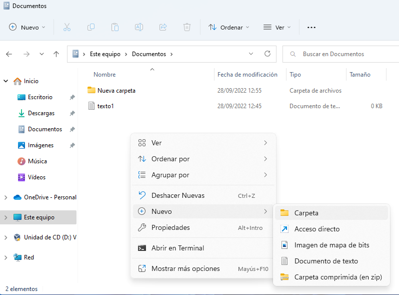

# Introducción a la informática
Hay muchas cosas que pueden abarcarse en una introducción a la informática. En este caso, nos vamos a centrar en la privacidad de los navegadores, comprender tipos de ficheros que existen y sus extensiones.

## Cheatsheet de combinaciones de teclas
| Acción | Combinación |
| ------ | ----------- |
| Abrir pestaña del navegador | CONTROL + T |
| Cerrar pestaña del navegador | CONTROL + W |
| Cerrar ventana | ALT + F4 |
| Hacer captura de parte de la pantalla | WINDOWS + SHIFT + S |
| Cambiar entre ventanas | ALT + TAB |
| Ver escritorio | WINDOWS + D |
| Recargar página web | CONTROL + R o F5 |
| Renombrar fichero o carpeta | F2 |
| Eliminar fichero | SUPR |
| Bloquear pantalla | WINDOWS + L |

## Ficheros y carpetas
### Crear una nueva carpeta en Windows 11
Para crear una nueva carpeta en Windows 11 se puede pulsar en el botón derecho en un sitio vacío y seleccionar "Nueva carpeta":

  

### Extensiones de ficheros
Si nos fijamos en la imagen anterior, el fichero "texto1" es un fichero de texto. Los ficheros de texto suelen tener la extensión ".txt".

El nombre de ese fichero, por lo tanto, debería ser "texto1.txt". Por seguridad (para que no cambiemos la extensión por error a los ficheros) Windows oculta la extensión. 

Algunas de las extensiones de ficheros más comunes son las siguientes:

| Nombre |.| Extensión |
| ------ |-| --------- |
| **Fichero de texto** | . | *txt* |
| **imagen** | . | *jpg* |
| **video** | . | *mp4* |
| **Documento** | . | odt |
| **Documento** | . | docx |
| **Ejecutable** | . | exe |
| **Ejecutable instalable** | . | msi |
| **Comprimido** | . | zip |
| **Comprimido** | . | rar |

En los sistemas operativos **Windows**, por defecto, las extensiones de fichero vienen deshabilitadas (por tanto, aunque están ahí, **no se ven**). Para poder verlas debes, desde cualquier carpeta, hacer lo siguiente:

### Comprimir y descomprimir ficheros
Los ficheros comprimidos suelen tener la extensión .zip o .rar (aunque existen otras: tar.gz, tgz, 7zip...).

Para comprimir un fichero, solamente hay que pulsar botón derecho sobre los archivos que se desean comprimir y pulsar la opción deseada. Por ejemplo, si disponemos de la aplicación 7zip:

|  |
|:-:|
| Botón derecho --> 7-Zip --> Añadir al archivo. Nos aparecerá una nueva ventana. |

|  |
|:-:|
| Le ponemos un nombre al fichero y elegimos **extensión zip** (es la más común). |

Si en lugar de comprimir, queremos descomprimir, hacemos el mismo proceso seleccionando la opción de "descomprimir" o "extraer":

|  |
|:-:|
| Botón derecho -> 7-Zip -> Extraer aquí (o "extraer ficheros" u otras opciones que digan "extraer"). |
  
## Editores de texto y procesadores de texto
Es importante diferenciar entre editores de texto y procesadores de texto. Mientras que un fichero editado con un editor de texto (p. ej: Bloc de Notas) solo contiene texto, uno editado con un procesador de texto contiene muchos metadatos: negritas, cursivas, márgenes, colores...). La extensión más típica usada para almacenar ficheros en editores de texto es **.txt** mientras que en procesadores de texto son **.odt** y **.docx**.

## Navegadores web
Los navegadores web más populares hoy en día son:

- Mozilla Firefox.
- Google Chrome.
- Microsoft Edge.
- Opera.

Todos estos navegadores funcionan muy bien hoy en día. Nosotros utilizaremos Firefox de forma habitual ya que además de funcionar muy bien es el único de estos que es libre.

## Seguridad en internet

### Contraseñas
Actualmente, las aplicaciones piden contraseñas normalmente complejas, ¿por qué?  

Bien, la razón es porque es más difícil robarlas. Existen dos tipos de ataques:

- Ataque por fuerza bruta: un programa que prueba contraseñas por fuerza bruta basicamente intentaría todas las contraseñas posibles. Por ejemplo, desde la a hasta la z (mayúsculas y minúsculas) desde 4 dígitos hasta 8. O solo numéricas. Una contraseña con muchos caracteres y que incluye algunos raros (* @ # & %...) es computacionalmente muy difícil (practicamente imposible) de descifrar.
- Ataque por diccionarios: se prueban los usuarios y contraseñas más comunes. Por ejemplo:

| Usuario   | Contraseña    |
| -------   | ------------- |
| admin     | admin         |
| 1234      | 1234          |
| admin     | 123456        |
| ........  | ........      |

*NOTA*: esto es solo un ejemplo de posibles combinaciones muy comunes. Si usas una de estas es más probable que alguien pueda descubrirla (incluso sin ningún tipo de aplicación). Por ello, se obliga a escribir contraseñas seguras.

En resumen, para evitar peligros con las contraseñas se recomienda cumplir ciertas normas de: complejidad de la misma (mayúsculas, minúsculas, números y caracteres poco habituales), longitud (más de 8 caracteres) y cambiarla cada cierto tiempo.

En empresas o páginas web se piden (en ocasiones) demasiados requisitos para las contraseñas, lo cuál puede resultar problemático. Por ejemplo, imagina que (aparte de los anteriores requisitos) te pidan que la cambies cada 6 meses y que cada vez sea diferente (no puedes repetir las antiguas). Además de esto, debes tener contraseñas diferentes para varios servicios.  Estos requisitos resultan contraproducentes en muchas ocasiones, ya que implican que las contraseñas se pierdan o se apunten en papeles sobre la mesa, terminen en papeleras... lo cuál las hace realmente más vulnerables a ser descubiertas.

## Navegadores web
Hay algunos conceptos a tener en cuenta respectoa los navegadores web:

- **Historial**: cuando navegas por internet queda almacenada tanto la fecha como la hora en que has accedido a cada página. La lista de páginas a las que accedes se llama "historial" y, si alguien accede a tu ordenador, puede descubrir información sobre ti. Todos los navegadores tienen opción de borrar el historial de navegación.
- **Modo incógnito o privado**: los navegadores tienen un modo privado (o incógnito). En este modo el historial de navegación no se guarda en el historial de navegación (por tanto, todo lo que haces en el modo incógnito es más privado ya que no queda almacenado).
- **Cookies**: las cookies son pequeñas líneas de información que una página (cuando entras) guarda sobre ti. De esta manera, si vuelves a entrar en ella sabe que eres la misma persona que lo ha hecho anteriormente. Una *cookie* puede consistir en tu login con usuario y contraseña que, una vez hecho, queda almacenado durante un tiempo (por eso no tienes que volver a identificarte/logearte cada vez que entras a la web). Las cookies también pueden ser eliminadas y hacerlo ayuda a mitigar riesgos de privacidad y seguridad.
- **Contraseñas**: los navegadores web más comunes permiten almacenar contraseñas (p. ej: en Mozilla Firefox tienen un sistema llamado Firefox Sync, en Google Chrome irían asociadas a tu cuenta de Google/Gmail). Almacenar contraseñas hace que estas estén en la nube y no las pierdas (con los riesgos de se almacenan en un sitio externo). Existen *malwares* denominados *keyloggers*, estos guardan todo lo que escribes en el ordenador (lo cuál es una manera efectiva de robar usuarios y contraseñas). Estos gestores de contraseñas te protegen ante eso, ya que no tienes que escribirlas.

## Malware
El malware o software maliciosoque se instala sin que el usuario lo sepa. Existen múltiples tipos, algunos son los siguientes:

### Spam
El spam se refiere a correos masivos con publicidad que te instan a entrar en distintas páginas web. En el correo electrónico, por ejemplo, suele haber una pestaña dedicada a correos de spam.

### Pishing
El Phishing se refiere a páginas web falsas que suplantan a las verdaderas para que el usuario desprevenido introduzca información sensible (es común el phishing bancario). Puede ser un mensaje que indique que te ha tocado la lotería y entres al enlace e introduzcas tus datos para cobrar el dinero.

Otro ejemplo es un correo que te avise de que debes cambiar tus credenciales en Instagram por una brecha de seguridad (y en lugar de llevarte a la página de instagram te dejan un enlace a una página clon www.instagrram.com, por ejemplo). Si metes ahí tus credenciales reales se las estarías dando a otra persona desconocida.

### Troyano
Malware escondido dentro de un software aparentemente bueno. Una vez lo ejecutas hacen su tarea maliciosa o se instalan sin más para actuar pasado cierto tiempo.

### Keylogger
Es un tipo de malware que guarda todas tus pulsaciones de teclado (y con esto pueden obtener cualquier cosa que escribas, desde contraseñas hasta otra información personal). Los navegadores web tienen autocompletado de formularios (p. ej: al registrarte en una página) para que un *keylogger* que se pueda tener no los detecte. También, almacenar contraseñas con un sistema como [LastPass](https://www.lastpass.com/es), de pago, o [BitWarden](https://bitwarden.com/), gratuito ayuda a protegerse contra este malware. Los navegadores web también almacenan contraseñas, aunque se consideran más inseguros que los servicios anteriores.

### Spyware
El spyware intenta solo recopilar información del usuario (actividad variada, historial de navegación web, etc.) para venderla posteriormente.

### Ramsonware
Este es el que más sale en el cine, realmente se ve muy bien que hace con algunas escenas de series o películas:

<iframe width="800" height="450" src="https://www.youtube.com/embed/lrXXzWtYkOw" title="YouTube video player" frameborder="0" allow="accelerometer; autoplay; clipboard-write; encrypted-media; gyroscope; picture-in-picture" allowfullscreen></iframe>

Aunque la escena presentada en el vídeo anterior es ficción, el ramsonware en sí es real y ahí se puede ver bastante bien lo que hace.
  
Este es probablemente el malware más peligroso que existe. La palabra Ramson significa “rescate”. Suelen infectar equipos a través de puertas traseras o troyanos y, una vez dentro, encriptan todos los ficheros que pueden contener información útil que estén a su alcance (dentro del propio equipo o a través de la red) lo que los hace muy peligrosos.
Algunos famosos son CryptoLocker o WannaCry. 

La única opción de recuperarse de un ataque de Ramsonware es restaurar los datos de una copia de seguridad (previa desinfección). Nunca se debe pagar el rescate por dos motivos: 

- Fomenta que el delincuente continúe usando este método para extorsionar a otras personas.
- Nadie puede asegurar que, tras el pago, se vaya a obtener el software y la contraseña de descifrado.

Algunos enlaces interesantes para informarse más sobre este tema:

- [Ataque a Telefónica en 2017](https://www.audea.com/telefonica-sufre-ciberataque-ransomware-red-interna/).
- [Experiencia de una persona en empresa con un ataque de Ramsonware (Xataka)](https://www.xataka.com/seguridad/yo-he-negociado-crackers-ataque-ransomware-nos-pedian-1-bitcoin-perdiamos-toda-nuestra-informacion)

|  |
| :-: |
| *Imagen de ordenador infectado con el ramsonware WannaCry*|

### Minería
El malware de minería de monedas utiliza sistemas para crear criptomonedas (lo que se conoce como “minar”) sin consentimiento ni conocimiento de las víctimas.

Este tipo de malware ha empezado a funcionar hace pocos años con el auge de las criptomonedas y se ha disparado (según McAfee Labs) desde 2018. Solo en ese año se crearon 5 millones de nuevos malwares de minería.

## Protección ante amenazas y privacidad
A nivel usuario, puedes protegerte de diversas formas:

- Mantener el sistema operativo y el antivirus actualizado.
- No entrar a cambiar la contraseña desde ningún email que te hayan enviado (puede ser falso). Tampoco confíes en los mensajes de móvil.
- No tengas la misma contraseña siempre.
- En caso de aplicaciones móviles, no instalar aplicaciones de fuentes desconocidas (solamente desde la Play Store). Por defecto, en Android, las aplicaciones de terceros no se pueden instalar a no ser que se active explicitamente la opción "Permitir orígenes desconocidos".
- Introduce tu correo en https://haveibeenpwned.com/ y comprueba que las contraseñas del mismo no han sido vulneradas. En esa página web se almacena información sobre filtraciones de seguridad en distintas plataformas y te indican si puedes tener problemas con la tuya.
- Puedes almacenar las contraseñas en algún gestor (LastPass, Bitwarden...). Aunque estarían almacenadas en un servidor externo (esto ya de por sí es un peligroso) serías menos vulnerable a otros malwares como Keyloggers y podrás tener varias diferentes sin perderlas. Suele ser un poco más seguro que almacenarlas en el navegador. 
- Si usas cuenta de Google revisa bien en ella si hay problemas de seguridad. Si almacenas ahí contraseñas te avisará si hay algunas expuestas a filtraciones.
- Si usas un ordenador externo, utiliza navegación privada.
- Ten cuidado con la navegación sobre redes Wifi abiertas (la información no va encriptada y puede capturarse con algún *sniffer* de tráfico, p. ej: [Wireshark](https://www.wireshark.org/).
- Vigila que la navegación sea HTTPS (y no HTTP). La información que se pasa por HTTPS va **encriptada**.
- Si te preocupa mucho la seguridad puedes probar otras opciones de navegador web, como por ejemplo: [Brave](https://brave.com/es/).
- Cuidado con almacenar contraseñas en papel y dejarlas en cualquier sitio. Guardalas de forma segura y rómpleas si las tiras.
- Borra el historial y *cookies* de forma periódica.

## Referencias
- Kat Aoki. How to Increase Web Browser Security. Lifewire. Obtenido de: https://www.lifewire.com/increase-web-browser-security-4767673