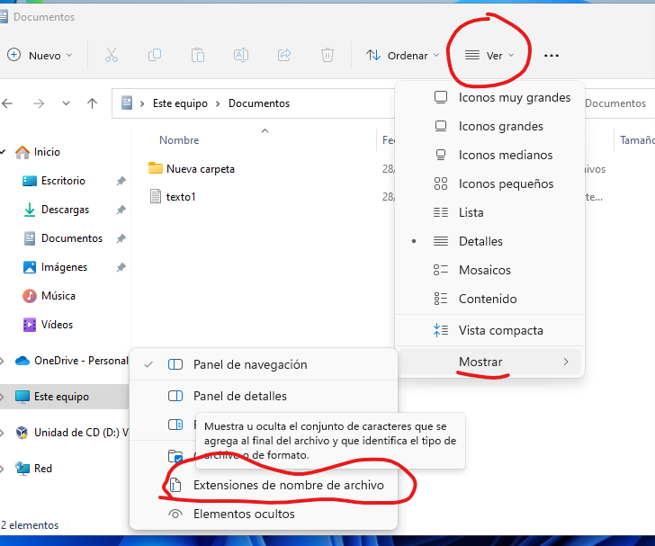

# Introducción a la informática
Hay muchas cosas que pueden abarcarse en una introducción a la informática. En este caso, nos vamos a centrar en la privacidad de los navegadores, comprender tipos de ficheros que existen y sus extensiones.

## Cheatsheet de combinaciones de teclas
| Acción | Combinación |
| ------ | ----------- |
| Abrir pestaña del navegador | CONTROL + T |
| Cerrar pestaña del navegador | CONTROL + W |
| Cerrar ventana | ALT + F4 |
| Hacer captura de parte de la pantalla | WINDOWS + SHIFT + S |
| Cambiar entre ventanas | ALT + TAB |
| Ver escritorio | WINDOWS + D |
| Recargar página web | CONTROL + R o F5 |
| Renombrar fichero o carpeta | F2 |
| Eliminar fichero | SUPR |
| Bloquear pantalla | WINDOWS + L |

## Ficheros y carpetas

### Crear una nueva carpeta en Windows 11
Para crear una nueva carpeta en Windows 11 se puede pulsar en el botón derecho en un sitio vacío y seleccionar "Nueva carpeta":

### Extensiones de ficheros
Si nos fijamos en la imagen anterior, el fichero "texto1" es un fichero de texto. Los ficheros de texto suelen tener la extensión ".txt".

El nombre de ese fichero, por lo tanto, debería ser "texto1.txt". Por seguridad (para que no cambiemos la extensión por error a los ficheros) Windows oculta la extensión.

Algunas de las extensiones de ficheros más comunes son las siguientes:

| Nombre |.| Extensión |
| ------ |-| --------- |
| **Fichero de texto** | . | *txt* |
| **imagen** | . | *jpg* |
| **video** | . | *mp4* |
| **Documento** | . | odt |
| **Documento** | . | docx |
| **Ejecutable** | . | exe |
| **Ejecutable instalable** | . | msi |
| **Comprimido** | . | zip |
| **Comprimido** | . | rar |

En los sistemas operativos **Windows**, por defecto, las extensiones de fichero vienen deshabilitadas (por tanto, aunque están ahí, **no se ven**). Para poder verlas debes, desde cualquier carpeta, hacer lo siguiente:

### Comprimir y descomprimir ficheros
Los ficheros comprimidos suelen tener la extensión .zip o .rar (aunque existen otras: tar.gz, tgz, 7zip...).

Para comprimir un fichero, solamente hay que pulsar botón derecho sobre los archivos que se desean comprimir y pulsar la opción deseada. Por ejemplo, si disponemos de la aplicación 7zip:

|  |
|:-:|
| Botón derecho --> 7-Zip --> Añadir al archivo. Nos aparecerá una nueva ventana. |

|  |
|:-:|
| Le ponemos un nombre al fichero y elegimos **extensión zip** (es la más común). |

Si en lugar de comprimir, queremos descomprimir, hacemos el mismo proceso seleccionando la opción de "descomprimir" o "extraer":

|  |
|:-:|
| Botón derecho -> 7-Zip -> Extraer aquí (o "extraer ficheros" u otras opciones que digan "extraer"). |

## Editores de texto y procesadores de texto
Es importante diferenciar entre editores de texto y procesadores de texto. Mientras que un fichero editado con un editor de texto (p. ej: Bloc de Notas) solo contiene texto, uno editado con un procesador de texto contiene muchos metadatos: negritas, cursivas, márgenes, colores...). La extensión más típica usada para almacenar ficheros en editores de texto es **.txt** mientras que en procesadores de texto son **.odt** y **.docx**.

## Navegadores web
Los navegadores web más populares hoy en día son:

- Mozilla Firefox.
- Google Chrome.
- Microsoft Edge.
- Opera.

Todos estos navegadores funcionan muy bien hoy en día. Nosotros utilizaremos Firefox de forma habitual ya que además de funcionar muy bien es el único de estos que es libre.

## Ejercicios
0. Prueba a cambiar la extensión de un fichero de Word o Writer a .zip (de fichero comprimido) y mira lo que ocurre. Razona por qué crees que pasa.
0. ¿Cuál es la diferencia entre un editor de textos y un procesador de textos? Lo que has probado en el ejercicio anterior puede ayudarte a razonarlo.
0. Busca y prueba dos procesadores de texto distintos de Word y Writer.
