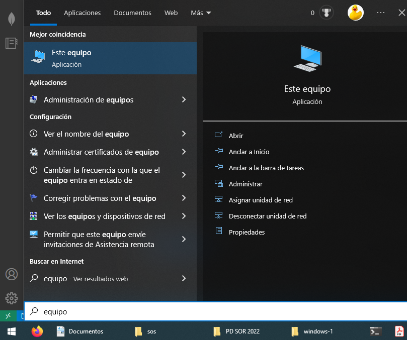
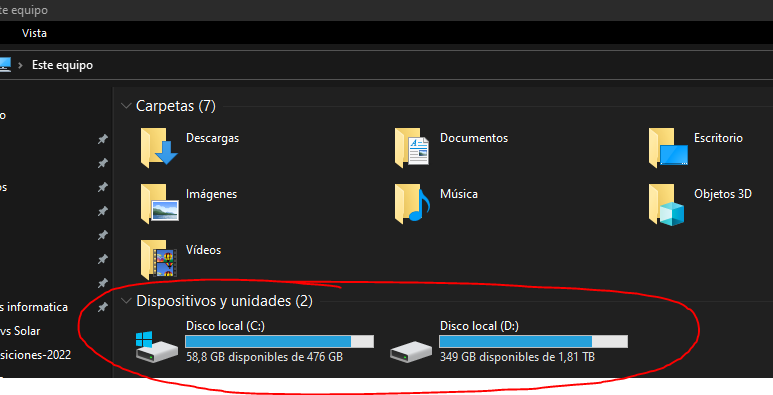
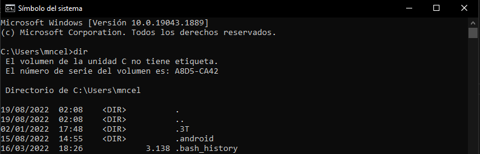
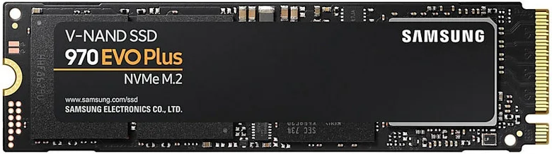
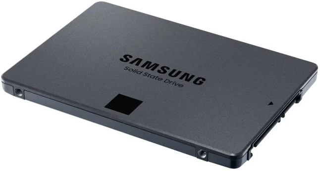
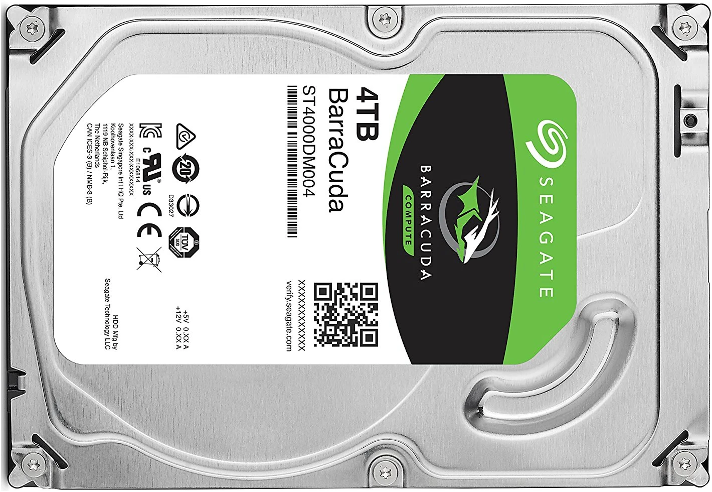

# Sistemas operativos
- **Sistemas operativos de propósito general**: o de uso general, el que utilizan las personas en su casa.
- **Sistemas operativos en modo servidor**: orientados a dar servicios a otras personas. P. ej: alojar webs a las que se accede desde navegadores web.

## Sistemas operativos de propósito general
Podemos ordenar los sistemas operativos mas habituales actualmente en tres grupos:

- Windows
- MacOS
- GNU/Linux

### Sistemas Windows
Tienen alrededor del 80% de la cuota de mercado en 2022. Los sistemas operativos de Microsoft nacen en 1981 con MS-DOS (el cuál solo funciona por un terminal de texto, no tiene ventanas todavía). Para hacerlo más accesible para el público general las ventanas (la primera interfaz gráfica de usuario o GUI) nace con Windows 1.0 en 1985. 

*Vídeo (Historia de Windows en 3 minutos)*
### MacOS
MacOS (antes llamado OS X) es la línea de sistemas operativos creada por Apple para sus ordenadores (igual que lo es la marca Windows para Microsoft). La primera versión tiene fecha de 1984 y fue el primer ordenador personal que incluía una GUI (interfaz gráfica de usuario).
Apple tiene un modelo de negocio basado en la exclusividad y la diferenciación con la competencia. Al contrario que Microsoft, Apple hace tanto el hardware como el software de sus productos.

### GNU/Linux
GNU/Linux es la base de muchos sistemas operativos de código abierto. GNU/Linux no es un sistema operativo completo, sino una serie de programas y herramientas con un núcleo (*kernel*) que comparten muchos sistemas operativos (OpenSuse, Ubuntu, Linux Mint, Debian, etc.).
Los nombres más importantes detrás de GNU/Linux son **Richard Stallman** y **Linus Torvalds**.

## Diferencias principales entre los sistemas operativos
### Organización de los ficheros en el disco duro
El [disco duro](https://www.amazon.es/Discos-Duros/s?k=Discos+Duros&rh=n%3A937917031&dc&ds=v1%3AZtzvkzKZifE%2BWaoygZk2IVosQELSpxL4yiTN2n4%2BgXE&qid=1660639171&rnid=1703620031&ref=sr_nr_n_4) es el componente donde se almacena la información del ordenador. Internamente, los archivos se organizan en una jerarquía de carpetas (también llamadas directorios) y ficheros.  

### Organización de los datos en sistemas Windows
En los sistemas Windows, tanto los discos duros como los pendrives, tarjetas SD u otros dispositivos de almacenamiento **se representan con una letra** (C, D, E, F, G, H...). Cada letra representa un disco físico donde se almacena la información (a veces ese disco duro físico se puede dividir en muchas letras y aparecer verse como si fuesen varios). 
Para acceder a la información de los discos en Windows puedes seguir los siguientes pasos:
1. Pulsa en el icono de Windows -> Este equipo.
  
2. En la sección "Dispositivos y unidades" puedes ver tus discos duros y su espacio ocupado y disponible. Como ves, están organizados por letras.
3.  

En Windows el disco principal (donde se guarda toda la información importante del sistema) es el disco C:/.

### Organización de los datos en sistemas GNU/Linux
Al contrario que en Windows, en sistemas GNU/Linux los discos físicos donde se almacena información no aparecen como letras. En estos sistemas existe una carpeta principal (llamada raíz) donde se almacena todo. Esta carpeta es "/".

- En Windows, **la carpeta del usuario "Marcos"** se encontraría (por defecto) en **C:\Usuarios\marcos**.
- En GNU/Linux, **la carpeta del usuario "Marcos"** se encuentra (por defecto) en **/home/marcos**.
- En Windows los discos donde se almacena la información se denotan con letras (C, D, E...).
- En GNU/Linux todo se organiza en una carpeta raíz (/) independientemente del disco en que se encuentre físicamente.

### Terminales de comandos
En GNU/Linux se usa BASH como terminal, mientras que en Windows es habitual hoy en día utilizar PowerShell.
  

### Extensiones de ficheros
TODO: ver -> extensiones de ficheros

TODO: tiendas de aplicaciones, archivos ocultos, terminales de comandos

### Archivos y carpetas
TODO: diferencia ruta absoluta y rutas relativas, navegación entre carpetas

### Sistemas de ficheros y particiones
En la parte de componentes físicos se ha hablado del almacenamiento de información en discos duros rígidos y discos en estado sólido (SSD). Estos últimos son más modernos, más rápidos y, por lo tanto, también más caros.

A continuación se muestran los distintos tipos de dispositivos de almacenamiento ordenadores de más rápido a más lento y, a su vez, de más caro a más barato:
|  |
| :--: |
| *SSD NVMe M.2 de 1TB por 157€ a 28/08/2022 (obtenido de [pccomponentes](https://www.pccomponentes.com/samsung-970-evo-plus-1tb-ssd-nvme-m2))* |

 

|  |
| :--: |
| *SSD SATA3 de 2.5" y 1TB por 157€ a 28/08/2022 (obtenido de [pccomponentes](https://www.pccomponentes.com/samsung-870-qvo-ssd-1tb-sata3))* |

 

|  |
| :--: |
| *Disco duro mecánico SATA3 de 3.5" y 4TB por 91€ a 28/08/2022 (obtenido de [pccomponentes](https://www.pccomponentes.com/seagate-barracuda-35-4tb-sata3))* |

Esto nos da una idea de donde vamos a trabajar ahora (sobre estos discos/dispositivos físicos). Los discos tienen una determinada capacidad (los dos primeros de la imaten son de 1 Terabyte o lo que es lo mismo, 1000 Gigabytes).

TODO: particiones, sistemas de ficheros

## Arranque del sistema
Respecto al arranque del sistema, existen cuatro conceptos importantes a entender:
- BIOS *(Sistema básico de entrada-salida)*
- UEFI *(Unified Extensible Firmware Interface)*
- MBR
- GPT

**BIOS** y **UEFI** se refieren a dos gestores de arranque. Se encargan de iniciar los componentes de hardware e iniciar el sistema operativo. UEFI es la versión más moderna (BIOS se ha quedado obsoleta). Aún así, coloquialmente se sigue utilizando **BIOS** para denominar, en general, al gestor de arranque.

MBR y GPT, por otro lado, son las tablas de particionado (GPT es la versión más moderna). Puedes consultar [este enlace](https://es.easeus.com/partition-manager-tips/mbr-y-gpt.html) para más información.

## Referencias
- Germán Cocca. Windows vs MacOS vs Linux - Operating System Handbook. Freecodecamp. Obtenido de: https://www.freecodecamp.org/news/an-introduction-to-operating-systems/#thethreemainoss
- Dong Ngo. File System and Partition Explained: How to Take Control of Your Storage. Dongknows. Obtenido de: https://dongknows.com/disk-partition-and-file-system-explained/#what-is-a-partition
- Imran Afzal. Complete Linux Training Course to Get Your Dream IT Job 2022. Curso en Udemy. Obtenido de: https://www.udemy.com/course/complete-linux-training-course-to-get-your-dream-it-job/
- Pedro. MBR o GPT - ¿Cuál es la diferencia y cuál es mejor?. EaseUS. Obtenido de: https://es.easeus.com/partition-manager-tips/mbr-y-gpt.html
