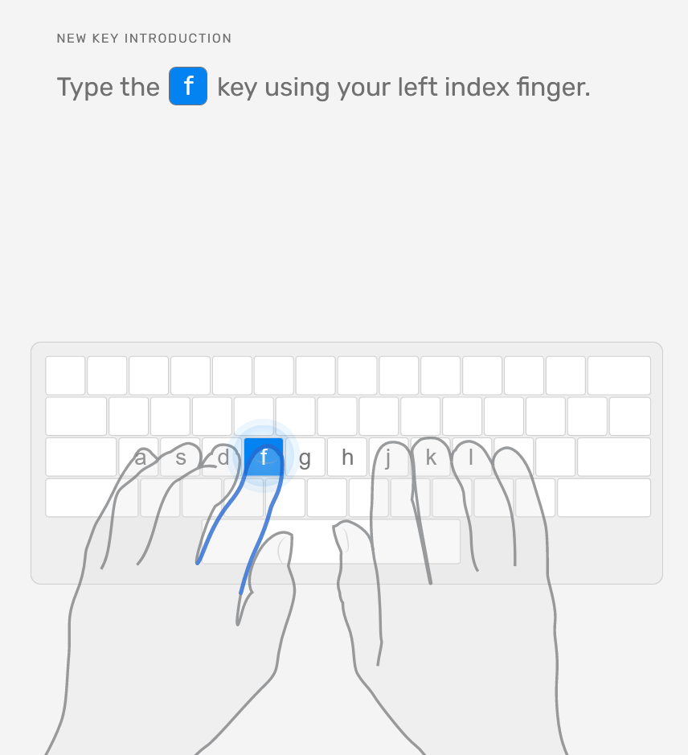
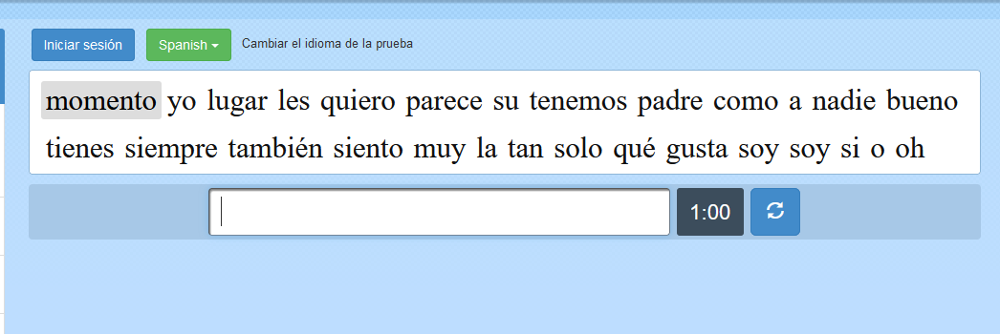

## Curso de mecanografía
Si te estás iniciando en informática o llevas un tiempo pero has aprendido a escribir por tu cuenta, te recomiendo que pruebes la forma recomendada de escribir con el [curso de la web typingclub](https://www.typingclub.com/sportal/program-54.game).

Una vez estés en la página, **regístrate con tu correo para que se guarden tus avances**. Intenta siempre escribir de la manera correcta, **colocando el dedo índice en las letras "a" y "j"**. Con el paso del tiempo conseguirás escribir cualquier cosas sin mirar el teclado.

## Pon a prueba tus habilidades
Puedes poner a prueba tus habilidades. ¿Cómo eres de rápido? ¿Quieres competir con amigos?

Existe una página llamada [Fastfingers](https://10fastfingers.com/typing-test/spanish) donde puedes medir tus tiempos escribiendo.

