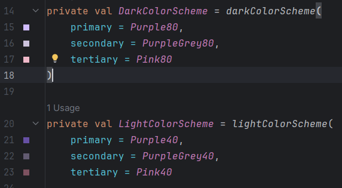
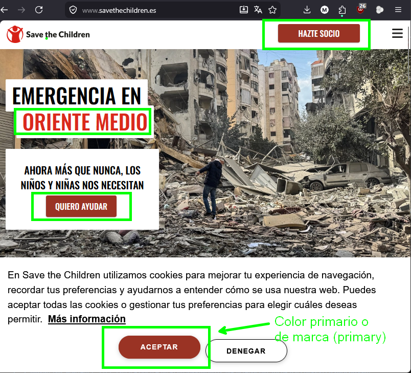
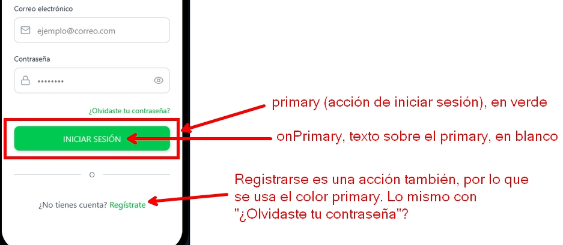
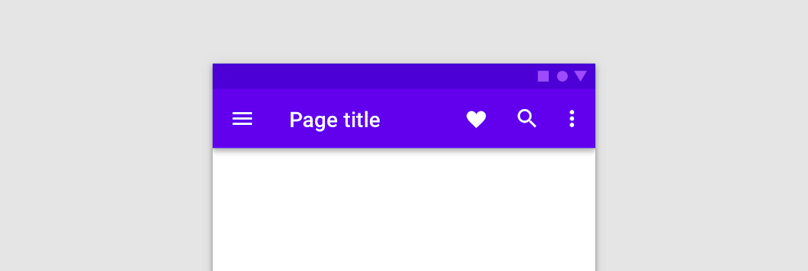
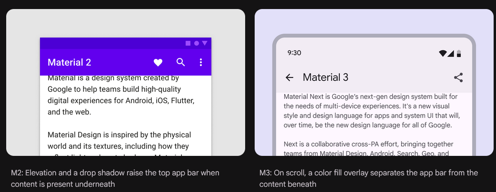

# Temas y estilos
Hasta ahora hemos estado usando colores directamente en los componentes:

```kotlin
Text(
    text = "Hola",
    color = Color.Black
)
```

Esto funciona, pero **no es una buena práctica** para aplicaciones reales. Si cada pantalla usa colores "a mano", es muy difícil mantener una apariencia coherente.

En lugar de eso, en Compose se usa un **sistema de temas (Theme)** que define los colores oficiales de la aplicación.

## Temas (themes)
Un **tema** (*theme*) es un conjunto de estilos globales que define la apariencia de la aplicación. Entre otras cosas define:

- Colores
- Tipografías
- Formas

En Compose, estos estilos se acceden mediante `MaterialTheme`.


```kotlin
MaterialTheme.colorScheme
```

Dentro de `colorScheme` encontramos los **colores del sistema de diseño** de la aplicación.

La idea es:

- No elegimos colores al azar, usamos **roles de color** definidos por el tema.

## Colores
Material 3 divide los colores en tres **colores de marca**:

- primary
- secondary
- tertiary

A continuación se muestra una imagen del fichero `Theme.kt` que se crea por defecto al crear un proyecto:



En muchas ocasiones **solo usaremos un color de marca, el primario**. A partir de aquí, solo haremos referencia a este color primario y solo se pedirán cosas en relación a él, ya que el secundario y terciario son menos habituales.

El color principal de la marca (`primary`) es basicamente el color que verás en la web de tu empresa como habitual, el color del logo, etc. Por ejemplo:

- Nike: negro.
- Tiktok: negro.
- Lego: rojo.
- Cocacola: rojo
- Twitter (logo antiguo): azul.
- Ford: azul.

Aquí he escogido empresas que tienen claramente un color principal. Este es el color primario y el que identifica a a la marca.

## Roles de color
Ahora que hemos visto lo que es el color primario (el principal de la aplicación) veamos variantes de color de las que puede interesarnos disponer en nuestra App. 

Los colores del tema en Android no se llaman "verde", "gris" o "negro". Se llaman según **el papel que tienen en la interfaz**. Por ejemplo:

| Color              | Uso                                                     |
| ------------------ | ------------------------------------------------------- |
| `primary`          | Color principal de la aplicación                        |
| `onPrimary`        | Color del contenido que va sobre `primary`              |
| `surface`          | Color base de superficies (fondos, pantallas, tarjetas) |
| `surfaceVariant`   | Variante de superficie para diferenciar zonas           |
| `onSurface`        | Color del texto principal sobre superficies             |
| `onSurfaceVariant` | Color del texto secundario sobre superficies            |

Siempre que hay un color se dispone de otro con el prefijo "ON". Por ejemplo:

- primary y onPrimary
- surface y onSurface
- surfaceVariant y onSurfaceVariant
- background y onBackground

## El prefijo `on`

El prefijo `on` indica **el color del contenido que se coloca encima de otro color**.

Por ejemplo:

| Color       | Significado                                  |
| ----------- | -------------------------------------------- |
| `primary`   | color del fondo o elemento principal         |
| `onPrimary` | color del texto o iconos encima de `primary` |

Ejemplo típico:

```kotlin
Button(
    onClick = {}
) {
    Text(
        text = "Entrar",
        color = MaterialTheme.colorScheme.onPrimary
    )
}
```

Aquí:

- El botón usa `primary`
- El texto dentro del botón usa `onPrimary` (significa "encima del primary")

Esto asegura **buen contraste automáticamente**.

!!! Tip "Prefijo ON"
    onPrimary, onSurface, onSurfaceVariant y todos los demás colores con "ON" son para indicar **el color que se escribe encima**. Por ejemplo: 
    
    - A continuación se muestra un ejemplo en el que el color **primary** sería el **rojo** (color de marca) y  el **onPrimary** sería **blanco** (lo que se escribe por encima).

    

## Acceder a los colores del tema

Los colores del tema se obtienen así:

```kotlin
MaterialTheme.colorScheme.primary
```

Por ejemplo:

```kotlin
Text(
    text = "Bienvenido",
    color = MaterialTheme.colorScheme.onSurface
)
```

## Color primario (`primary` y `onPrimary`)
El color primario, siguiendo las indicaciones de material 3, **se usa especialmente para disparar acciones**. Por ejemplo:



!!! Note "Ejercicio"
    1. En un proyecto que tengas o uno nuevo, ve al fichero `Theme.kt` y, dentro de la función de tu tema, pon la variable `dynamicColor` a `false`. Esto es necesario para que puedas ver adecuadamente los colores que pongas.
    2. Crea un botón de nombre "Púlsame" que tenga color rojo de fondo y blanco de letra. Para el fondo deberás referenciar a `primary` y para el texto a `onPrimary`.

En Material 2, el color **primary** se usaba mucho también para otras cosas además de acciones. Por ejemplo, para el color de la AppBar (la barra superior de la pantalla). Si deseas un enfoque más del estilo Material 2, podrías aplicar primary como color de fondo a la barra superior (TopAppBar).

A continuación, se muestra un ejemplo de la barra superior [(top app bar) con estilo de Material 2](https://m2.material.io/components/app-bars-top) (con color `primary` de fondo):



!!! Tip "Material 2 vs Material 3"
    El estilo de Material 2 o 3 no tiene que ser seguido o no tiene que ser seguido al pie de la letra. Las guías de diseño de Material son eso, guías de diseño, no obligan a seguir algo al pie de la letra.

    Si quieres aplicar un diseño distinto o introducir variaciones en las recomendaciones de Material puedes hacerlo.

## Superficies (`surface` y `onSurface`)

`surface` se usa como color base de la interfaz. Por ejemplo, el fondo de una pantalla:

```kotlin
Column(
    modifier = Modifier
        .fillMaxSize()
        .background(MaterialTheme.colorScheme.surface)
        .padding(16.dp)
) {
    Text(
        text = "Bienvenido",
        color = MaterialTheme.colorScheme.onSurfacesss
    )
}
```

En este caso:

- El fondo usa `surface`
- El texto usa `onSurface`

!!! Note "Ejercicio"
    Prueba el ejemplo anterior. Edita los colores en tu tema para que sean diferentes.

## AppBar: Material 2 vs Material 3
En la versión 3 de las guías de diseño de Material (Material 3), el color de la barra superior (TopAppBar) es `SurfaceColor`, es basicamente el mismo color que el fondo de la pantalla. 


A continuación, se muestra una imagen [obtenida de la documentación de Material 3](https://m3.material.io/components/app-bars/overview), sobre dos ejemplos de AppBar (una con M2 y otra con M3):



¿Cuál te gusta más?

## Superficies diferentes (`surfaceVariant`)

A veces queremos distinguir zonas de la interfaz sin usar colores demasiado fuertes.

Para eso existe `surfaceVariant`.

```kotlin
Box(
    modifier = Modifier
        .fillMaxWidth()
        .background(MaterialTheme.colorScheme.surfaceVariant)
        .padding(16.dp)
) {
    Text(
        text = "Introduce tus datos",
        color = MaterialTheme.colorScheme.onSurfaceVariant
    )
}
```

Esto se usa mucho para:

* Cajas informativas
* Contenedores suaves
* Zonas separadas de la pantalla

Existe un tipo de contenedor llamado `Card` al que podrías aplicar surfaceVariant.

## Comparación: colores directos vs tema

### No recomendado

```kotlin
Text(
    text = "Bienvenido",
    color = Color.Black
)
```

### Recomendado

```kotlin
Text(
    text = "Bienvenido",
    color = MaterialTheme.colorScheme.onSurface
)
```

Usando el tema conseguimos:

* Coherencia visual
* Mejor mantenimiento
* Adaptación automática a temas claros u oscuros

---

## Ejemplo completo

```kotlin
Column(
    modifier = Modifier
        .fillMaxSize()
        .background(MaterialTheme.colorScheme.surface)
        .padding(24.dp)
) {

    Text(
        text = "Login",
        color = MaterialTheme.colorScheme.onSurface
    )

    Spacer(Modifier.height(8.dp))

    Text(
        text = "Introduce tus credenciales",
        color = MaterialTheme.colorScheme.onSurfaceVariant
    )

    Spacer(Modifier.height(16.dp))

    Button(onClick = {}) {
        Text("Entrar")
    }
}
```

## Ejercicio

Refactoriza la pantalla de login del ejercicio anterior siguiendo estas reglas:

* No se puede usar `Color.xxx`
* Todos los colores deben venir de `MaterialTheme.colorScheme`

Requisitos:

* Fondo de la pantalla → `surface`
* Botón principal → `primary`
* Texto del botón → `onPrimary`
* Texto principal → `onSurface`
* Texto secundario → `onSurfaceVariant`
* Alguna zona destacada → `surfaceVariant`