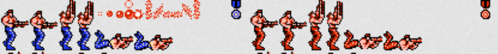
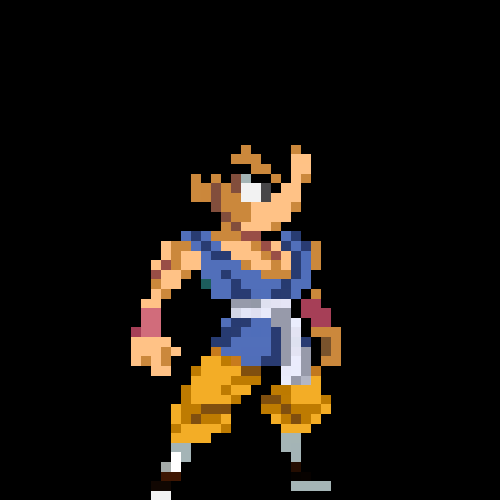

# Motores de videojuegos
## Consejos iniciales
Para desarrollar juegos ten en cuenta lo siguiente:

- El desarrollo de juegos conlleva mucho trabajo y aprendizaje continuo.
- No vas a empezar hoy a programar y mañana hacer el próximo League of Legends (o sí). Aunque irás poco a poco, te va a gustar lo que mejorarás cada día! Es muy visual y divertido empezar a hacer pequeños videojuegos desde un game engine.
- Al igual que para programar, **la repetición es la clave para aprender cosas**. **Si quieres aprender, practica tanto como puedas.**
- Ve poco a pjoco y gradualmente. Empieza haciendo proyectos pequeños y no intentes hacer algo muy grande desde el principio.
- Si se te ocurren cosas según vas desarrollando pequeños proyectos, anótalas y guárdalas para más adelante. Céntrate en el objetivo principal y luego ve añadiendo funcionalidades adicionales que hayas anotado.

## Conceptos clave
### Framework de videojuegos (*game framework*)
Es un conjunto de bibliotecas que ayudan a construir partes fundamentales del juego. No tienen por qué aportar las piezas y puede ser necesario escribir gran cantidad de código.

La construcción de un juego usando un *framework* requiere más trabajo que hacerlo desde un motor de juegos (*game engine*).

### Motor de juegos (*game engine*)
Es una colección de herramientas y tecnologías diseñadas específicamente para hacer más sencillo el proceso de desarrollo del juego. Provee también un *framework* que aporta las funcionalidades más habituales y reduce el tiempo de desarrollo.

## Funcionalidades de un *game engine*
- Renderización 2D y 3D.
- Físicas (movimiento de objetos, gravedad, choques y rebotes de objetos, etc.).
- Soporte para diversas plataformas (web, móvil, escritorio...).
- Entorno de desarrollo común.

## Motores de videojuegos populares
Existen tres motores de videojuegos muy populares en el mercado:

- [Godot](https://godotengine.org/)
- [Unity](https://unity.com/es)
- [Unreal Engine](https://www.unrealengine.com/es-ES)

### Unity
Fue desarrollado en 2005 y es probablemente el motor de videojuegos (*game engine*) más popular. Es el motor de mayor éxito para hacer juegos *indie*, ya que es gratuito y muy completo tanto para 2D como 3D. Eso sí, si decides montar una empresa en torno a él, puede resultar muy caro.

- Es gratuito si las ganancias son inferiores a 200.000$ anuales.
- Dispone de una *asset store* (tienda de recursos) con muchos y muy completos, tanto gratuitos como de pago.
- Tiene muy buen soporte para móviles. Tiene buenos SDKs para realidad virtual y realidad aumentada.
- Hay muchísimos cursos e información disponible en internet sobre él (es el más popular).

### Unreal Engine (UE)
Es un motor muy potente para desarrollar videojuegos de gama alta (también llamados triple-A), ya que ha sido desarrollado desde un principio para gestionar tareas complejas de forma más eficiente que otros motores. Es de código abierto y probablemente la mejor opción para desarrollar juegos con muchos requisitos gráficos.

- Es gratuito hasta 1 millón de dólares de ganancias. Después, el coste es del 5% de las ganancias que se obtengan a partir de ese dinero.
- El lenguaje desarrollo que se usa es C++ (más difícil que Java, Python, C# u otros lenguajes).
- Es muy bueno para juegos con gráficos tope de gama, aunque estos gráficos implican la necesidad de ordenadores más potentes para su uso.
- Mejor orientado a empresas medianas o grandes que a juegos simples o desarrollos individuales.
- Es mejor para juegos 3D que para 2D.
- Es, junto con Unity, el motor más popular (este más orientado a juegos 3D y AAA y Unity a 2D y juegos de móviles). Aún así, ambos son buenos tanto para 2D como 3D.
- La tienda de recurso (*asset store*), tiene una gran comunidad (al igual que la de Unity), pero no tan grande como esta última.

### Godot
Es un motor libre y gratuito que lleva varios años creciendo en popularidad. Como lenguaje utiliza GDScript (muy, muy similar y orientado a Python).

- Tiene licencia MIT y es totalmente libre y gratuito incluso para usarlo comercialmente. Cualquier juego que desarrolles **es completamente tuyo sin ninguna restricción**.
- Muy amigable para nuevos usuarios.
- Mejor para 2D que para 3D. Probablemente más sencillo y amigable que Unity (en mi opinión personal actual) para hacer juegos 2D. Muy sencillo y rápido de instalar.
- No hay tantos recursos como los que encuentras con Unity o Unreal Engine.

## Conceptos básicos relacionados con el desarrollo de videojuegos
- **Sprites**: es como se les llama a las imágenes representadas en Unity.
- **Spritesheets**: listas de imágenes que están juntas en un mismo fichero (divisibles en partes). Los spritesheets pueden trocearse para introducirlos en el juego o crear animaciones.

- **Asset Store**: tienda con recursos para los juegos (fondos, personajes, enemigos, plataformas, etc.). Unity tiene una tienda de recursos a la que se puede llegar desde Window -> Asset store o desde Window -> Package manager.
- **Frames por segundo (fps)**: número de imágenes que se muestran en 1 segundo (típicamente en las películas suele ser 24 o 30 y en juegos varía).
- **Juego top-down**: juego que ves desde arriba (p. ej: un pokemon antiguo).
- **Pixel art**: estilo que utiliza imágenes pixeladas.

- **Tile palette**: paleta con trozos de mundo que queremos reutilizar a lo largo de nuestro juego (p. ej: trozos de plataforma, de ladrillo, etc.).

### Recursos descargables
- Variados (Kenney, hay ambos gratuitos y de pago): [https://www.kenney.nl/assets](https://www.kenney.nl/assets)
- 2D, 3D, sondios… (uso libre): [https://opengameart.org/](https://opengameart.org/)
- Fuentes: [https://www.dafont.com/](https://www.dafont.com/) y [https://fonts.google.com/](https://fonts.google.com/)
- Unity Asset Store.

## Referencias
- Lindsay Schardon. Best Game Engines of 2022. GameDev Academy. Obtenido de: [https://gamedevacademy.org/best-game-engines/](https://gamedevacademy.org/best-game-engines/)
- Asaf Eldad. Unity vs Unreal: key differences. Incredibuild. Obtenido de: [https://www.incredibuild.com/blog/unity-vs-unreal-what-kind-of-game-dev-are-you](https://www.incredibuild.com/blog/unity-vs-unreal-what-kind-of-game-dev-are-you). Ultima actualización: 22/07/2025.
- Chris Bradfield. Godot Engine Game Development Projects. Packt. Birmingham: Packt; 2018.