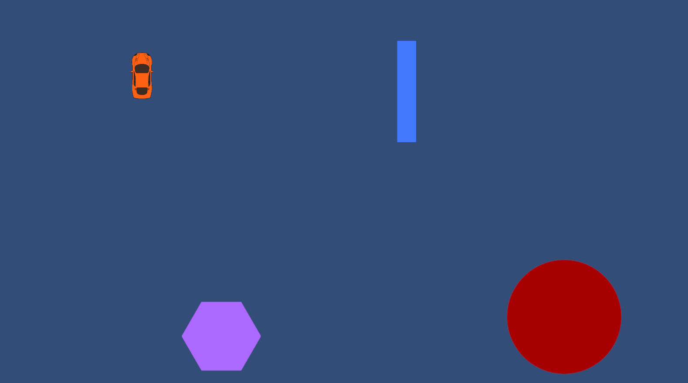
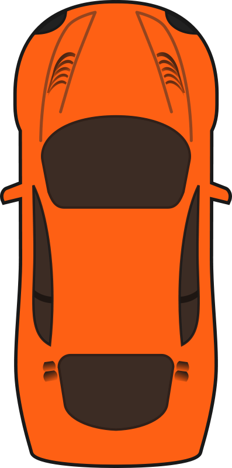

# Juego de coches sencillo
En este ejercicio vamos a crear un juego de coches *top-down* (es decir, que se ve desde arriba):

## Parte I: realización del juego

Puedes empezar descargando la imagen de este coche. Tu objetivo es hacer, con lo que has aprendido, el juego que ves en la imagen. En el juego **deben cumplirse los siguientes puntos**:

{: align=right width="120" }

- Tu controlas el coche y podrás chocar contra los distintos objetos (que tendrás que crear).
- Los objetos deben tener un tamaño similar al que se ve en la imagen (puedes cambiar el tamaño de los objetos con modificando algo de su transform...).
- Cuando choques contra un objeto, ese objeto no se moverá del sitio.
- En el caso del coche, cuando presiones "arriba" o "w" el coche se moverá de frente, sin importar la posición en que esté. Si pulsas "s" o "atrás" el coche irá para atrás". En cambio, **si pulsas "a-d o izquierda-derecha el coche girará** (recuerda el Rotate que hemos visto).

Como consejos para la realización del juego:

- Necesitarás usar varios tipos de collider (nosotros hemos usado en el tutorial solo BoxCollider2D, pero puedes hacer búsqueda por Collider2D y usar el que más te convenga según la figura que tengas). En el coche, para una colisión sencilla, te recomiendo un BoxCollider2D.
- Es posible que tengas ["problemas gravitatorios"](https://www.google.com/search?q=my+unity+rigidbody2d+falling+down&client=firefox-b-d&sca_esv=e133efb347e6c9df&ei=k-bfaN_YJYudkdUPlY3DgQk&oq=my+unity+rigidbody2d&gs_lp=Egxnd3Mtd2l6LXNlcnAiFG15IHVuaXR5IHJpZ2lkYm9keTJkKgIIADIFECEYoAEyBRAhGJ8FMgUQIRifBTIFECEYnwUyBRAhGJ8FSK8pULcEWM4icAJ4AJABAJgBiwGgAesPqgEENy4xMrgBA8gBAPgBAZgCFaAC1RDCAggQABiwAxjvBcICBBAhGBXCAgkQABiABBgTGArCAgcQABiABBgTwgIIEAAYExgWGB6YAwCIBgGQBgWSBwQ1LjE2oAeYlQGyBwQzLjE2uAfOEMIHBjAuOC4xM8gHOg&sclient=gws-wiz-serp) ;). Si ese es el caso, quizá debas ver como eliminar esa gravedad (ya que es un juego visto desde arriba, los objetos no deben caer).

## Parte II: efectos de los obstáculos
Si has seguido las instrucciones tu coche en la parte I choca contra los objetos pero estos permanecen totalmente estáticos (no se mueven). Ahora, debes conseguir físicas en esos objetos, de manera que cuando el coche choque contra ellos estos reboten o se muevan en consecuencia del choque (es algo bastante simple si lo piensas, solo necesitas "añadir físicas" a los objetos).