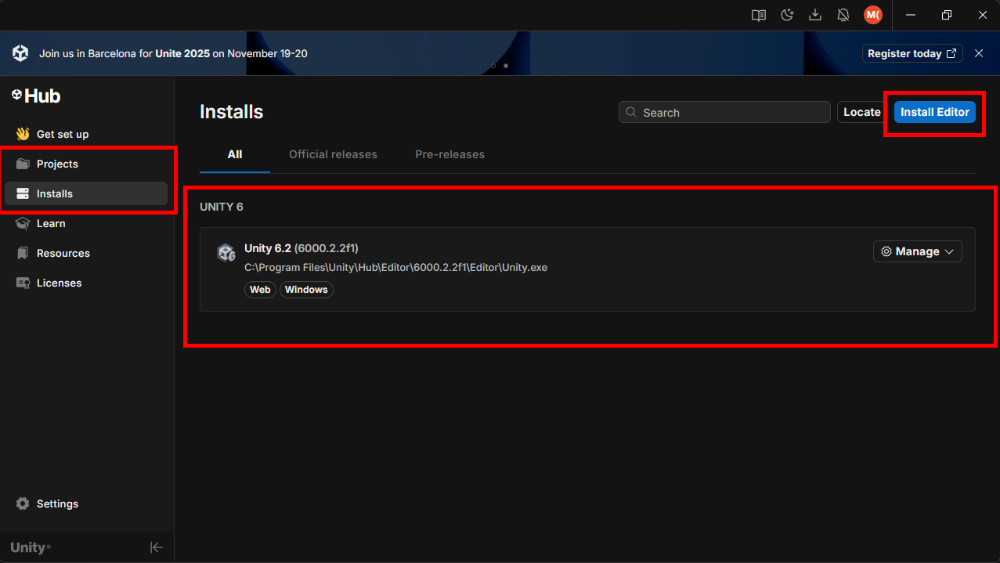
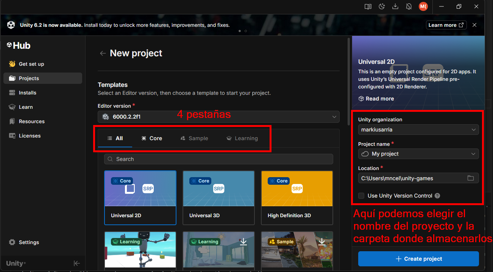
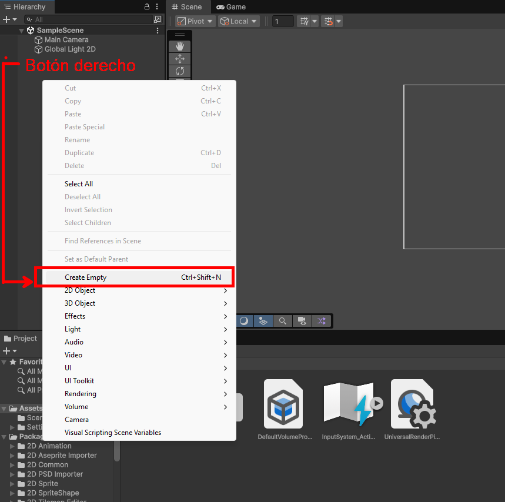
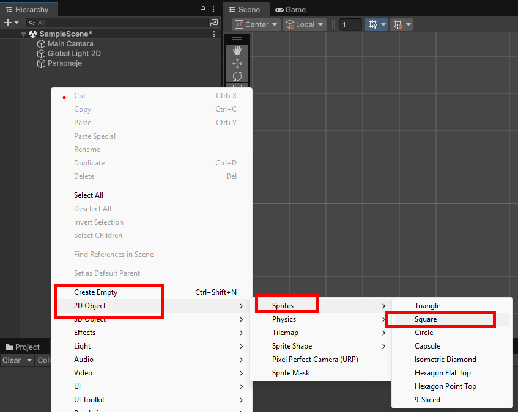
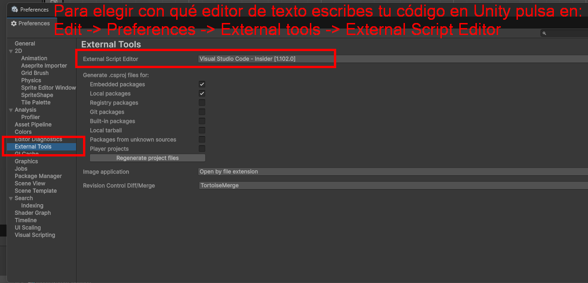
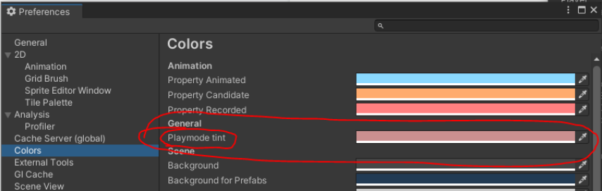
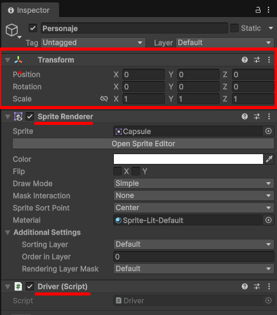

# Unity 2D
## Descarga de Unity
Para desarrollar para Unity, puedes descargarte primero UnityHub (es una aplicación donde puedes gestionar diversas versiones de Unity). Unity, por su parte, es el propio motor de videojuegos (y lo puedes descargar desde Unity Hub).

En pocas palabras, el primer paso es descargarte [UnityHub](https://unity.com/es/unity-hub) y después, desde dentro de Unity Hub podrás descargar la última versión estable de Unity (es posible que se te inicie la descarga automáticamente).



En la imagen anterior podemos ver las pestañas de **proyectos** e **instalaciones** (estamos en la de instalaciones). Arriba podemos pulsar en "Instalar Editor" para instalar versiones de Unity. Es posible que al entrar ahí ya se te ponga una versión a descargar automáticamente (sino, lo puedes hacer con el botón correspondiente).

## Creación de proyecto en Unity
Para crear un proyecto 2D vamos a "Projects" - New Project (y elegimos Universal 2D):



!!! Ejercicio
    1. Descarga UnityHub y la última versión estable de Unity.
    2. Elige una carpeta para tus proyectos (p. ej: juegos-unity). Después, elige esa carpeta y dentro de ella crea un proyecto **de tipo Universal 2D** que se llame PrimerJuego.


## La interfaz de Unity
En la siguiente imagen podemos ver las partes de las que se compone la interfaz de Unity.


1. La parte principal es la central: **La escena**. Una escena representa una pantalla del juego (por ejemplo, la pantalla del menú, un nivel del juego con el jugador y los monstruos, etc.).
2. Cada escena contiene **objetos del juego (GameObjects)**. Estos son los que salen en el menú de la parte izquierda de la imagen (la jerarquía). Por ejemplo: monstruos, el personaje, una plataforma, etc.
3. Si pulso en un GameObject (parte izquierda) podré ver sus propiedades en la parte derecha.

Resumiendo, la parte principal de Unity es la escena (que será el nivel que vamos a crear). En esta escena vamos a añadir objetos para mejorarla.

## Los GameObjects y sus componentes
Para crear el **GameObject más básico posible** en la escena hacemos lo siguiente:


### GameObjects: el componente transform
Si pulsas sobre el GameObject (recuerda, el que hemos creado es **el más básico posible**) podrás ver que solo tiene un componente llamado **transform**. Este componente **representa la posición del objeto en la escena y su tamaño**. 

!!! info
    Todos los GameObjects tienen, al menos, este componente transform.

### GameObjects: imágenes con el componente Sprite Renderer
{ align=right }
Aunque tenemos un GameObject, no vemos nada todavía en la escena. Quiero hacer que este GameObject sea en el futuro el personaje de mi juego. Para ello, lo primero debería ser poder poner una imagen del mismo. Para ello usamos el componente **Sprite Renderer**.

Ten en cuenta que una imagen en desarrollo de juegos se denomina como Sprite**. 

Si pulsas sobre el GameObject que has creado para que te aparezcan sus propiedades/componentes en el inspector (panel derecho). Una vez hecho esto, en la parte inferior del inspector (bajo el transform) verás un botón **"Add Component"**.

Si en ese "Add Component" añadimos un componente de tipo "Sprite Renderer" podremos ahí añadir las propiedades de la imagen.

!!! info
    Ya tenemos dos componentes:

    - El **transform** posee la posición, rotación y tamaño del GameObject.
    - El **Sprite Renderer** nos permite añadir una imagen al GameObject.


!!! Note "Ejercicio"
    1. Cambia el nombre al Game Object para que se llame "Personaje" (será el personaje que luego moveremos).
    2. Descarga la imagen del conejo (este conejo es de un pack de recursos de [kenney.nl](https://kenney.nl){ target=_blank }).
    1. Copia o arrastra el conejo a los recursos (assets) de tu proyecto (panel inferior). Esto nos permitirá usarlo después.
    2. Añade un Sprite Renderer al personaje. Verás que el componente Sprite Renderer tiene la propiedad **"Sprite"**. Arrastra el conejo desde los assets hasta el atributo Sprite y debería aparecer en la escena.
    3. Modifica su *transform* en el inspector (panel derecho) para moverlo a la parte inferior derecha de la pantalla. Para ello tendrás que modificar su posición en el eje X y en el eje Y.
    4. Modifica su escala: haz que sea 1.5 veces más grande.
    5. Ahora, resetea de nuevo su posición y escala a como estaban al principio. Posición (0,0,0) y escala 1.


También, en lugar de crear un GameObject vacío (el cuál recordemos que tendrá siempre, como mínimo, un transform) y luego añadirle el "Sprite Renderer" para poder añadirle un Sprite (imagen), **Unity nos permite añadir directamente el GameObject con el SpriteRenderer**. Veámoslo:

#### Creación directa de objetos Sprite en Unity

Para crear un objeto que directamente tenga ya un Sprite Renderer con una forma concreta (por ejemplo, un cuadrado) hacemos lo siguiente:



Esto nos añadirá un nuevo objeto ya con un cuadrado representado (o un círculo, triángulo, etc.). 

### Otros componentes 
Además de transform y sprite renderer, existen muchos otros componentes (colliders, físicas, tilemaps, sonidos...). Estos los veremos más adelante.

## Scripting básico
Vamos a explicar esto usando el nuevo InputSystem de Unity (si consultais internet y veis otras formas de hacerlo, es posible que estén hechas con el antiguo InputSystem).

Vamos a empezar viendo, con el nuevo InputSystem de Unity, como mover el personaje de la forma más sencilla posible.

### Creación de un script
Hay dos maneras de crear un script en Unity:
- Forma I: botón derecho en la zona de `assets` y luego: *create - scripting - Monobehaviour Script*. Después de esto, se le pone el nombre al script y se "arrastra" al GameObject al que se quiere enlazar (los scripts van asociados a un GameObject).
- Forma II: en un GameObject cualquiera (p. ej: el personaje) añades un nuevo componente de tipo "script" y le das un nombre. De esta manera, ya queda tanto creado como asociado.

!!! Note "Ejercicio"
    En este ejercicio vamos a practicar la creación, enlazado, desenlazado y borrado de un script en Unity:

    1. Crea un nuevo script de la primera forma, luego enlázalo con el personaje.
    2. Elimínalo del personaje y luego borra el script.
    3. Crea un nuevo script de la segunda forma (directamente añadiendolo como componente al personaje).
    4. Elimina el script.
    5. Crea una carpeta Scripts en tus assets.
    6. Crea un script de nombre PersonajeController y luego enlázalo al personaje.
    7. Abre el script.

### Métodos básicos en un script
Si has abierto el script tal como se indica en el ejercicio, verás que este hereda de una clase llamada "MonoBehaviour". Además, verás que estamos sobreescribiendo dos métodos: `Start()` y `Update()`:

- Start(): este método se ejecuta en el momento en que el nodo al que está asociado el script (en este caso, el nodo al que lo hemos asociado es el personaje). En el momento en que ejecutamos el juego el método Start() del nodo se ejecutará automáticamente.
- Update(): este método se ejecutará una vez por frame. Por ejemplo, si este juego se está ejecutando a 60 frames o imágenes por segundo, entonces el método Update() se ejecutará 60 veces cada segundo. 

```csharp
public class PersonajeController : MonoBehaviour
{
    // Se llama justo antes de ejecutarse el primer frame
    void Start()
    {
     
    }

    // Update se llama una vez por frame
    void Update()
    {
     
    }
}
```

!!! info
    No vas a necesitar hacer apenas bucles en Unity, ya que el propio Update() ya se está ejecutando en bucle. Si quieres ejecutar algo de forma constante en el tiempo solo tienes que ponerlo ahí dentro.

#### Mostrando mensajes por pantalla

Para mostrar un mensaje en la consola de Unity podemos usar `Debug.Log(mensaje)`.

!!! Ejercicio
    1. Muestra un mensaje "Hola mundo" al ejecutar el juego. Comprueba que aparece en la consola de Unity.
    2. Muestra un mensaje "Me ejecuto una vez por frame." de manera que aparezca una vez por cada frame o imagen.
    3. Elimina los mensajes anteriores y crea un contador de frames, de manera que con cada frame vaya sumándose el contador y mostrando el número por pantalla.

#### Movimiento de personaje: comprobando las teclas pulsadas
Para mover el personaje puedes utilizar la clase `Keyboard` de Unity.InputSystem:
```csharp
if (Keyboard.current.aKey.isPressed)
{
    // Me muevo a la izquierda
} else if (...) {
    // Me muevo a la derecha
}
```

La variable `isPressed` tiene un *true*o un *false* dependiendo de si está pulsada la tecla "A" o no lo está. Hay una referencia en `Keyboard.current` a cada tecla posible del teclado, por lo que puedes comprobar si está presionada cualquiera de ellas.

Esto es interesante, ya que si estoy pulsando la tecla "a" o la flecha izquierda, puede que quiera moverme a la izquierda. Por su parte, si pulso "d" o la flecha derecha, me quiero mover a la derecha, etc.

!!! Note "Ejercicio"
    1. ¿En qué método crees que deberías poner el código anterior para comprobar de forma continuada durante todo el juego si se está puslando una tecla?
    2. En ese método que has pensado, coloca el código necesario (basandote en lo que te he puesto yuo) para comprobar si nos estamos moviendo a la izquierda (a) o a la derecha (d). En ese caso pon mensajes de "Me muevo a la izquierda" y "Me muevo a la derecha". Comprueba que funcionan ejecutando el juego y pulsando esas teclas.
    3. Si has hecho ya lo anterior, haz también que funcione para la "flecha arriba" y "flecha abajo". Esto es más cuestión de saber programar (puedes usar un OR || para que te funcione el juego para ambas teclas).

Si has resuelto correctamente el ejercicio, podrás moverte a izquierda y derecha con las flechas y con A-D.

#### Movimiento de personaje: cambiando la posición
A estas alturas supongo que estais pensando... "todo esto está muy bien, pero cuando podré hacer el próximo League of Legends"?

Pues tranquilos amigos/as, vamos paso a paso. Ahora toca a mover el personaje al pulsar esas teclas (que ya es un gran avance en tan poco tiempo que llevamos de tutorial!):

!!! Note "Ejercicio"
    1. ¿Recuerdas como mover el personaje desde Unity (no desde el script)? Lo hemos hecho hace un rato. Muévelo de nuevo poniéndolo **más a la izquierda o más a la derecha desde el inspector de Unity, no con la interfaz gráfica**.
    2. ¿Cómo se llama el componente del GameObject que has tocado para cambiar esa posición?

Bien, si has hecho el ejercicio anterior has debido responderte a la segunda pregunta. El componente que has tenido que tocar ha sido el *transform* (concretamente el position del transform). Pues esto mismo que modificamos en el ejercicio es lo que modificaremos en el script, pero: ¿cómo accedemos a su transform? Pues con `transform.position`:

!!! Note "Ejercicio"
    1. Muestra un mensaje al iniciar el juego que indique la posición del jugador: "La posición del personaje al empezar el juego es: ..."

Si has hecho el ejercicio, verás que la posición se ve como una coordenada de tres dimensiones (posición en el eje horizontal, posición en el eje vertical, profundidad). Esto es, (x, y, z).

Existen **dos tipos de datos principales** para colocar objetos en la escena de Unity:

- **Vector2**: coordenadas x e y.
- **Vector3**: coordenadas x, y, z.

Por ejemplo, para crear un Vector3 puedes usar lo siguiente: `Vector3 miPosicion = new Vector3(1, 2, 0);`. El valor que has podido ver en consola (de transform.position) es un Vector3.

Esa posición del personaje puede ser modificada:

!!! Note "Ejercicio"
    1. Intenta modificar la posición del personaje desde código al iniciarse el juego (para que esté arriba a la derecha por ejemplo). Para ello tienes que modificar el transform.position para que tenga otro valor (recuerda, un valor de tipo Vector3 y con la "z" a 0, ya que estamos en 2 dimensiones).

Si modificamos el tamaño (escala) del cuadrado, podemos hacerlo parecer una plataforma.


!!! Note "Ejercicio"
    Crea tres plataformas rectangulares sobre las que, en el futuro, nuestro personaje pueda subirse:
    
    - Una de ellas hazla creando un cuadrado directamente desde el menú.
    - Las otras dos creando un GameObject vacío y luego añadiendo el componente con la imagen de un cuadrado (a ver si la encuentras!).


## Configuraciones del editor de Unity
### Configurar editor de texto para programar
Podemos elegir Visual Studio 2022 o Visual Studio Code.


### Cambiar color al estar en modo "ejecución"
Si ejecutamos un juego y mientras estamos jugándolo cambiamos parámetros del mismo, estos no se cambian. Para identificar cuando estamos en modo "ejecución" es mejor cambiar el color de la interfaz de Unity: 

*Edit → Preferences → Colors → Playmode tint*



## Movimiento del personaje

!!! Note "Ejercicio"

    1. Crea un nuevo proyecto Universal2D y en él crea una cápsula (recuerda, está en *2D Objects - Sprites*). Luego crea un script asociado a la misma.
    2. Muestra un mensaje "Hola mundo" cuando se ejecute el primer frame. Para esto puedes usar `Debug.Log("Mensaje")`. Ejecuta el juego para probar que aparece en la consola de Unity.
    3. Si consigues que funcione lo anterior, ahora intenta que se muestre un contador una vez por frame (y que ese contador vaya aumentando). El mensaje será "Frame número: X"

## Componente transform: moviendo el personaje
Al pulsar sobre la cápsula que hemos hecho, a la derecha vemos que tiene diversas propiedades: **transform, Sprite Renderer y Script**.

Cada una de ellas tiene un objetivo concreto. El script lo tiene porque le hemos asociado uno, el Sprite renderer es porque hay un dibujo (un sprite) asociado, en este caso de una cápsula pero podría ser cualquier fichero de imagen que queramos.

El transform se refiere a la posición del objeto en el juego. Tiene como propiedades: position (posición), rotation (rotación) y escala (tamaño).
.

!!! Note "Ejercicio"
    1. Mueve el objeto modificando las propiedades del "position" de transform. Prueba tmabién a moverlo a mano usando la tecla "w" y las flechas.
    2. Rota el objeto unos 45 grados usando el "rotation" del transform. Prueba a rotarlo en todos los ejes (x, y, z) uno detrás de otro. 
    3. Luego, prueba también a rotar usando la tecla "r" y girando el objeto. Verás que los números del transform se van cambiando.
    4. Prueba a cambiar la escala del objeto.

### Transform: método Rotate()
Con todo lo anterior vemos como cambiar el objeto de forma permanente en el juego (ya sea la posición, escala o rotación). Muchas veces, nos interesa hacerlo dinamicamente desde código (por ejemplo, rotar el personaje cuando lo vas moviendo). La clase `MonoBehaviour` de la que heredamos en el script posee la propiedad `transform`, así que podemos acceder a ella en código con:

```csharp
transform.Rotate(0, 0, 0); // coordenadas x, y, z
```

!!! Ejercicio
    1. Haz que la cápsula gire 45 grados nada más empezar el juego (hazlo en el script, no en Unity).
    2. Haz que la cápsula gire 45 grados en cada frame (en script).
    3. Haz que la cápsula gire sin parar muy lentamente (aproximadamente que haga un giro completo cada 5 segundos). Ojo, si usas cifras decimales necesitas añadir una "f" al final (por ejemplo: 5.5f).
    4. Finalmente, deja todo como al principio (puedes comentar las líneas de código del transform).


### Transform: position
Podemos cambiar la posición también y hacer que el objeto se mueva lentamente. `transform.position` es de tipo Vector3.

Por ejemplo, si hacemos lo siguiente:

```csharp
void Start()
{
    transform.position = new Vector3(2, 4, 0);
}
```

Al ejecutar, el personaje (en este caso la cápsula) se moverá 2 en el eje X y 4 puntos en el eje Y.


!!! Note "Ejercicio: sumar vectores"
    1. Si mueves el código de cambio de posición del método "Start()" a Update(), ¿qué crees que ocurrirá? Pruébalo.
    2. Recuerda, position no es un número, es un objeto de tipo "Vector3" que recibe 3 coordenadas. Aún así, **podemos sumar dos objetos de tipo Vector3 con el operador +** (igual que en una suma de números). Eso sí, no podemos sumar un Vector3 + número, tiene que ser Vector3 + Vector3. Intenta ahora que el objeto se mueva lentamente hacia arriba (tendrás que ir actualizando el position con una posición un poco más alta en y cada vez).

### Transform: método Translate()
Para cambiar la posición de un objeto, hay una forma más cómoda que cambiar el position y es con el método **Translate()**. El método **Translate** nos evita tener que sumar a mano. Vamos a ver como funciona:

```csharp
    void Update()
    {
        // transform.position = transform.position + new Vector3(0, 0.01f, 0);
        transform.Translate(0, .01f, 0);
    }
```

!!! Note "Ejercicio"
    1. Prueba el código anterior pero ahora, añade una línea más usando el transform.Rotation para que gire un poco.

    Puede que no lo esperes, pero haciendo esto el objeto hará círculos (ya que el movimiento en "y" es sobre sí mismo, no sobre el mundo). Si no lo entiendes prueba a pulsar sobre la cápsula y pulsar "w", verás las flechas y posiblemente entenderás este comportamiento.


## Sprites
Un Sprite en Unity es un objeto C# que representa una imagen. En este caso, nuestra cápsula es un Sprite que es un dibujo de una cápsula, podemos ver que tenemos **Sprite Renderer** además de transform:


Bien, pues podemos hacer que en lugar de una cápsula lo que movemos sea un coche, vamos a hacerlo. 

!!! Note "Ejercicio: descargar y colocar sprite de un coche"
    1. Cambia el nombre de tu cápsula a "Coche".
    2. Busca en Google "car sprites" y descarga la imagen de un coche cualquiera que se vea desde arriba, por ejemplo [este](https://nohat.cc/f/related-posts-scratch-race-car-sprite/m2i8K9K9A0d3G6b1-201907241634.html). 
    3. Una vez lo descargues mételo en la carpeta "assets" de tu proyecto Unity.
    4. Arrastramos el sprite desde los recursos (assets) de nuestro proyecto, a la propiedad "Sprite" del Coche (ver imagen).
    5. Finalmente, ajustamos el tamaño (escala) y rotación del coche para que quede lo mejor que podamos (y ejecutamos el juego para probar).
    
    