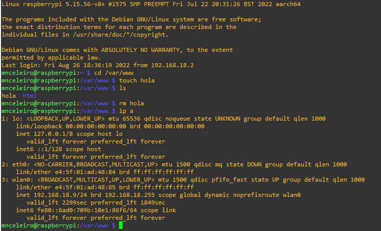

# Terminal de comandos
Un terminal de comandos es una interfaz en modo texto usada para controlar un ordenador (ya sea Linux o Windows).

A continuación se muestra el ejemplo de un terminal de comandos en un sistema operativo basado en Linux (Raspbian):

No te preocupes si lo que ves te resulta extraño ahora, ya que en pocos días entenderás perfectamente todo lo que aparece en esa imagen.

## Comandos básicos de GNU/Linux
| Acción | Comando |
| :----: | ------- |
| Reiniciar ordenador | sudo reboot |
| Apagar ordenador | sudo shutdown -h now |
| Ver procesos | top htop ps ps -ef |
| Probar conexión y latencia | ping www.google.com ping 151.101.133.50
| Ver información de red | ip address |
| Mostrar mensaje por pantalla | echo "mensaje". Por ejemplo: echo "Hola mundo"  echo "Estoy ejecutándome en el SHELL: $0."

### Comandos de carpetas y ficheros
La raíz de todas las carpetas (también llamadas directorios) se denomina en **Windows** como **C:**. En **GNU/Linux**, en cambio, **la raíz de todo es “/”**. Un usuario se sitúa en Windows y GNU/Linux en las siguientes carpetas:

- *Windows 10*:     &emsp;*C:/Usuarios/**nombreUsuario**/*
- *GNU/Linux*:      &emsp; */home/**nombreUsuario**/*

| Acción | Comando | Ejemplo |
| ------ | ------- | ------- |
| Ver dónde estás | pwd | pwd |
| Listar ficheros | ls -l ls -la ls -lh | **ls** (muestra ficheros, pero no los ocultos) **ls -l** (muestra ficheros e información) **ls -a** (muestra ficheros, incluídos los ocultos) **ls -lh** (muestra información y "h" de *human readable*)
| Moverse entre carpetas | cd ruta_carpeta | Si estoy en /home/mnceleiro puedo moverme a "Documentos" de dos formas:  **Ruta absoluta (pongo la ruta completa)** cd /home/mnceleiro/Documentos  **Ruta relativa (pongo solo desde donde estoy)** cd Documentos  **Para volver atrás (.. representa la carpeta superior)** cd .. |
| Crear carpeta | mkdir nombre_carpeta | mkdir clase
| Crear fichero vacío | touch nombre_fichero | touch datos.txt |
| Eliminar algo | rm nombre_carpeta rm nombre_fichero | rm partidos rm -r MisFotos  *Si hay cosas dentro de una carpeta y queremos que borre la carpeta con todo el contenido de dentro hay que usar la opción **-r** *.
| Mover carpeta | Mover un fichero: mv origen destino  Mover carpeta con cosas: mv **-R** origen destino | **Mover usando rutas absolutas (ruta completa)** mv /home/mnceleiro/downloads/datos.txt /home/mnceleiro/documents/datos.txt  **Mover usando rutas relativas (relativo al directorio donde te encuentras)** mv datos.txt ../documents.datos.txt  *Si usas la opción -R puedes mover una carpeta y todo lo que tiene dentro.* |
| Cambiar nombre a algo | mv nombre_antiguo nombre_nuevo | mv datos.txt ../documents/datoscopia.txt  También puede usarse para mover y con -R |
| Ver contenido de un fichero | cat <ruta_fichero> cat -l <ruta_fichero> | cat /etc/shells (el archivo shells tiene una lista con los shells instalados en el sistema)  cat /etc/passwd (en este fichero se almacenan los datos de los usuarios del sistema) |

## Instalación de software
Existen distintas tiendas de aplicaciones según la distribución GNU/Linux usada así como gestores de paquetes. 
El gestor de paquetes más conocido se llama **APT** y es usado en distribuciones basadas en Debian, por ejemplo: Ubuntu, Linux Mint, Zorin OS, Steam OS.

Los comandos más interesantes a usar con la herramienta APT son los siguientes:

| Acción | Comando | Ejemplo |
| ------ | ------- | ------- |
| Instalar | apt install programa | sudo apt install kdenlive  Para instalar sin que pida confirmación: sudo apt install -y libreoffice |
| Eliminar | apt remove programa | sudo apt remove gimp |
| Actualizar | apt update apt upgrade | sudo apt update sudo apt upgrade  |

Es importante tener en cuenta que **apt no es el único gestor de software disponible**. Aunque **apt** es probablemente la mejor forma de instalar cosas, a veces hay aplicaciones que no se encuentran aquí.
Si no encuentras la aplicación en apt podrías buscar la aplicación en internet y descargarla desde la página oficial (tal y como harías en Windows) o incluso buscar en internet algún tutorial de como hacerlo, por ejemplo:

- [Instalar Spotify en Ubuntu (filtrando último año)](https://www.google.com/search?q=Instalar+spotify+en+Ubuntu&client=firefox-b-d&sxsrf=ALiCzsbNq7lw0-VEnp-j00t0oxK4FidwvA:1651835021653&source=lnt&tbs=qdr:y&sa=X&ved=2ahUKEwi6tMX93Mr3AhUHP-wKHUIhC_EQpwV6BAgBEB4&biw=1920&bih=927&dpr=1).
- [Instalar Steam en Ubuntu (filtrando último año)](https://www.google.com/search?q=Instalar+spotify+en+Ubuntu&client=firefox-b-d&sxsrf=ALiCzsbNq7lw0-VEnp-j00t0oxK4FidwvA:1651835021653&source=lnt&tbs=qdr:y&sa=X&ved=2ahUKEwi6tMX93Mr3AhUHP-wKHUIhC_EQpwV6BAgBEB4&biw=1920&bih=927&dpr=1).

Te recomiendo hacerlo **filtrando por "último año"** o por la versión de Linux que tengas. Por ejemplo: ["Instalar Spotify en Ubuntu 20.04"](https://www.google.com/search?client=firefox-b-d&q=Instalar+spotify+en+Ubuntu+20.04).

## Gestión de procesos
| Acción            | Comando                   | Descripción/Ejemplos          |
| ----------------- | ------------------------- | ----------------------------- |
| Ver procesos      | top htop ps -ef   | top y htop son interactivos (htop requiere instalación).  Ejemplo de ps: ps -ef \| grep firefox *(filtra procesos con nombre firefox mediante grep)* |
| Ver procesos (en forma de árbol) | pstree | ps + tree |
| Matar procesos (por código)   | kill [-código] <num_proceso> | Supongamos que queremos matar firefox (hay que mirar cuál es su ID de PROCESO, puedes hacerlo usando htop o ps):  `ps -e \| grep firefox`  Matar un proceso de forma normal (por defecto usa código 15): `kill 12345`  Matar un proceso de manera forzada (p. ej: si se queda trabado). Para matar de forma forzada el código es el 9: `kill -9 12345` |
| Matar procesos (por nombre) | killall [-código] <nombre_proceso> | `killall firefox`  Matar el proceso (forzandolo): `killall -9 firefox`   |

**Puedes consultar más información sobre como matar procesos y envío de señales a procesos [aquí](https://www.cyberciti.biz/faq/unix-kill-command-examples/).**

Referencias:

- Imran Afzal. Complete Linux Bash Shell Scripting with Real Life Examples. Udemy. Disponible en: https://www.udemy.com/course/linux-bash-shell-scripting-through-real-life-examples/