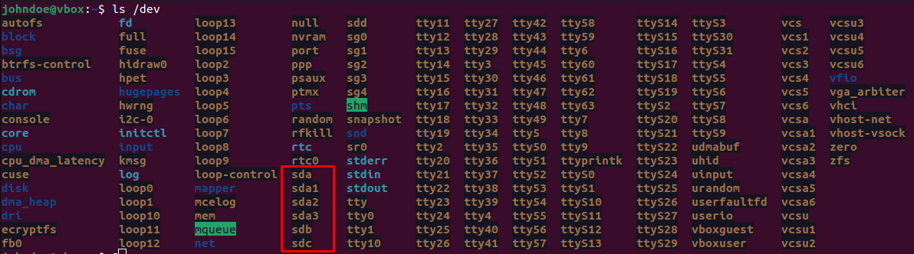

Al encender un ordenador arranca la BIOS y, después de esta, arranca el sistema operativo (según el orden de arranque establecido en la BIOS).

## Arranque clásico (Legacy BIOS + MBR)
- Permite un máximo de 4 particiones primarias por disco (o tres primarias y una extendida). El arranque se puede instalar solo sobre particiones primarias.
- El resto de particiones deben ser extendidas. No se instala nada en una partición extendida, sino que esta se divide en particiones lógicas.
- El tamaño máximo de partición es de 2TB.

!!! Nota

    No se puede instalar nada sobre particiones extendidas. Para hacerlo, antes estas deben subdividirse en "particiones lógicas".

El arranque clásico tiene completa compatibilidad con cualquier sistema. Todos los discos soportan MBR.

## Arranque nuevo (UEFI + GPT)
La tabla de particiones Good Partition Table (GPT) se ha diseñado para mejorar las limitaciones que tenía MBR. Ahora:

- En lugar de tener particiones: **primaria**, **extendida** y **lógica** ahora solamente tienes **volúmenes** (es decir, esta parte se simplifica ya que solo hay un tipo de partición). Puedes crear "volúmenes" (particiones) sobre un disco sin tener que preocuparte más por el tipo de partición.
- Las nuevas BIOS son más seguras que las anteriores, permiten usar el ratón y tienen interfaces más elaboradas. Estas nuevas BIOS se denominan **UEFI**.
- GPT es un formato para particionar discos duros, tiene un máximo de 128 particiones por disco con un máximo de 9.4ZB por partición (respecto a los 2TB que tenía MBR).

También, en UEFI disponemos de **Fast Boot** y **Secure Boot**:
- **Fast boot**: se salta todo el arranque de la BIOS y va directamente al sistema operativo.
- **Secure boot**: no se puede arrancar un sistema operativo en que se han hecho modificaciones. El secure boot firma digitalmente la partición.

No es posible arrancar particiones GPT si tienes la BIOS en modo Legacy. En el modo UEFI ahora se puede arrancar desde discos duros particionados en GPT.

## Manejo de discos y particiones en GNU/Linux
### Dispositivos de almacenamiento en Linux
Los dispositivos de almacenamiento (discos duros, SSDs, DVDs, Pendrives...) se representan como un dispositivo en el directorio /dev (*devices*).


Los discos son representados con la [siguiente nomenclatura](https://tldp.org/HOWTO/Partition/devices.html):

- **Discos SATA:** sda, sdb, sdc, sdb...
- **Particiones en discos SATA:** sda1, sda2, sda3...
- **Discos IDE (interfaz antigua):** hda, hdb, hdc...
- **Discos y particiones NVMe:** nvme0, nvme0n1, nvme0n1p1, nvme0n1p1...

El fichero donde se almacenan las particiones en linux es **/etc/fstab**.

### Listar particiones
Algunos comandos para consultar la lista de discos y/o particiones son los siguientes:

```
# Listar discos
mount

# Listar discos
fdisk -l

# Listar discos (salida más limpia)
lsblk
```

### Realizar operaciones sobre discos con fdisk
Después de realizar uno de los comandos anteriores para listar los discos y particiones, elegimos el disco que queremos particionar (p. ej: sdb):
```
sudo fdisk /dev/sdb
```

Una vez entramos, tenemos varias opciones. Algunas de las más interesantes a recordar:

- "m": mostrar la ayuda.
- "p": print, mostrar las particiones que tenemos actualmente.
- "n": New, crea una nueva partición.
- "w": Write, escribe la tabla de particiones.
- "d": delete, elimina una partición.

#### Ejercicio
- Añade a Virtualbox dos nuevos discos SATA de 10GB y crea en sdb dos particiones, una de 100MB y otra de 5GB usando fdisk.
- Lista las particiones.
- Borra la partición de 100MB.
- Crea una partición de 50MB.

### Realizar operaciones sobre discos con gdisk
fdisk solo funciona sobre MBR, por lo tanto no debes intentar usarlo nunca en una tabla de particiones GPT. Para eso se usa la herramiente **gdisk**.

#### Ejercicio
Usa la herramienta gdisk para particionar el disco sdc con una partición de 6GB y otra con el resto de espacio.

## Referencias
