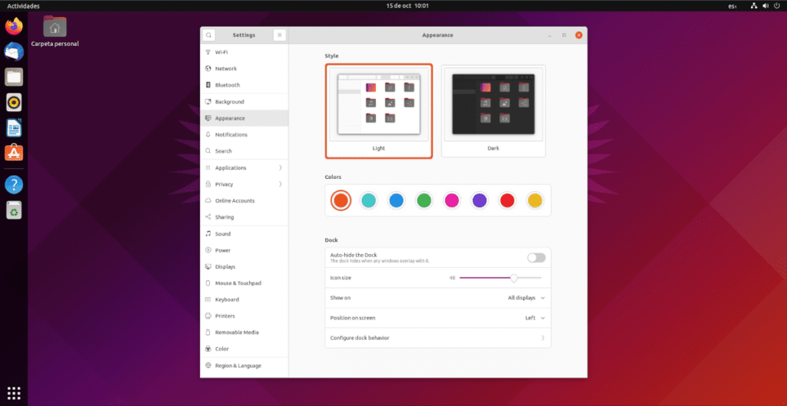
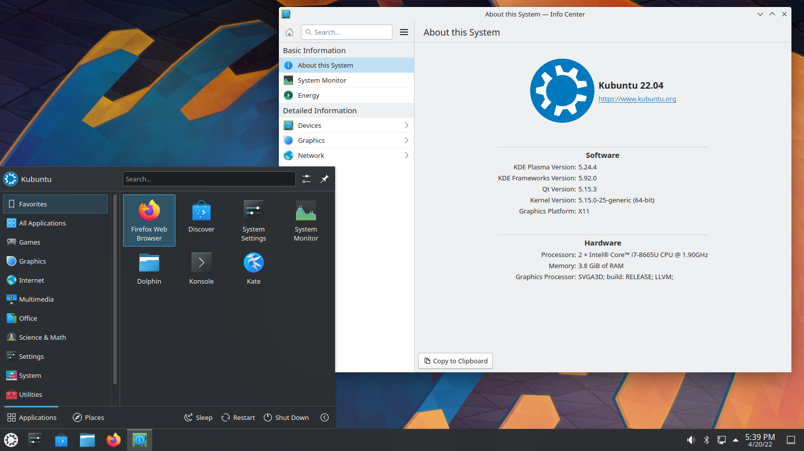
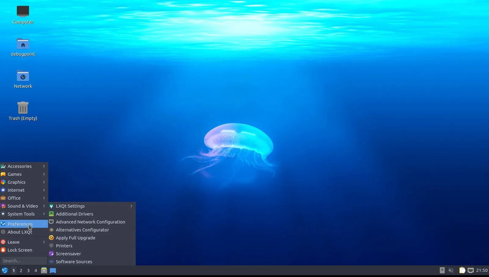
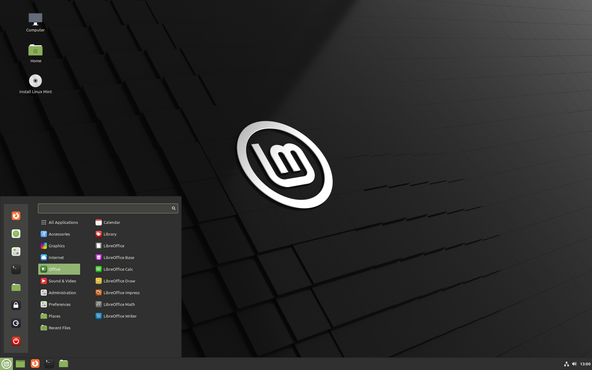
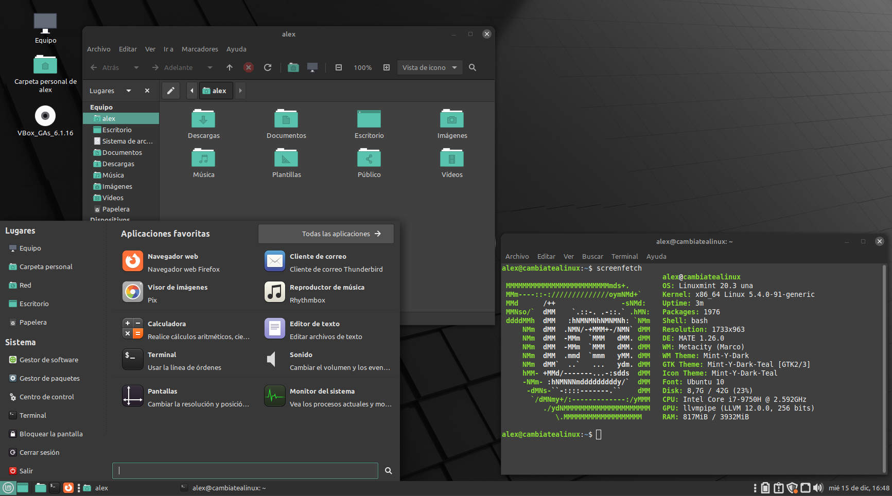
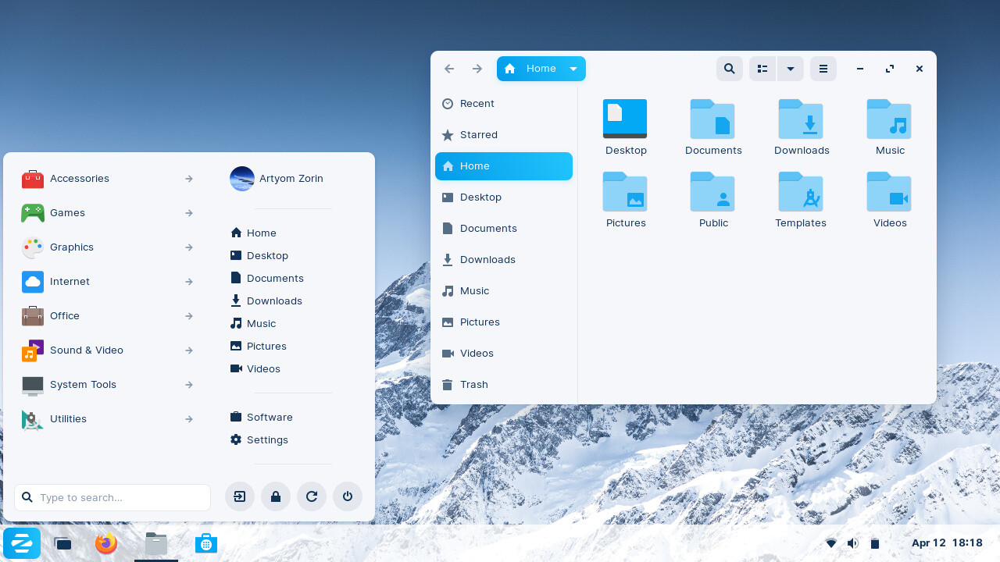
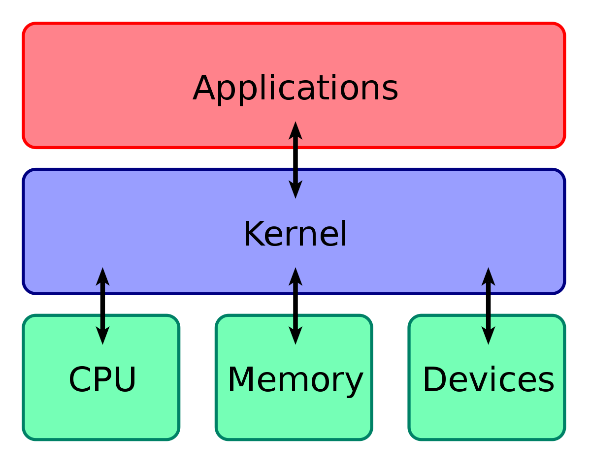
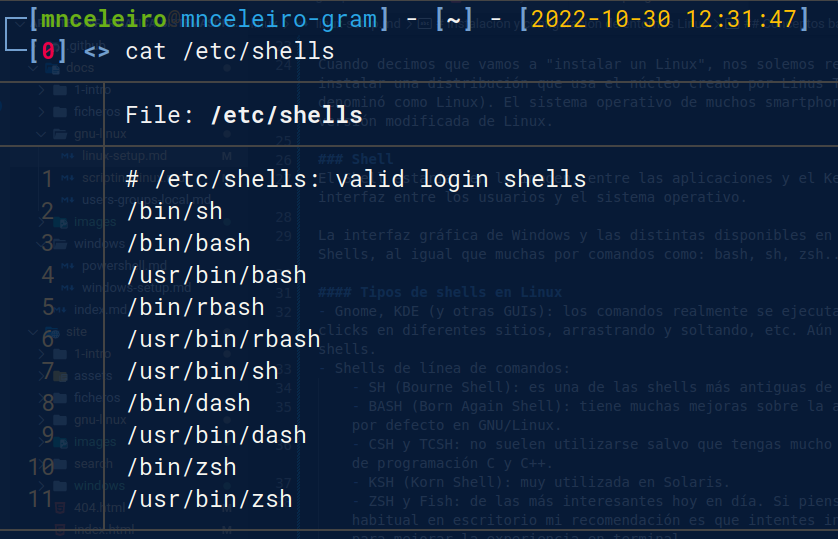

# Instalación y configuración de entornos Linux

## GNU/Linux
GNU/Linux es la base de muchos sistemas operativos de código abierto. GNU/Linux no es un sistema operativo completo, sino una serie de programas y herramientas con un núcleo (*kernel*) que comparten muchos sistemas operativos (OpenSuse, Ubuntu, Linux Mint, Debian, etc.).
Los nombres más importantes detrás de GNU/Linux son **Richard Stallman** y **Linus Torvalds**.

### Distribuciones GNU/Linux y entornos de escritorio

Existen múltiples distribuciones basadas en Linux con diferentes características (Debian, OpenSuse, Ubuntu, Linux Mint, Zorin OS, Fedora, Archilinux, etc.). Además, cada una de estas distribuciones se puede usar con diferentes entornos de escritorio (puedes imaginarte unos más parecidos al estilo de Windows, otros más parecidos a MacOS y otros diferentes a ambos). 

Las distribuciones GNU/Linux más habituales y más “beginner friendly” son las basadas en Ubuntu. Las versiones más habituales de Ubuntu son las siguientes:

* Ubuntu con entorno de escritorio “Gnome” (denominado como [Ubuntu](https://ubuntu.com/download)) .
* Ubuntu con entorno de escritorio “KDE” (denominado como [Kubuntu](https://kubuntu.org/)).

Para ordenadores antiguos o con muy pocos recursos:

* Ubuntu con entorno de escritorio “XFCE” ([Xubuntu](https://xubuntu.org/)).
* Ubuntu con entorno de escritorio “LXDE” ([Lubuntu](https://lubuntu.me/)).

A continuación se muestran imágenes de distintos sistemas operativos y entornos de escritorio:

|  |
|:--:|
| **Ubuntu** con **GNOME** (Ubuntu) |

|  |
|:-:|
| **Ubuntu** con **KDE** (Kubuntu) |

|  |
|:-:|
| **Ubuntu** con **LXDE** (Lubuntu) |

|  |
|:-:|
| **Linux Mint** (distribución basada en Ubuntu) con entorno de escritorio **Cinnamon** |

|  |
|:-:|
| **Linux Mint** con entorno de escritorio denominado **MATE** |

|  |
|:-:|
| **Zorin OS** (distribución basada en Ubuntu y *Windows friendly*). Tiene un entorno de escritorio GNOME adaptado por ellos mismos para hacerlo más familiar a Windows. |

Como veis, **es posible tener el mismo sistema operativo con diferente entorno de escritorio**. GNOME, KDE, XFCE, Cinnamon, MATE o LXDE son entornos de escritorio diferentes.

**Iniciarse en GNU/Linux**: *si quieres iniciarte en GNU/Linux en uso personal usar Ubuntu o una distribución basada en Ubuntu es la mejor opción. Mis recomendaciones para empezar: Ubuntu (el normal con Gnome), Linux Mint (Cinnamon) o Zorin OS.*

Algunos sistemas operativos o entornos de escritorio en GNU/Linux consumen muy pocos y están preparados para dar una segunda vida a ordenadores antiguos. Si quieres dar una segunda vida a un ordenador antiguo sigue [este enlace](https://itsfoss.com/lightweight-linux-beginners/).
 

## GNU/Linux en servidores
Algunos usuarios habituales de Linux son los siguientes:

- Gobierno de los Estados Unidos y algunas de sus agencias (nacional, estatal, federal e internacional).
- NASA: no solo lo utilizan para la mayor parte de su computación, sino que además contribuyen al código.
- Hospitales
- Red de trenes de alta velocidad de Japón (bullet trains).
- Control de tráfico.
- Institutos financieros.
- Liders de comercio online (Amazon, Paypal, Ebay o Walmart.
- Muchas otras compañías (Google, IBM, Facebook, Mcdonals...).

Dentro de las versiones de GNU/Linux en entornos empresariales destacan las siguientes:

- Redhat.
- CentOS: administrado también por Redhat y totalmente gratuito. No recibe soporte técnico de Redhat.
- Fedora Server: gratuito.
- Suse Linux Enterprise Server: pertenece a la compañía Novell. VMWare utiliza Suse como entorno.
- Debian.
- Ubuntu Server.

## Conceptos básicos 
### Interfaces de usuario
Existen varios términos para describir interfaces gráficas:

- **UI**: **U**ser **I**nterface (en español IU: **I**nterfaz de **U**suario).
Lo que ves en tu ordenador ahora mismo se llama GUI (Interfaz gráfica de usuario o *Graphical User Interface*). Los terminales de comandos.
- **GUI**: **G**raphical **U**ser **I**nterface o interfaz **gráfica** de usuario.

La diferencia es que la G (*graphical*) indica que es una interfaz en modo gráfico y no en modo texto. En sistemas basados en Linux existen diferentes interfaces gráficas: GNOME, KDE, XFCE, LXDE, Cinnamon, MATE...

### Arquitectura del sistema

|  |
|:--:|
| *Imagen obtenida de: [Wikipedia](https://en.wikipedia.org/wiki/Kernel_(operating_system))* |

#### Kernel (núcleo)
Podemos imaginarnos el kernel como un programa en la parte más profunda del sistema operativo y que se ocupa de la interactuación con el hardware (procesador, disco duro, ram...).

Cuando desde un terminal ejecutamos un comando, el kernel lo recibe y se ocupa de interactuar con el hardware.

Aunque muchas veces trata a las distribuciones (Ubuntu, Fedora, Linux Mint, ArchLinux...) como "Linux" a secas, realmente Linux es el kernel o núcleo y todos esos nombres son distribuciones diferentes que usan ese kernel.

Cuando decimos que vamos a "instalar un Linux", nos solemos referir a que vamos a instalar una distribución que usa el núcleo creado por Linus Torvalds en 1991 (y al que denominó como Linux). El sistema operativo de muchos smartphones (Android) usa una versión modificada de Linux.

#### Shell
El Shell estaría, en la imagen, entre las aplicaciones y el Kernel. Un Shell hace de interfaz entre los usuarios y el sistema operativo.

La interfaz gráfica de Windows y las distintas disponibles en GNU/Linux son también Shells, al igual que muchas por comandos como: bash, sh, zsh...

##### Tipos de shells en Linux
- Gnome, KDE (y otras GUIs): los comandos realmente se ejecutan, pero se hace mediante clicks en diferentes sitios, arrastrando y soltando, etc. Aún así, estos son también shells.
- Shells de línea de comandos:
    - SH (Bourne Shell): es una de las shells más antiguas de Linux.
    - BASH (Born Again Shell): tiene muchas mejoras sobre la anterior y es la que viene por defecto en GNU/Linux.
    - CSH y TCSH: no suelen utilizarse salvo que tengas mucho control sobre lenguajes de programación C y C++.
    - KSH (Korn Shell): muy utilizada en Solaris.
    - ZSH y Fish: de las más interesantes hoy en día. Si piensas usar Linux de forma habitual en escritorio mi recomendación es que intentes instalar una de estas dos para mejorar la experiencia en terminal.

Si consultas el fichero /etc/shells puedes ver la lista de shells que tienes instaladas en el sistema.

  

#### Aplicaciones
Una aplicación puede ejecutarse por interfaz gráfica, pero también por terminal de comandos.

Muchas aplicaciones gráficas lo que hacen realmente (al pulsar, por ejemplo, un botón) es ejecutar comandos en un shell concreto. Este shell, a su vez, interactúa con el Kernel que a su vez lo hace con el hardware. Así es como se produce toda la comunicación entre las capas.

Si ejecutamos, por ejemplo, una aplicación (imaginemos Steam), esa aplicación se ejecuta en un Shell, el cuál a su vez se comunica con el Kernel y este finalmente con el hardware. Hay una comunicación completa desde el usuario hasta el hardware.

#### Sistema operativo
La combinación del Kernel, el Shell y los programas a más bajo nivel es lo que forma el sistema operativo.

## Terminal de comandos
Un terminal de comandos es una interfaz en modo texto usada para controlar un ordenador (ya sea Linux o Windows).

A continuación se muestra el ejemplo de un terminal de comandos en un sistema operativo basado en Linux (Raspbian):

No te preocupes si lo que ves te resulta extraño ahora, ya que en pocos días entenderás perfectamente todo lo que aparece en esa imagen.

## Comandos básicos de GNU/Linux
| Acción | Comando |
| :----: | ------- |
| Reiniciar ordenador | sudo reboot |
| Apagar ordenador | sudo shutdown -h now |
| Ver procesos | top htop ps ps -ef |
| Probar conexión y latencia | ping www.google.com ping 151.101.133.50
| Ver información de red | ip address |
| Mostrar mensaje por pantalla | echo "mensaje". Por ejemplo: echo "Hola mundo"  echo "Estoy ejecutándome en el SHELL: $0."

### Comandos de carpetas y ficheros
La raíz de todas las carpetas (también llamadas directorios) se denomina en **Windows** como **C:**. En **GNU/Linux**, en cambio, **la raíz de todo es “/”**. Un usuario se sitúa en Windows y GNU/Linux en las siguientes carpetas:

- *Windows 10*:     &emsp;*C:/Usuarios/**nombreUsuario**/*
- *GNU/Linux*:      &emsp; */home/**nombreUsuario**/*

| Acción | Comando | Ejemplo |
| ------ | ------- | ------- |
| Ver dónde estás | pwd | pwd |
| Listar ficheros | ls -l ls -la ls -lh | **ls** (muestra ficheros, pero no los ocultos) **ls -l** (muestra ficheros e información) **ls -a** (muestra ficheros, incluídos los ocultos) **ls -lh** (muestra información y "h" de *human readable*)
| Moverse entre carpetas | cd ruta_carpeta | Si estoy en /home/mnceleiro puedo moverme a "Documentos" de dos formas:  **Ruta absoluta (pongo la ruta completa)** cd /home/mnceleiro/Documentos  **Ruta relativa (pongo solo desde donde estoy)** cd Documentos  **Para volver atrás (.. representa la carpeta superior)** cd .. |
| Crear carpeta | mkdir nombre_carpeta | mkdir clase
| Crear fichero vacío | touch nombre_fichero | touch datos.txt |
| Eliminar algo | rm nombre_carpeta rm nombre_fichero | rm partidos rm -r MisFotos  *Si hay cosas dentro de una carpeta y queremos que borre la carpeta con todo el contenido de dentro hay que usar la opción **-r** *.
| Mover carpeta | Mover un fichero: mv origen destino  Mover carpeta con cosas: mv **-R** origen destino | **Mover usando rutas absolutas (ruta completa)** mv /home/mnceleiro/downloads/datos.txt /home/mnceleiro/documents/datos.txt  **Mover usando rutas relativas (relativo al directorio donde te encuentras)** mv datos.txt ../documents.datos.txt  *Si usas la opción -R puedes mover una carpeta y todo lo que tiene dentro.* |
| Cambiar nombre a algo | mv nombre_antiguo nombre_nuevo | mv datos.txt ../documents/datoscopia.txt  También puede usarse para mover y con -R |
| Ver contenido de un fichero | cat <ruta_fichero> cat -l <ruta_fichero> | cat /etc/shells (el archivo shells tiene una lista con los shells instalados en el sistema)  cat /etc/passwd (en este fichero se almacenan los datos de los usuarios del sistema) |

## Instalación de software
Existen distintas tiendas de aplicaciones según la distribución GNU/Linux usada así como gestores de paquetes. 
El gestor de paquetes más conocido se llama **APT** y es usado en distribuciones basadas en Debian, por ejemplo: Ubuntu, Linux Mint, Zorin OS, Steam OS.

Los comandos más interesantes a usar con la herramienta APT son los siguientes:

| Acción | Comando | Ejemplo |
| ------ | ------- | ------- |
| Instalar | apt install programa | sudo apt install kdenlive  Para instalar sin que pida confirmación: sudo apt install -y libreoffice |
| Eliminar | apt remove programa | sudo apt remove gimp |
| Actualizar | apt update apt upgrade | sudo apt update sudo apt upgrade  |

Es importante tener en cuenta que **apt no es el único gestor de software disponible**. Aunque **apt** es probablemente la mejor forma de instalar cosas, a veces hay aplicaciones que no se encuentran aquí.
Si no encuentras la aplicación en apt podrías buscar la aplicación en internet y descargarla desde la página oficial (tal y como harías en Windows) o incluso buscar en internet algún tutorial de como hacerlo, por ejemplo:

- [Instalar Spotify en Ubuntu (filtrando último año)](https://www.google.com/search?q=Instalar+spotify+en+Ubuntu&client=firefox-b-d&sxsrf=ALiCzsbNq7lw0-VEnp-j00t0oxK4FidwvA:1651835021653&source=lnt&tbs=qdr:y&sa=X&ved=2ahUKEwi6tMX93Mr3AhUHP-wKHUIhC_EQpwV6BAgBEB4&biw=1920&bih=927&dpr=1).
- [Instalar Steam en Ubuntu (filtrando último año)](https://www.google.com/search?q=Instalar+spotify+en+Ubuntu&client=firefox-b-d&sxsrf=ALiCzsbNq7lw0-VEnp-j00t0oxK4FidwvA:1651835021653&source=lnt&tbs=qdr:y&sa=X&ved=2ahUKEwi6tMX93Mr3AhUHP-wKHUIhC_EQpwV6BAgBEB4&biw=1920&bih=927&dpr=1).

Te recomiendo hacerlo **filtrando por "último año"** o por la versión de Linux que tengas. Por ejemplo: ["Instalar Spotify en Ubuntu 20.04"](https://www.google.com/search?client=firefox-b-d&q=Instalar+spotify+en+Ubuntu+20.04).

## Gestión de procesos
| Acción            | Comando                   | Descripción/Ejemplos          |
| ----------------- | ------------------------- | ----------------------------- |
| Ver procesos      | top htop ps -ef   | top y htop son interactivos (htop requiere instalación).  Ejemplo de ps: ps -ef \| grep firefox *(filtra procesos con nombre firefox mediante grep)* |
| Ver procesos (en forma de árbol) | pstree | ps + tree |
| Matar procesos (por código)   | kill [-código] <num_proceso> | Supongamos que queremos matar firefox (hay que mirar cuál es su ID de PROCESO, puedes hacerlo usando htop o ps):  `ps -e \| grep firefox`  Matar un proceso de forma normal (por defecto usa código 15): `kill 12345`  Matar un proceso de manera forzada (p. ej: si se queda trabado). Para matar de forma forzada el código es el 9: `kill -9 12345` |
| Matar procesos (por nombre) | killall [-código] <nombre_proceso> | `killall firefox`  Matar el proceso (forzandolo): `killall -9 firefox`   |

**Puedes consultar más información sobre como matar procesos y códigos de proceso [aquí](https://www.cyberciti.biz/faq/unix-kill-command-examples/).**

Referencias:

- Imran Afzal. Complete Linux Bash Shell Scripting with Real Life Examples. Udemy. Disponible en: https://www.udemy.com/course/linux-bash-shell-scripting-through-real-life-examples/