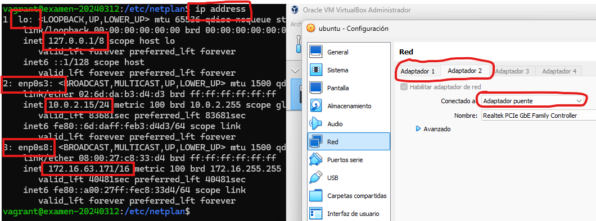

# Redes en GNU/Linux
## Comandos principales

```bash title="Ver configuración IP"
ip address
```

|  |
| :-: |
| *Ejecución del comando "ip address" (3 interfaces de red, una es la de loopback)* |

El comando anterior puede sustituirse por `ip -4 address` o `ip -6 address` para ver solo la IPv4 o IPv6 del equipo.


=== "Ver conexiones (comando actual)"

    ```bash
    # Por defecto, ss muestra una lista de las conexiones establecidas
    ss

    # Si solo queremos los que están en escucha (listening)
    ss -l

    # ss -t (solo tcp), -u (solo udp), -x (solo unix) establecidas
    ss -t -u -x

    # Mostramos las TCP (pero no solo las que están establecidas, 
    # también los puertos en escucha: -a indica todas)
    ss -t -a

    # Ver la conexión de otra IP a tu servidor (solo esa ip)
    ss dst 192.168.1.100
    ```

=== "Ver conexiones (forma antigua con net-tools)"

    ```bash
    netstat
    netstat -a  # Muestra todas las conexiones (tcp y udp). Vemos todos los puertos en escucha.
    netstat -at # Solo TCP
    netstat -l  # Solo los puertos activos
    netstat -u  # Solo puertos UDP 
    ```

!!! Note "Ejercicio"
    Supongamos que ahora mismo estamos conectados por SSH desde nuestra máquina host a la máquina virtual. Esto es, desde el puerto 22 del host al 2222 de la máquina virtual. Si estás usando Vagrant esto es real.

    Intenta ver solamente esa conexión con el comando ss y con el comando netstat.


## Configuración tradicional: /etc/network/interfaces

## Configuración de red con Netplan
https://linuxconfig.org/netplan-network-configuration-tutorial-for-beginners

!!! Note "Ejercicio"
    Haz un backup de la configuración actual de netplan

## Otras configuraciones de red
## Protocolos HTTP y HTTPS
## Instalación de servidores web


## Referencias
- Linux.com Editorial Staff. An Introduction to the ss Command. Obtenido de https://www.linux.com/topic/networking/introduction-ss-command/. Última consulta 25/09/2024.