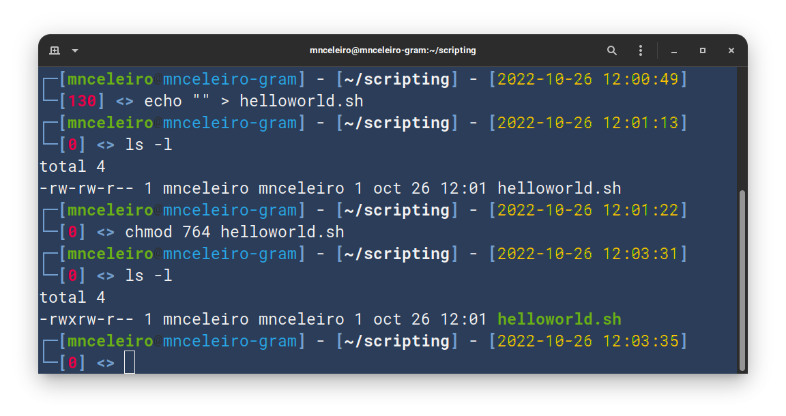
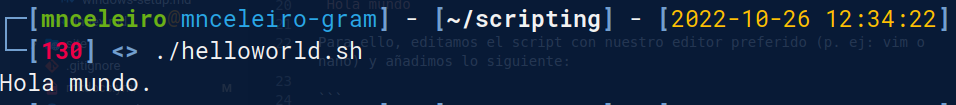
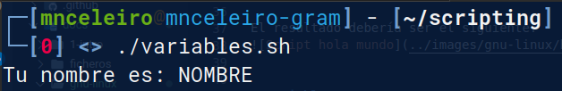
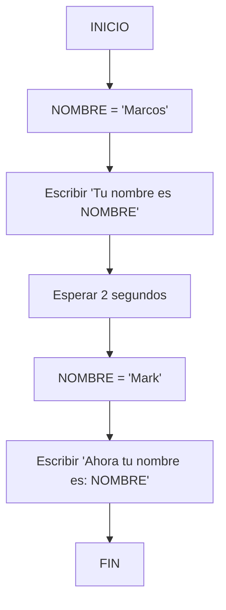
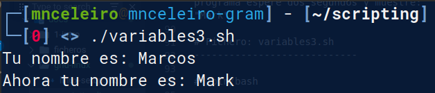
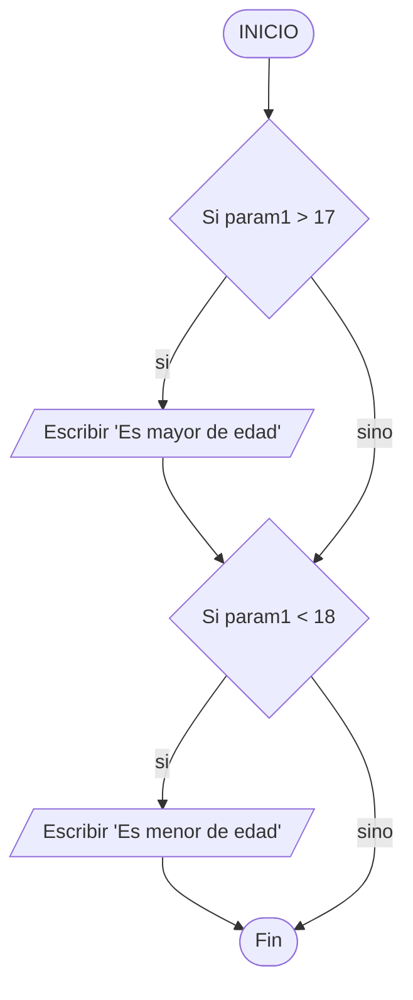
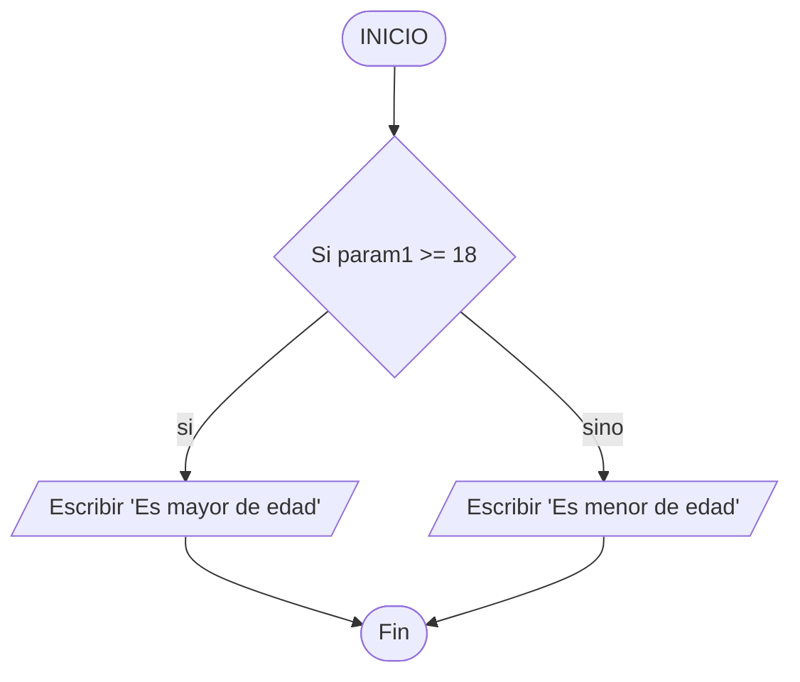
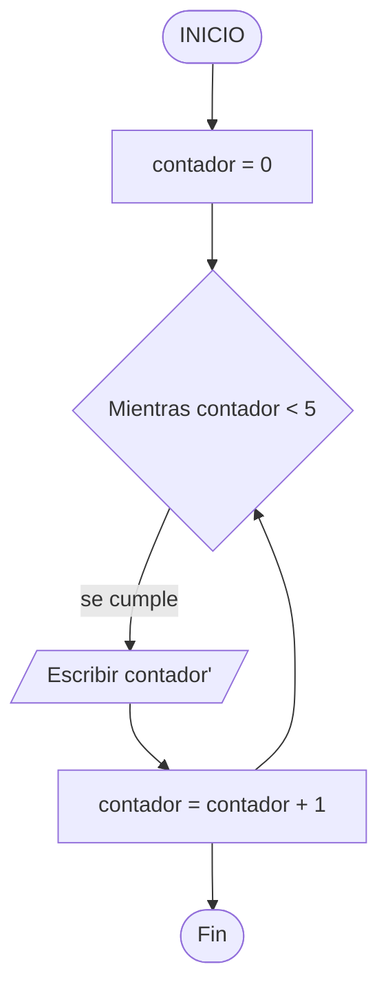

# Shell scripting
Existen múltiples shells (podemos ver cuál estamos usando mostrando con echo la variable de entorno $SHELL).

## Mi primer script
### Contenido del script
Para empezar, nuestro primer script mostrará en pantalla solamente la línea:

`Hola mundo`

Flujo de ejecución de un programa que escriba por pantalla "Hola mundo":


Para crear traducir este diagrama de flujo a un programa real editamos el script con nuestro editor preferido (p. ej: vim o nano) y añadimos lo siguiente:

```bash
#!/bin/bash

echo "Hola mundo."
```

La orden de escribir a pantalla se traduce en **shell scripting con la orden echo**.

### Permisos de ejecución
Para crear un script en BASH creamos un fichero con el nombre que queramos y le damos permisos de ejecución (u+x):

`echo "" > helloworld.sh`

Esto crea un fichero helloworld.sh al que deberíamos darle también permisos de ejecución. Para dar permisos usamos el comando chmod y podemos hacerlo de dos maneras distintas:

`chmod u+x helloworld.sh`

o

`chmod 764 helloworld.sh`

Ejemplo de realización de la tarea de creación de script y permisos de ejecución para el usuario:


### Ejecución
Para ejecutar el script podemos usar cualquiera de los siguientes comandos:

`./helloworld.sh`

`bash helloworld.sh`

El resultado debería ser el siguiente:
  

## Variables
Una variable es un sitio en memoria para guardar información. Un ejemplo de creación de una variable y asignación de un número a ella sería el siguiente:

`EDAD=35`

Veamoslo con un script de ejemplo. Crearemos una **variable** llamada **NOMBRE** donde guardaremos el nombre de una persona. Luego el ordenador escribirá por pantalla "Tu nombre es (y aparecerá el nombre guardado en la variable)."


Veamos ahora la traducción a código:

```bash title="variables.sh"
# Ejercicio: crear una variable "NOMBRE" que almacene el nombre de una persona. Después, mostrar por pantalla "Tu nombre es ________."

#!/bin/bash

NOMBRE="Marcos"
echo "Tu nombre es: NOMBRE"
```

Resultado de la ejecución (no nos sale como queremos):
  

¿Es esto lo que esperábamos? Efectivamente, el echo está funcionando como debe y el terminal nos muestra lo que le indicamos. Pero, ¿como podemos hacer que el echo nos interprete la variable **NOMBRE** e indique, por tanto, lo que hemos almacenado en la variable?

Bien, para hacer que **la palabra "NOMBRE" se interprete como una variable**, solo tenemos que **ponerle delante el caracter de DOLAR ($)**:

```bash title="variables2.sh"
# Ejercicio: crear una variable "NOMBRE" que almacene el nombre de una persona. Después, mostrar por pantalla "Tu nombre es ________."

#!/bin/bash

NOMBRE="Marcos"
echo "Tu nombre es: $NOMBRE" # (1)!
```

1. :man_raising_hand: El $ hace que en lugar de mostrar la palabra NOMBRE esta se interprete como una variable (y se muestre, por tanto, su contenido).

Resultado de la ejecución:


Ahora sí funciona correctamente. El valor que le hemos asignado a la variable es "Marcos", pero si lo cambiamos con otro la frase también cambiará.

Probemos con otro ejercicio, en este vamos a hacer lo mismo que en el anterior pero añadiremos un cambio en el nombre después de 2 segundos.



```bash title="variables3.sh"
# Ejercicio: crear una variable "NOMBRE" que almacene el nombre de una persona. Después, mostrar por pantalla "Tu nombre es ________." Después, haz que el programa espere dos segundos y muestre: "Te has cambiado el nombre y ahora es "Mark".

#!/bin/bash

NOMBRE="Marcos"
echo "Tu nombre es: $NOMBRE"

sleep 2

NOMBRE="Mark"
echo "Ahora tu nombre es: $NOMBRE"
```

Resultado:

  
 

*Para saber más: además de "VARIABLE" existe también la definición de "CONSTANTE". Una constante es lo mismo que una variable, solo que esta no puede volver a cambiarse a lo largo del programa.*

## Parámetros
Ya vimos que para acceder al contenido de una variable usamos **el caracter $** (p. ej: $nombre).

Al ejecutar un script podemos pasarle a estos una serie de parámetros. Veamos ejemplos con comandos:

- ls -l: **ls** es el comando y **-l** es el primer parámetro.
- cat fichero.txt: en este caso, cat es el comando de nuevo y **fichero.txt** sería el primer parámetro (por el cuál el comando CAT sabe que fichero debe mostrar).
- tar -cvf personas.tar paula.txt diego.txt adrian.txt: en este caso, -cvf es el primer parámetro, personas.tar es el segundo parámetro, paula.txt el tercero, etc.

Bien, nosotros podemos crear también scripts que reciban parámetros. Para mostrarlo vamos a utilizar el último script mostrado y hacer que ambos nombres (el primero y el segundo) sean elegidos por el usuario que lo ejecuta (y así no tengan por que ser siempre los mismos):

```bash title="parametros1"
#!/bin/bash

# Asignamos el parámetro 1 a la variable NOMBRE.
NOMBRE=$1
echo "Tu nombre es: $NOMBRE."

sleep 2

# Ahora, asignamos el parámetro 2 a la variable NOMBRE.
NOMBRE=$2
echo "Han pasado dos segundos y ahora tu nombre es: $NOMBRE."
```

Resultado de dos ejecuciones de ejemplo:
```
./parametros1 Ellen Elliot
Tu nombre es: Ellen.
Han pasado tiempo y ahora mi nombre es: Elliot.

./parametros1 "Ellen Page" "Elliot Page"
Tu nombre es: Ellen Page.
Han pasado tiempo y ahora mi nombre es: Elliot Page.
```

Como vemos, existen ya variables predefinidas en la ejecución de un script y a las que podemos acceder con el **$**. En este caso, $1, $2, $3 (en resumen $número) son variables que representan a cada parámetro del script.

Podríamos también haber dejado el script directamente así:

```bash title="parametros2"
#!/bin/bash

echo "Tu nombre es: $1."
sleep 2
echo "Han pasado dos segundos y ahora tu nombre es: $2."
```

El resultado sería exactamente el mismo:

- La **ventaja del primer script** es que **queda más claro que es lo que se está mostrando** (nombre es una variable muy indicativa de que es lo que se va a mostrar).
- La **ventaja del segundo script**, por su parte, es que **queda sencillo y con pocas líneas**.

Además de $número, existen muchas otras maneras de acceder a información sobre los parámetros:

| Variable      | Descripción                       |
| --------      | --------------------------------- |
| $número       | Representa el parámetro pasado en ese número ($1, $2, $3...). |
| $* y $@       | Todos los parámetros que se hayan pasado al script. |
| $#            | Número de parámetros (en el ejemplo anterior $# devolvería un 2, porque se han pasado dos nombres). |
| $0            | El nombre del script |
| $?            | Muestra el resultado del último comando ejecutado (p. ej: si no ha dado error devolverá un 0, que es éxito). |

```bash title="parametros3"
#!/bin/bash

echo "O número de parámetros pasado ao script é: $#."
echo "Nome do script: $0."
echo "O parámetro 1 é: $1."
echo "O parámetro 2 é: $2."
echo "O parámetro 3 é: $3."
echo "O parámetro 4 é: $4."
echo "O parámetro 5 é: $5."
echo "Os parámetros son os seguintes: $*."
echo "Os parámetros son os seguintes: $@."
echo "O resultado do comando anterior é: $?."
```

Resultado de la ejecución (lo pruebo con 3 parámetros):
```
./parametros3 hola boas tardes
O número de parámetros pasado ao script é: 3.
Nome do script: ./parametros3.
O parámetro 1 é: hola.
O parámetro 2 é: boas.
O parámetro 3 é: tardes.
O parámetro 4 é:.
O parámetro 5 é:.
Os parámetros son os seguintes: hola boas tardes.
Os parámetros son os seguintes: hola boas tardes.
O resultado do comando anterior é: 0.
```

Ejercicio propuesto:

```bash title="parametros4-tunombre-tuapellido"
#!/bin/bash

# 1. Escribir un saludo por pantalla: "Hola mundo."

# 2. Escribir un mensaje donde indiques el nombre del programa (siempre debe ser correcto, aunque el nombre del script cambie).

# 3. Escribir un mensaje que indique el número de parámetros pasados al script.

# 4. Mostrar todos los parámetros pasados al script.

# 5. Escribir un mensaje que ponga:
#       El parámetro 1 es: _____, el 2 es: ______ y el 3 es _______.

# 6. Prueba un mensaje con el parámetro $_.
```

## Sentencias condicionales (if/else)
En programación existen las llamadas sentencias condicionales, basicamente puedes decir lo siguiente:

```title="Pseudocódigo de un condicional if/else"
Si condición
haz algo
Sino...
haz otra cosa
```

Traducido al inglés el si condicional se denomina **if**, y el sino **else**. Una sentencia if real quedaría tal que así:


Sintaxis de if:
```bash title="Sintaxis real de un condicional if"
if [ condicion ]
then
    # Hacemos cosas
fi
```
*fi es if al revés, es la manera en que terminamos la condición*.<br />

Veamos ahora con un if/else (si se cumple la condición hacemos algo, en caso contrario hacemos otra cosa):

```bash title="Sintaxis real de un condicional if / else"
if [ condicion ]
then
    # Hacemos algo
else
    # Hacemos otra cosa
fi
```

### Ejercicio de ejemplo: menores y mayores de edad
Script que, pasando como parámetro una edad, nos diga si es menor de edad o mayor de edad (mayor o igual que 18). Utiliza solo ifs (sin else).



```bash title="condicionales1 - Intenta hacerlo!"
#!/bin/bash

# Programa al que se le pasa como parámetro una edad:
## - Si es mayor o igual a 18 años, escribe: "Es mayor de edad."
## - Si la edad es inferior a 18 años, escribe: "Es menor de edad."

# SINTAXIS PARA RESOLVER EL EJERCICIO:
# Si    parametro1      es mayor que     17
# if    $1              greater than     17
# if    [ $1                -gt          17 ]              
# then/entonces
#   echo ...
# fi

# NOTA: necesitarás dos ifs (uno para mayor y otro para menor).
```

Intenta resolverlo antes de mirar la solución (que se muestra aquí abajo!):
```bash title="condicionales1 - Solución" linenums="1"
#!/bin/bash

# Programa al que se le pasa como parámetro una edad:
## - Si es mayor o igual a 18 años, escribe: "Es mayor de edad."
## - Si la edad es inferior a 18 años, escribe: "Es menor de edad."

# SINTAXIS PARA RESOLVER EL EJERCICIO:
# Si    parametro1      es mayor que     17
# if    $1              greater than     17
# if    [ $1                -gt          17 ]              
# then/entonces
#   echo ...
# fi

# NOTA: necesitarás dos ifs (uno para mayor y otro para menor).
if [ $1 -gt 17 ]
then
    echo "E maior de idade."
fi

if [ $1 -lt 18 ]
then
    echo "E menor de idade."
fi
```

Resultado de la ejecución:
```title="Ejemplo de ejecución de condicionales1"
./condicionales1 18
Es mayor de edad.

./condicionales1 17
Es menor de edad.
```

Vamos a ver ahora algunas de las condiciones que se pueden utilizar en un condicional:

- -lt → less than (menor que)
- -gt → greater than (mayor que)
- -le → less equals than (menor o igual que)
- -ge → greater equals than (mayor ou igual que)
- -eq → *equal*, igual a.
- -ne → not equal (distinto de)

En el ejercicio anterior podríamos haber utilizado *mayor o igual que 18 ($1 -ge 18)* en lugar de mayor que 17 ($1 -gt 17). Existen muchas soluciones diferentes para cada ejercicio.

Aunque este método funciona, es más correcto hacerlo con un si / sino (if/else). Es decir, en lugar de usar dos ifs utilizamos un if y debajo un else:



```bash title="condicionales2" linenums="1"
#!/bin/bash

if [ $1 -ge 18 ] # (1)!
then # (2)!
    echo "Es mayor de edad."
else # (3)!
    echo "Es menor de edad." 
fi
```

1. Si param1 >= 18 (pregunto si el parámetro 1 es mayor o igual que 18)
2. **Si** (if) se cumple (then, entonces) --> Escribo (en pantalla) que es mayor de edad.
3. En caso contrario (sino, else) --> Escribo que es menor de edad.

El resultado es el mismo que en el anterior script. 

!!! Nota

    Un else no puede ir sin un if y un else nunca lleva condición. El else se ejecuta si no se cumple la condición del if.

### Sentencias condicionales (if/else) con más de una condición
Si te fijas bien, verás que en el else (en el sino...) no podemos poner ninguna condición. En ocasiones no nos es suficiente con poner una única condición en el if, sino que necesitamos comprobar más. Para esto podemos usar **else if (elif)**.

#### Ejercicio de ejemplo: menores de edad, mayores de edad y jubilados
Ahora, al ejercicio anterior, le vamos a añadir una condición más (vamos a comprobar si la edad pasada como parámetro corresponde a una persona jubilada).

Existen varias maneras de hacer este ejercicio:

##### Resolución con if/elses dentro de otros if/elses
Con esta solución vamos a hacer que si se comprueba que la edad es igual o superior a 18 años se haga otro if para comprobar si está jubilado o no (pueden darse ambos casos):

```bash title="condicionales3" linenums="1"
#!/bin/bash

# Programa al que se le pasa como parámetro una edad:
## - Si es mayor de 67 años, escribe: "Está jubilado."
## - Si la edad es inferior a 18 años, escribe: "Es menor de edad."
## - Si la edad es superior a 17 años pero inferior a 67, escribe: "Es mayor de edad."

if [ $1 -ge 18 ]
then
        if [ $1 -gt 67 ] # (1)!
        then
            echo "Está jubilado."
        else
            echo "Es mayor de 18."
        fi
# En caso de que no sea mayor de 18 es que es menor de edad.
else
    echo "Es menor de edad."
fi
```

1. Si el código pasa por aquí signfiica que el parámetro 1 es igual o mayor que 18 años. Ahora, ya sabiendo que superamos los 18, tenemos que comprobar si llegamos o no a la jubilación. Para eso hace falta otro if/else que compruebe si también superamos los 66 años. <br /><br/>:older_man: ¿Somos mayores de 66? → IF<br/><br/>o<br/><br/>:woman: ¿No lo somos? → ELSE

##### Resolución haciendo varias comprobaciones en el mismo if (&&)
Hasta ahora hemos puesto condiciones una sola vez (en el if). Podemos poner tantas condiciones como queramos con **else if (elif)** (significa: sino si... o en caso contrario...).

Un elif (al igual que *if*) siempre lleva condición. El *else* es el único que no lleva (lo que hay en el *else* se ejecuta solo en caso de que todo lo anterior no se cumpla).

En el mismo condicional se pueden comprobar tantas cosas como se deseen uniéndolas con AND (&&) o con OR (||):
- AND (&&): verdadero si ambas condiciones son verdaderas.
- OR (||): es verdadero si una de las dos condiciones es verdadera.

```bash title="condicionales4" linenums="1"
#!/bin/bash

# Programa al que se le pasa como parámetro una edad:
## - Si es mayor de 67 años, escribe: "Está jubilado."
## - Si la edad es inferior a 18 años, escribe: "Es menor de edad."
## - Si la edad es superior a 17 años pero inferior a 67, escribe: "Es mayor de edad."

if [ $1 -ge 18 ] && [ $1 -lt 67 ] # (1)!
then
    echo "Es mayor de edad."

elif [ $1 -ge 67 ] # (2)!
then
    echo "Está jubilado."

else
    echo "Es menor de edad."
fi
```

1. Aquí se comprueban dos condiciones:<br />- ¿Es mayor o igual que 18?<br/>- ¿Es menor que 67?<br /><br />Ambas se deben cumplir para continuar por el then.
2. Si el código va por aquí es que una de las dos condiciones anteriores no se cumplió (por tanto sabemos que o bien es menor de 18 :child: o bien es mayor de 67 :older_woman:).<br /><br />Con el elif y el else sabremos cuál es :love_you_gesture:

Aquí hemos añadido una nueva posibilidad. En el **if** hemos unido dos condiciones:

1. El parámetro 1 ($1) es mayor o igual que 18.
2. El parámetro 1 ($1) es menor que 67 años.

Hemos unido las dos condiciones con && (AND, y). Esto quiere decir que **solamente si se cumplen ambas condiciones entraría ahí**. Por tanto, si se cumplen ambas condiciones mostrará el mensaje de que es mayor de edad.

En caso de que solo necesitamos que se cumplan una de las dos usaríamos || en lugar de &&.

##### Resolución más sencilla: if/elif/else
Aunque las resoluciones anteriores son válidas, las más sencilla suele ser siempre la mejor. A continuación se os muestra otra posible solución del ejercicio (aunque con un pequeño error para que lo solucioneis).

Ejercicio: ejecuta el siguiente código y si no funciona **arréglalo**:

```bash title="condicionales5 - Encuentra el error!" linenums="1"
#!/bin/bash

# Programa al que se le pasa como parámetro una edad:
## - Si es mayor de 67 años, escribe: "Está jubilado."
## - Si la edad es inferior a 18 años, escribe: "Es menor de edad."
## - Si la edad es superior a 17 años pero inferior a 67, escribe: "Es mayor de edad."

if [ $1 -ge 18 ]
then
    echo "Es mayor de edad."

elif [ $1 -ge 67 ]
then
    echo "Está jubilado."

else
    echo "Es menor de edad."
fi
```

Intenta encontrar el error! es algo muy simple una vez te des cuenta :-).

## Bucles

### Bucle while (mientras)
La palabra *while* significa en español **mientras**. El bucle while o "mientras" hace que, en caso de cumplirse la condición, todo lo que hay dentro (entre el "do" y el "done") se ejecute repetidamente hasta que esa condiciónd el *while* deje de cumplirse. La sintaxis es similar a la del if:

```bash
while [ condición ]
do
    # Aquí escribimos todo lo que queramos hacer en caso de que la condición se cumpla
done
```

Este bucle *while* funcionará igual que el if, salvo por el hecho de que repetirá sin parar la ejecución (se repetirá una y otra vez). Vamos a ver la diferencia entre usar un IF y un WHILE con un ejemplo:

=== "Código (con if)"

    ```bash title="if-vs-while"
    #!/bin/bash

    # Ejercicio: indica si el número es positivo, no pongas nada en caso de ser negativo

    echo -n "Escribe un número: "
    read numero

    if [ $numero -gt 0 ]
    then
            echo "El número $numero es positivo."
    fi
    ```

=== "Ejecución if"

    ```
    ./if-vs-while
    Escribe un número: 2
    El número 2 es positivo.
    ```

=== "Código (con while)"

    ```bash
    #!/bin/bash

    # Ejercicio que muestra los numeros positivos.

    echo -n "Escribe un número: "
    read numero

    while [ $numero -gt 0 ]
    do
            echo "El número $numero es positivo."
    done
    ```

=== "Ejecución while"

    ```
        /if-vs-while2  
        Escribe un número: 2
        El número 2 es positivo.
        El número 2 es positivo.
        El número 2 es positivo.
        El número 2 es positivo.
        El número 2 es positivo.
        El número 2 es positivo.
        ...
        ...
    ```

Ahora veamos el código con *while*:

- Si la condición no se cumple (si le damos, por ejemplo, un -5) funcionaría igual que en el if (no pasaría nada).
- Si la condición se cumple (y mientras se siga cumpliendo) lo que hay dentro seguirá ejecutándose hasta el infinito. En el caso de este script hay que parar el programa con la combinación ++ctrl+c++.

### Ejercicios con bucle *while*

#### Contar de 1 a 5

Crea un script que cuente los números del 1 al 5 (usa para ello un bucle *while*). Si quieres sumar números puedes usar el comando **expr**: `expr 4 + 5`

La lógica del programa sería la siguiente:




A continuación se muestra un posible resultado.

```bash title="contar-hasta-5" linenums="1"
--8<-- "docs/ficheros/scripts/bucles/while/contar-hasta-5"
```

Si lo ejecutas, verás que no cuenta exactamente del 1 al 5. Arréglalo para que funcione como debe.

#### Mostrar los números entre dos números dados
Crea un script que, pasados dos parámetros, muestre os números desde el primero al último (ambos incluídos). Por ejemplo: si ejecutas el script como `./entre-numeros 20 23` la salida debería ser `20 21 22 23`.

## Bucle for (para)
La sintaxis del bucle for es similar a las anteriores:

```bash title="Sintaxis del bucle for (para)"
for VARIABLE in 1 2 3 4 5
do
    # Hago cosas
done
```
En este bucle, la VARIABLE tomaría primero el valor 1, luego el 2, luego el 3, luego el 4 y finalmente el 5. Se ejecutaría 5 veces y en $VARIABLE cada vez uno de esos valores.

Veamos un ejemplo como el anterior del *while* (que muestre números del 1 al 5).

```bash title="Mostrar números del 1 al 5"
--8<-- "docs/ficheros/scripts/bucles/for/contar-hasta-5"
```

### For con rangos
El bucle for se puede usar con rangos. La sintaxis es la siguiente:

```bash title="Sintaxis de rangos en el bucle for"
for i in {n1..n2}
do
    echo $i # (1)!
done
```

1. En este caso le estamos llamando "i" al contador. "i" recorrerá desde n1 hasta n2 todos los números.

Veamos con un ejemplo real que recorra los números del 1 al 5:

=== "Contar 5 con rangos"

    ```bash title="Recorrer números del 1 al 5 usando rangos"
    --8<-- "docs/ficheros/scripts/bucles/for/contar-hasta-5-rangos"
    ```

=== "Ejecución"

    ```
    ./contar-hasta-5-rangos 
    El contador vale: 1.
    El contador vale: 2.
    El contador vale: 3.
    El contador vale: 4.
    El contador vale: 5.
    ```

Si deseamos trabajar con rangos como ahora, pero queremos hacer que el contador vaya de 2 en 2, de 5 en 5... podemos hacerlo con la sintaxis siguiente:
```bash title="Sintaxis de rangos en el bucle for"
for i in {NUMERO_INICIAL..NUMERO_FINAL..NUMERO_DE_SALTOS}
do
    echo "$i" # (1)!
done
```

1. Se mostrará el valor de la variable i. Este valor empezará en NUMERO_INICIAL e irá saltando NUMERO_DE_SALTOS hata llegar a NUMERO_FINAL.

Por ejemplo, el siguiente código irá hacia atrás desde 20 hasta -5 (e irá de 5 en 5):
=== "Rangos con salto"

    ```bash title="Recorrer números del 1 al 5 usando rangos"
    --8<-- "docs/ficheros/scripts/bucles/for/contar-hasta-5-rangos-salto"
    ```

=== "Ejecución"

    ```
    ./contar-hasta-5-rangos-salto 
    El contador vale: 20.
    El contador vale: 15.
    El contador vale: 10.
    El contador vale: 5.
    El contador vale: 0.
    El contador vale: -5.
    ```

## Ejercicios
Realiza los siguientes ejercicios:

1. Usando un bucle *for* **con rangos**, cuenta desde el número 8 hasta el 1.
2. Usando un bucle *for* **sin rangos**, cuenta desde el número 8 hasta el 1.
3. Usando un bucle *while* cuenta desde el número 8 hasta el 0 (retrocediendo de 2 en 2).
4. Crea un script que cuente los números impares empezando en el 133 hasta 0 (bucle for). Los números deben estar en la misma línea separados por espacios.
5. Crea un script que haga un head de todos los ficheros pasados como parámetro, no importa cuántos sean (*recuerda que hay una variable que te devuelve todos los parámetros, así podrás usarlos en un bucle for sencillo*). Debe indicarse claramente (al hacer el head de cada fichero) cuál se está mostrando (más abajo tienes un ejemplo de ejecución del ejercicio).
6. Crea un script que, pasado un solo parámetro, indique si el parámetro que se le pasa es un número par o impar. Para comprobar si el número es par o impar solo hay que ver el resto de la división, para ello se usa el operador "%". Por ejemplo: para 10 % 2 el resultado será 0, para 11 % 2 el resultado (el resto) será 1.
7. Haz que el script anterior (de comprobar si un número es par o impar) funcione para cualquier número de parámetros.
8. Crea un script con un menú que pregunte al usuario las siguientes opciones:
    - (1) Ver estado de los discos.
    - (2) Ver uso de RAM.
    - (3) Mostrar las carpetas del directorio /home.
    - En caso de que el usuario ponga un número distinto de 1, 2 o 3, debe mostrarse un error.
8. Haz una copia del script anterior y añade una opción 4 que sea "Salir". El programa se repetirá continuamente mostrando el menú y pidiendo opciones hasta que el usuario pulse esa opción. También, si se elige una opción que no existe (por ejemplo: 7) debe mostrarse un mensaje de error.

### Ejemplos de ejecución de los ejercicios
A continuación se muestran ejemplos de salidas de los ejercicios anteriores al ejecutarlos:

=== "Resultado ejercicio 4"

    ```
    nceleiro@mnceleiro-gram:~$ ./contar-impares-for 
    133 131 129 127 125 123 121 119 117 115 113 111 109 107 105 103 101 99 97 95 93 91 89 87 85 83 81 79 77 75 73 71 69 67 65 63 61 59 57 55 53 51 49 47 45 43 41 39 37 35 33 31 29 27 25 23 21 19 17 15 13 11 9 7 5 3 1 
    mnceleiro@mnceleiro-gram:~$
    ```

=== "Resultado ejercicio 5"

    ```
    ./head-ficheros
    
    -------------- FICHERO: rosalia.txt ---------------------

    Adios rios, adios fontes
    Adios regatos pequenos
    Adios vista dos meus ollos
    Non sei cando nos veremos

    ------------- FICHERO: estrofa.txt ------------------------

    Adios, adios, que me vou
    Herbiñas do camposanto
    Donde meu pai s' enterrou
    Herbiñas que biquey tanto
    Terriña que nos criou

    ---------------------------------------------------------
    ```

=== "Resultado ejercicio 6"
    ```
    ./par-impar 4
    El número 4 es PAR.

=== "Resultado ejercicio 7"

    ```
    ./par-impar 4 18 22 23
    El número 4 es PAR.
    El número 18 es PAR.
    El número 22 es PAR.
    El número 23 es IMPAR.
    ```

## Tabla de diferencias entre lenguajes de programación
| Lenguaje genérico | Shell scripting | Javascript | Java |
| - | - | - | - |
| variable = "algo" | variable = "algo" | let variable = "algo" | String variable = "algo"<br/>int variable = numero |
| Escribir "texto" | echo "texto" | console.log("texto") | System.out.println("texto") |
| Leer variable<br/><br/>Leer num | read num | let num = prompt("Indica un número") | Scanner sc = new Scanner(System.in);<br/><br/>int num = sc.nextInt(); | 
| Esperar segundos | sleep segundos | setTimeout(..., milisegundos) | Thread.sleep(milisegundos) |
| Si x > 10... | if [ x -lt 10 ]; then<br/>&emsp;...<br/>else<br/>&emsp;...<br/>fi | if (x > 10) \{<br/>&emsp;...<br/>\} else if (x === 10) \{<br/>&emsp;...<br/>} else \{<br/>&emsp;...<br/>} | if (x > 10) \{<br/>&emsp;...<br/>\} else if (x == 10) \{<br/>&emsp;...<br/>} else \{<br/>&emsp;...<br/>} |

## Referencias
- How-to: Shell parameters. ss64. Obtenido de: https://ss64.com/bash/syntax-parameters.html
- Vivek Gite. Bash For Loop Examples. cyberciti. Obtenido de: https://www.cyberciti.biz/faq/bash-for-loop/#C_style_for_loop
- Shell scripting tutorial. shellscript.sh. Obtenido de: https://www.shellscript.sh

