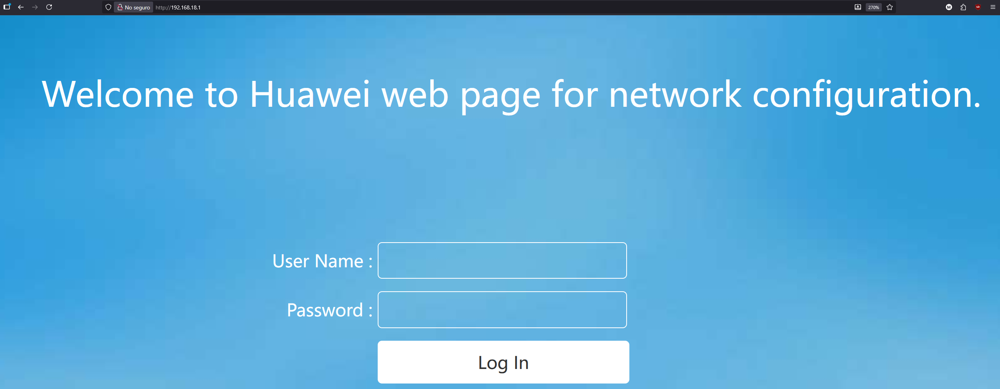
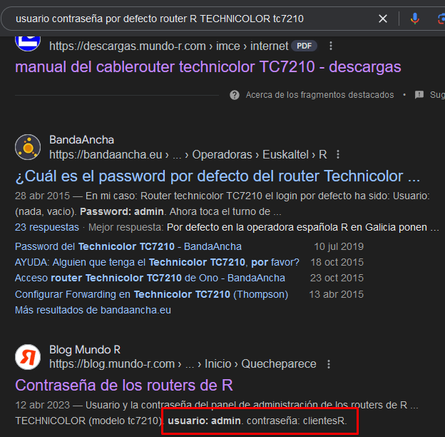

Para desarrollar páginas o aplicaciones web a veces es común utilizar Windows y XAMPP o WAMP, pero en producción (aplicaciones reales) necesitamos tener un servidor dedicado con un servidor web instalado y configurado. En este ejercicio vamos a instalar Apache en GNU/Linux.

Aún así, **deja la máquina Windows 11 anterior encendida**. Como la máquina está en **bridge**, podremos conectarla con la que crearemos en este punto.

## Instalación de servidor web Apache en Ubuntu
```rb title="contar-hasta-5" linenums="1"
--8<-- "docs/ficheros/vagrant/vagrantfiles/Vagrantfile-2-vms-ubuntu-bridge-with-gui"
```

1. Crea una máquina virtual con Virtualbox y la última versión estable de Ubuntu. Podéis usar este [script de vagrant que automáticamente descarga e instala un Ubuntu 24.04](../../ficheros/vagrant/vagrantfiles/Vagrantfile-2-vms-ubuntu-bridge-with-gui). Este script incluye 2 máquinas (vm1 y vm2).
      1. Si preferís usar un Ubuntu con Virtualbox podéis hacerlo. Si hacéis esto, instalad los *guest additions* y activad la compartición del portapapeles entre ambas máquinas.
2. [Crea un usuario](https://mnceleiro.github.io/informatica/gnu-linux/users-groups-local/#informacion-sobre-usuarios-y-grupos) de nombre <tunombre_tuprimerapellido> con el comando *useradd*. Haz que este usuario tenga un home con el mismo nombre, como shell /bin/bash y que pertenezca al grupo *sudo* (de esta manera podrá ejecutar comandos como administrador).
3. **Logueate en el terminal con ese usuario** y haz el resto de la práctica con él (de esta manera se identificará que eres tu en el prompt). *(captura: de ejecución del comando **groups** con ese usuario. Debería aparecer sudo en la lista de grupos.*
4. Mira si existe la carpeta /var/www en tu sistema, ¿existe?
5. Comprueba si puedes acceder a la página web desde tu máquina virtual usando la la URL: `localhost`, ¿puedes?. En caso de que no tengas navegador web (por no tener entorno de escritorio) puedes probar si te funciona con los comandos [`curl`](https://www.keycdn.com/support/popular-curl-examples) o `wget` (estos comandos hacen peticiones remotas).
   1. ¿Por qué crees que te ha dado un error? La razón, es que un servidor es algo que escucha en un puerto (por defecto, un servidor web escucha en el 80 y localhost es tu propia máquina). No tenemos ningún servidor instalado que escuche en el 80, así que vamos a instalar uno para poder así montar nuestro propio entorno web en él.
6. Instala el servidor web Apache (`sudo apt install apache2`).
7. Verifica que Apache está en ejecución. Para arrancar, parar, reiniciar o comprobar el estado de un servicio en la mayoría de linux modernos usamos el comando `systemctl`. Si está en ejecución todo está bien, en caso de que no lo esté arráncalo.
8.  Comprueba ahora los pasos anteriores de nuevo (si funciona la URL `localhost` en el navegador web de tu máquina virtual (o con `curl` o `wget`). Debería funcionarte.
9.  Accede ahora a `localhost` desde tu máquina principal. Si lo haces, el servidor web no te va a devolver la página, ¿por qué?
    1.  La ip `localhost` es 127.0.0.1 y referencia **a la propia máquina**. Por tanto, si desde tu máquina principal pones esa ip a donde estás entrando es a esa máquina (no a la virtual donde está el servidor instalado). Recuerda que son dos máquinas diferentes.
10. Intenta ahora acceder a la máquina (tendrás que usar su dirección ip). Debería aparecerte la página web al poner la IP en el navegador.
11. El servidor web está mostrando una página de prueba que viene con la instalación del servidor Apache. El fichero index.html es el que contiene esta página. Localiza donde está ese index.html (pista: es en una ruta en que te he preguntado antes!) y modifícalo con tu nombre y apellidos.
12. Si estás en una clase con otros compañeros, diles que entren a tu ip de máquina virtual (y tu puedes entrar en la suya). Puedes también probar las ips subsiguientes/anteriores y ver que ocurre (verás que todos estáis en red!)

## Apache: permisos y acceso a la web
11. Vamos a jugar un poco más. Estamos accediendo a la web por ip, pero sería más interesante hacerlo por nombre. Un servidor DNS se ocupa de resolver los nombres de dominio y asociarlos con IPs, pero es un poco complejo y se sale del límite de esta práctica. Por esta razón, lo que vas a hacer es cambiar el `fichero hosts`de la máquina Windows de la práctica anterior y añadir la IP de tu servidor Linux referenciada a `curriculum.tunombre.local`.
    1.  Busca en internet donde encontrar el "fichero hosts" en Windows (es el mismo tanto en Windows 10 como en Windows 11.
    2.  Abre el fichero hosts en tu máquina Windows (la de la práctica anterior).
    3.  Mapea la IP de tu servidor web al dominio `curriculum.tunombre.local`
    4.  Si lo has hecho bien deberías poder acceder desde esa máquina a la máquina Linux a través de "miservidorweb.local" como URL.
12. Lee la teoría explicada en la sección de [document root de Apache](../apache#carpeta-de-apache-document-root)
13. Consulta los permisos de la carpeta *document root* de Apache.
14. Modifica el index.html para que solo aparezca una línea con tu nombre y apellidos en un <h1\>. *(captura con el terminal y la página con tu nombre y apellidos)*.
15. Antes has consultado los permisos de la carpeta de Apache, ¿has podido editar el index.html sin sudo? ¿Por qué (si o no) puedes? Explícalo teniendo en cuenta el usuario y grupo al que pertenece el fichero.
16. Dile a una IA de tu elección que te genere un curriculum en HTML y CSS con todo integrado en un solo fichero index.html. Indícale tu nombre y apellidos y lo demás (si no quieres poner tus datos reales puedes inventarlos). Al menos debería tener:
    1.  Nombre y apellidos
    2.  Edad
    3.  Estudios (p. ej: ESO, Bachillerato, ciclo medio de ..., etc.).
    4.  Trabajos en los que has estado.
17. Copia el texto que te genera en el index.html de tu servidor web. Ya tienes un curriculum en formato web que, si tienes suerte, se verá bastante bien. Intenta que quede bien, a ver que tal se os da pedir cosas a las IAs :-)

## Apache: configuración de Virtualhosts
Los virtualhosts nos permiten crear múltiples webs en la misma máquina y mismo puerto (usando nombres de dominio diferentes gracias a la cabecera "Host" de HTTP). Vamos a ver como hacerlo:

1. Crea un fichero de nombre curriculum en /etc/apache2/sites-available.
2. Prueba la configuación con `apache2ctl configtest`.
3. Aunque tenemos el sitio definido, necesitamos habilitarlo. Para ello tenemos que tener el fichero .conf en `/etc/apache2/sites-enabled`. Hay un comando que ya nos crea un enlace débil del fichero que hemos creado antes: `sudo a2ensite curriculum` (a2ensite es de "Apache 2 enable site").

```
<VirtualHost *:80>
    ServerName curriculum.tunombre.local
    ServerAlias curriculum.tunombre.local curriculum

    ServerAdmin webadmin@ejemplo.local

    DocumentRoot /var/www/curriculum

    ErrorLog ${APACHE_LOG_DIR}/sitio1_error.log
    CustomLog ${APACHE_LOG_DIR}/sitio1_access.log combined

    <Directory /var/www/sitio1/public_html>
        Options Indexes FollowSymLinks
        AllowOverride None
        Require all granted
    </Directory>

</VirtualHost>
```

4. Ahora, crea otros dos hosts virtuals (virtual hosts) con el siguiente document root:
    1.  Para el curriculum arréglalo para que esté en: /var/www/curriculum
    2.  Para un restaurante arréglalo para que esté en: /var/www/restaurante
    3.  Para una tienda de comics arréglalo para que esté en: /var/www/tiendacomics

Ya lo tenemos! Hemos conseguido instalar un servidor web Apache en GNU/Linux con varios virtualhosts y varias páginas web en el mismo servidor. Si tuviésemos además un servidor DNS, no tendríamos que modificar el `/etc/hosts` de las máquinas cliente para que se pueda entrar en las páginas.

## Parte OPCIONAL (PARA NOTA!): Redirección de puertos
1. En la misma máquina virtual anterior, comprueba los adaptadores de red y asegúrate de que quede solo puesto adaptador puente (*bridge*).
2. Mira la IP en tu máquina virtual y asegúrate de que, desde la máquina host, puedes acceder a la página web con tu curriculum.
3. Asegúrate de que tu móvil esté conectado a la wifi de tu casa. Comprueba si puedes acceder al servidor web desde tu móvil (si tanto el ordenador como el móvil están en la misma red debería funcionarte).
4. Bien, ahora **desactiva la wifi de tu móvil** e intenta entrar de nuevo con tu conexión de datos, ¿te funciona la página? No debería funcionarte. Razona por qué no funciona: pregunta a una IA de tu elección, dale datos concretos e intenta entender en detalle por qué falla la conexión a la página. (*Captura de los prompts, tu explicación y la respuesta de la IA utilizada*).

Bien, la razón por la que no podemos conectarnos es porque en el momento en que quitamos la wifi, **estamos intentando entrar desde internet a una ip privada**. Ten en cuenta lo siguiente:

### Un poco de teoría: ¿por que no funciona la página sin wifi?
- En tu casa, sin importar cuántos móviles, tabletas o equipos de sobremesa tengas, **solo tienes una ip pública y todos acceden con ella a internet (es la misma para todos vuestros equipos)**. Dentro de tu casa manejas ips privadas.
- Por defecto, todos los puertos del router de tu casa están cerrados. Por tanto, si intentas acceder desde tu móvil por 4G (tu móvil no está en tu red local, sino en internet) **no funcionará, ya que no puede acceder al puerto 80 de tu ip pública** (por seguridad todos los puertos de acceso desde fuera a tu casa están cerrados por defecto).
- Además, si tecleas la ip pública de tu casa (supongamos que es: 1.2.3.4) y en tu casa hay 5 equipos encendidos, ¿como sabe el router a cuál enviar la petición? Recuerda que la ip pública la tiene el router! Desde fuera conectas con el router.
- Para solucionar este problema existe el concepto de redirección de puertos (*port forwarding*). Para exponer tu curriculum a internet necesitas indicar al router que, todo el tráfico que le llegue al puerto 80 lo redirija a la IP privada de tu elección (en este caso será la ip privada asignada a la máquina virtual).

La comprensión de toda esta explicación depende de tus conocimientos sobre redes. Si lo entendiste más o menos, quizá es bueno que vuelvas a echar un ojo a la explicación que te ha dado la IA en el ejercicio anterior (o incluso volver a preguntarle si quieres hacerlo de otra manera diferente).

### Haciendo que funcione la página desde internet (móvil sin conectar a la wifi)
Al desconectar tu móvil de la wifi, este está en internet y no en tu red local. Como tu móvil no está en tu red privada, tienes que conectarte a tu servidor usando la IP pública (la ip de tu router). Vamos a ver como hacer todo este proceso:

5. Necesitamos entrar en nuestro router (que puede ser de muchas marcas y modelos diferentes). Para conectarnos al router necesitamos saber la ip del mismo. Usando `ipconfig` (Windows) mira si ves ahí la IP de tu router (aparecerá como "puerta de enlace predeterminada").
6. Una vez la tienes, inserta esa ip en un navegador web (lo puedes hacer desde la máquina principal o la virtual, ya que están ambas en la misma red local). Te recomiendo hacerlo desde la principal, ya que te será más cómodo.



7. En la imagen anterior ves un ejemplo de pantalla de *login* en un router Huawei (según el modelo de Huawei también puede cambiar). Necesitas averiguar el usuario y contraseña por defecto del mismo (si lo tienes de fábrica). Hay dos maneras en que puedes hacerlo:
      1. **Forma I:** mira en las etiquetas del router (debajo de él) y revisa si ves un usuario y contraseña para conectarte. Suelen ser combinaciones como: "admin:admin", "admin:1234", etc.
      2. **Forma II:** buscar en Google: "usuario contraseña por defecto router R TECHNICOLOR tc7210"



### Acceso al router
8. Accede al router con tu usuario y contraseña y explora las opciones que hay (puedes ver, por ejemplo, cuántos dispositivos hay conectados en tu casa y que IP privada tienen).
2. Busca el reenvío de puertos. Puede aparecer como: apertura de puertos, *port forwarding*, redirección de puertos, reenvío IP, etc. Si no lo encuentras ayúdate de Google o IAs.
3. **EN ESTE APARTADO NO HARÁ FALTA QUE GUARDES LOS CAMBIOS, solo es obligatorio rellenar lo que te digo (pero no guardarlo)**. Intenta configurar lo siguiente (ayúdate de nuevo de internet): Intenta que el tráfico que va al puerto 80 de tu ip pública (es decir, de tu router) se reenvíe al puerto 80 de tu servidor webg (es decir, de la ip de tu máquina virtual). *(captura de la configuración del router)*.
4. Si has decidido guardar los cambios y lo has hecho todo bien, el puerto 80 quedará expuesto a internet (esto significa que deberías poder acceder desde tu móvil a tu página web hosteada en el servidor Apache). Si aparece la página web al entrar desde tu móvil **significa que conseguiste montar un servidor web en tu equipo, con tu propia página y todo accesible desde internet, ¡¡Enhorabuena, BUEN TRABAJO!! :material-party-popper::material-party-popper::material-party-popper::material-party-popper::material-party-popper::material-party-popper::material-party-popper::material-party-popper:**
5. Finalmente, si has decidido aplicar la regla (guardar los cambios y probar) simplemente ahora puedes eliminarla para que ningún puerto de tu router quede expuesto hacia fuera.

!!! Note "Si no te funciona..."
    Si no te ha funcionado el reenvío de puertos y consideras que has hecho todo bien, es posible que no sea fallo tuyo. A veces el operador utiliza CG-NAT (esto es, comparte tu ip pública con otros clientes a la vez que contigo). Si es así puedes simplemente ignorarlo.

    En caso de que en el futuro quieras abrir puertos al exterior de verdad y exponer tu servidor web, un NAS, un servidor SSH u otro servicio puedes comentárselo a tu operador en llamada telefónica y luego podrás hacerlo sin problemas.

    Finalmente, no olvides eliminar la regla del reenvío de puertos.
