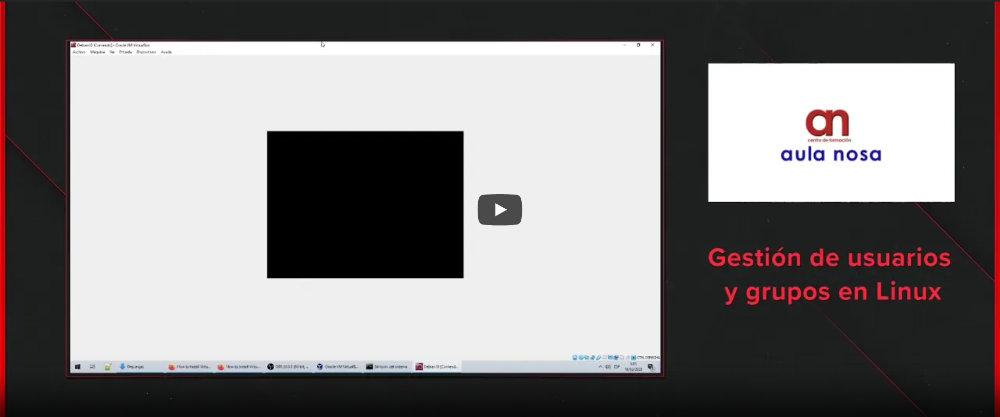

## Información sobre usuarios y grupos
La información de los usuarios y grupos locales que hay en el sistema, en GNU/Linux, **la información sobre gestión de usuarios y grupos se almacena en los siguientes ficheros**:

| Fichero | Descripción |
| ------- | ----------- |
| /etc/passwd | Fichero de usuarios. |
| /etc/group | Fichero con los grupos |
| /etc/shadow | Fichero con las contraseñas (encriptadas) |
| /etc/skel | Es el esqueleto de creación de un nuevo usuario. Esto es, cuando se crea un nuevo usuario mediante el comando **useradd**, los ficheros que haya en /etc/skel se copiarán en su home. |
| /etc/default/useradd | Aquí se define donde está el esqueleto (/etc/skel por defecto) para crear nuevos usuarios y el SHELL que se usará por ellos. | 

## Comandos de gestión de usuarios

| Comando | Descripción |
| - | - |
| id id [-un] | Muestra el id y nombre del usuario actual y todos los grupos en los que está (tanto el principal como lo secundarios). Se podría obtener la misma información con un: **cat /etc/group \| grep "usuario"** |
| whoami | Muestra solamente el usuario actual que está ejecutando el comando. Es equivalente a hacer un **id -un**. |
| adduser | Crea un usuario de forma interactiva (este no nos es útil para automatizar tareas mediante scripts). |
useradd | Crea un usuario. La sintaxis es la siguiente:  useradd -m [-d ruta_carpeta_home] [-s shell_a_utilizar] <nombre_usuario>.   Un ejemplo real, para el usuario "marcos", podría ser el siguiente: **useradd** **-m** **-d** /home/marcos **-s** /bin/bash **marcos**. |
| 

A continuación se muestra en un tutorial en vídeo como gestionar usuarios y grupos locales en Debian y derivados:
