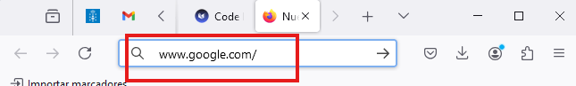
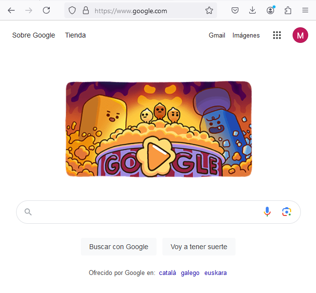

# Servidores web
Los servidores web se ejecutan a través del protocolo HTTP (puerto 80) y HTTPS (puerto 443). Pero, ¿cómo funciona un servidor web?

Deberíamos conocer un poco el concepto de protocolo TCP y el concepto de puerto. Aún así, un servidor web basicamente hace una petición al puerto 80/443 y recibe una respuesta.

## Lo que envía el navegador
Si entramos a www.google.com desde el navegador...



Lo que el **navegador de verdad envía** es lo siguiente:


```title="Petición web a Google (REQUEST). Lo que ENVÍA EL NAVEGADOR WEB" linenums="1" hl_lines="1-2"
GET / HTTP/2
Host: www.google.com
User-Agent: Mozilla/5.0 (Windows NT 10.0; Win64; x64; rv:130.0) Gecko/20100101 Firefox/130.0
Accept: text/html,application/xhtml+xml,application/xml;q=0.9,image/avif,image/webp,image/png,image/svg+xml,*/*;q=0.8
Accept-Language: es-ES,es;q=0.8,en-US;q=0.5,en;q=0.3
Accept-Encoding: gzip, deflate, br, zstd
Connection: keep-alive
Upgrade-Insecure-Requests: 1
Sec-Fetch-Dest: document
Sec-Fetch-Mode: navigate
Sec-Fetch-Site: cross-site
Priority: u=0, i
TE: trailers
```

Lo más interesante aquí son las dos primeras líneas (somos el navegador web, el cliente que quiere ver lo que hay en google.com). Explicamos las más interesantes de toda la petición:

- **GET / HTTP/2**: quiero el recurso que está en el directorio raíz, uso el protocolo HTTP versión 2.
- **Host**: www.google.com: hago la petición a la web www.google.com. En la línea anterior é indicado que quiero el directorio raíz de esta página web.
- **Accept: ...**: esto es el formato que yo, como cliente, espero que me devuelvan. En este caso estoy aceptando HTML, XML y una serie de formatos de imagen.
- **Accept-Language: es-ES**: indico que el idioma que quiero es el español.
- **Accept-Encoding: gzip**: la respuesta viene comprimida (por lo que ocupa menos espacio). Así es más rápida ya que hay menos datos que transportar.

**¿Bien pero ahora, cuál es la respuesta?**

## Respuesta que recibimos del servidor
Lo que vemos al escribir en el navegador la dirección de Google es lo siguiente:



Pero, ¿qué es lo que hay en realidad?

En la respuesta se obtiene el siguiente texto:

```title="Respuesta de GOOGLE (RESPONSE). Lo que en realidad hay detrás de la imagen" linenums="1" hl_lines="1-2"
HTTP/2 200
date: Wed, 25 Sep 2024 18:27:35 GMT
expires: -1
cache-control: private, max-age=0
content-type: text/html; charset=UTF-8
strict-transport-security: max-age=31536000
content-security-policy-report-only: object-src 'none';base-uri 'self';script-src 'nonce-LP5Qz-1ZkYGmJpHHPxG-Mg' 'strict-dynamic' 'report-sample' 'unsafe-eval' 'unsafe-inline' https: http:;report-uri https://csp.withgoogle.com/csp/gws/other-hp
cross-origin-opener-policy: same-origin-allow-popups; report-to="gws"
report-to: {"group":"gws","max_age":2592000,"endpoints":[{"url":"https://csp.withgoogle.com/csp/report-to/gws/other"}]}
accept-ch: Sec-CH-Prefers-Color-Scheme
content-encoding: br
server: gws
content-length: 64200
x-xss-protection: 0

<!doctype html><html itemscope="" itemtype="http://schema.org/WebPage" lang="es"><head><meta charset="UTF-8">...
```

La última línea es TODO el HTML de la página.
