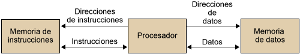

## Arquitecturas tradicionales
### Von Neumann
A finales de los años 40, Von Neumann se integró en un grupo y trabajó en el desarrollo de EDVAC, similar a ENIAC pero añadiendo el concepto de “programa almacenado”. Antes de esto el programa no se guardaba en memoria (la cuál era solo para datos) sino que se indicaba a la máquina qué hacer a través de conexiones físicas.

Dicho de otra manera, la lógica de programación era estaba basada en relés y conexiones cableadas en las anteriores arquitecturas (principalmente Harvard) y para cambiar un paso del algoritmo había que recablear. Esto se cambió en esta arquitectura unificando memoria de datos e instrucciones en una sola memoria principal, simplificando la doble gestión de control de datos e instrucciones.

!!! Nota

    La gran aportación de Von Neumann respecto a arquitecturas preexistentes (p. ej: Harvard) fue eliminar la lógica de programación basada en relés o conexiones cableadas, unificando la memoria de datos y la de programa en una sola denominada como **memoria principal** y simplificando, por tanto, la doble gestión de control de datos y programa. Además mejoraba la disponibilidad incremental de espacio permitiendo dividir entre una y otra a voluntad.

[Puedes probar aquí el funcionamiento de VonNeumann](https://lab.xitrus.es/VonNeumann/).

### Harvard
Se distingue de Von Neumann por la división de la memoria en instrucciones y datos, de manera que el procesador puede acceder separada y simultáneamente a ambas.

La arquitectura Harvard original no dispone de una memoria de programa, sino que la programación se realiza encendiendo y apagando relés (la consideración de programación en términos de memoria fue posterior).

### Harvard modificada
Actualmente, las arquitecturas ARM, x86 y AMD64 son de tipo “Harvard modificado”. Esto es, permiten acceso simultáneo a la memoria de programa y de datos solo a nivel de caché, mientras que en memoria principal se encuentran juntas al clásico estilo de arquitectura Von Neumann.

La arquitectura Harvard modificada auna las ventajas de ambas:

- Mantiene una única memoria principal con datos e instrucciones, simplificando así la lógica de circuitos y el espacio.
- Permiten la protección de instrucciones a nivel de procesador mediante la separación a nivel de caché.
- Al estar separados en la CPU, existe un acceso paralelo simultáneo a datos e instrucciones, con el consiguiente aumento de rendimiento

### Arquitecturas actuales
Actualmente existen tres arquitecturas ampliamente utilizadas que son:

- **x86:** arquitectura de 32 bits de Intel (basada en CISC)
- **AMD64/x86-64:** arquitectura de 64 bits creada por AMD que extendía la anterior (basada en CISC).
- **ARM:** arquitectura basada en RISC, con conjuntos de instrucciones más simples.

#### Arquitectura x86 (32 bits)
La arquitectura x86 es probablemente la más utilizada de la historia en ordenadores. Se ha creado en los años 70.

El primer microprocesador se ha lanzado en 1971 por Intel. Años más tarde, en 1978 Intel lanza el procesador **Intel 8086**, primer procesador con juego de instrucciones x86 y que usaba una arquitectura de 16 bits. Su nombre se utilizó para nombrar los próximos procesadores de Intel: 80186, 80286, 80386, 80486, etc.

Aunque x86 era inicialmente de 16bits, las versiones más actuales y que conocemos en ordenadores las últimas décadas son de 32 bits. Los ordenadores con arquitectura x86 cesaron su producción en 2007.

#### Arquitectura AMD64 (64 bits)
La arquitectura x86 era de Intel y utilizaba instrucciones de 32 bits desde 1985. La arquitectura más usada actualmente en ordenadores personales es AMD64 (de 64 bits).

En el año 2003 el mercado de procesadores se dividía entre dos marcas que competían entre sí: **AMD** e **Intel** (algo que sigue ocurriendo a día de hoy). AMD se les adelanta en el mercado en esta época sacando procesadores con una nueva arquitectura con un juego de instrucciones x86_64 que no solo era de 64 bits, sino que incluía también en ella el juego de instrucciones completo de x86 tanto para 16 bits como para 32, permitiendo así instalar programas de todo tipo. Consulta [este enlace](https://www.thinkinvirtual.com/2017/03/diferencias-entre-i386-x86-x64-amd64-e.html) para más información sobre el tema.

#### ARM
La arquitectura ARM (Advanced RISC Machines) es la más utilizada en dispositivos móviles, teniendo un bajo consumo de energía. Aunque a día de hoy practicamente todos los ordenadores que compramos son x64, están empezando a fabricarse ordenadores con arquitectura ARM.

Como ejemplo, Apple ha empezado hace muy poco tiempo a usar procesadores con arquitectura ARM para sus portátiles. No es posible instalar software para arquitecturas de 64 bits en ordenadores que usan ARM (por lo cuál la decisión de Apple no es tomada a la ligera).

Muchos dispositivos hoy en día dependen de baterías, pero la tecnología de mejora de baterías apenas ha mejorado en toda una década y esto hace que se busque mejorar el tiempo de uso en batería de otras maneras, y esta arquitectura es buena para ello.

## Práctica
Para redactar la práctica entrega capturas con todos los ejercicios.

1. Busca el modelo de procesador y la RAM de la que dispone tu ordenador, así como su arquitectura.
2. Si dispones de [este ordenador](https://es.aliexpress.com/item/1005003280539571.html) y quieres instalar en el el programa [VirtualBox](https://www.virtualbox.org/). Indica por qué no puedes instalar la última versión y cuál sería la última válida (lo difícil aquí es pensar por qué la última versión no vale, después busca la última compatible con ese ordenador).

## Referencias
- Diferencias entre i386, x86, x64, AMD64 e IA64. Thinkinvirtual. Obtenido de: https://www.thinkinvirtual.com/2017/03/diferencias-entre-i386-x86-x64-amd64-e.html
- José María López. La guerra de los procesadores: CISC versus RISC (o x86 contra ARM). Hipertextual. Obtenido de: https://hipertextual.com/2021/09/procesadores-risc-cisc-arm
