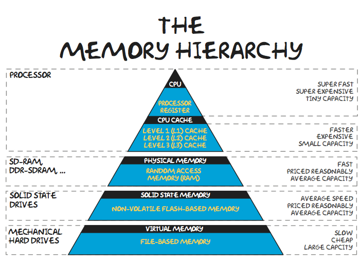

## La memoria RAM

La memoria RAM (Random Access Memory o memoria de acceso aleatorio) tiene capacidad para
almacenar datos, pero lo más importante a conocer de ella es que esos datos se perderán en el
momento en que la RAM se quede sin energía (cuando apagues el ordenador).

### Funcionamiento de la CPU y las memorias

Hemos visto los principales componentes que forman parte del hardware de un ordenador.
Ahora veremos como funciona un procesador en asociación con la memoria RAM.

- El procesador se encarga de ejecutar los programas.
- La memoria RAM se encarga de almacenar los datos.

Cuando la CPU ejecuta un programa este se carga en la memoria RAM (debido a que la CPU
tiene acceso directo a la RAM y puede guardar y cargar datos de forma muy veloz).

Además, existe un tipo de memoria persistente denominada caché. Cuando se ejecuta un
programa algunos datos se almacenan en esta memoria (la cuál es persistente y todavía más
rápida que la RAM, pero de mucho menos tamaño).

|  |
|:-:|
| *Jerarquía de memorias (velocidad vs capacidad). Imagen obtenida de: [Teachbooik.com.au](https://runestone.academy/ns/books/published/welcomecs/_images/Memory-Hierarchy.jpg)*. |

Cuánto más cercana está la memoria utilizada a la CPU, más veloz es (el acceso a ella por la CPU
es más rápido). Además de esto, cuánto más lejana está la memoria de la CPU (y por tanto, más
lento es el acceso a ella) más barato es también el precio.

## Módulos de RAM según su forma

Las ranuras de memoria RAM (o memoria principal) son fácilmente identificables en la placa base gracias a las pestañas laterales (y que normalmente se encuentran muy juntas y van en pares de: 2, 4 u 8 dependiendo del factor de forma de la placa base.

|  |
|:-:|
| *Ranuras de memoria RAM DDR3. Imagen obtenida de: [Wikibooks](https://es.m.wikibooks.org/wiki/Archivo:DDR3_RAM_slots_%E2%80%93_dual_channel-top_oblique_PNr%C2%B00302.jpg)*. |

Inicialmente los módulos de RAM eran circuitos integrados de memoria que se soldaban directamente a la placa base (por lo general eran módulos **DIP** de 14 o 16 pines). Antiguamente los módulos se conectaban a la placa mediante unas patillas delicadas denominadas módulos **SIP**. Hacia finales de los años 80 (más o menos la época del 386) aparecieron los zócalos **SIMM**, luego los **DIMM** y finalmente los **RIMM**.

### Módulos de memoria RAM: SIMM (1983)
A mediados de los 80 aparecieron las primeras memorias RAM cuyo módulo era una placa de circuito impreso (PCB) similar a los actuales. Estos son los módulos SIMM (Single In-line Memory Module).

Las memorias SIMM llevaron, a lo largo de su historia, capacidades de entre 256 KiB hasta 128 MiB de tipo DRAM (las de 128 MiB se usaban para servidores).

!!! Nota

    Antes de las SIMM, para ampliar la RAM en un ordenador se iban soldando los módulos a la placa. Era, por tanto, difícil quitarlas sin causar daños. Las RAMs SIMM se insertan en un slot (como se hace actualmente) y por tanto son sencillas de quitar e instalar.

#### Número de pines
Las memorias SIMM tenían 30 contactos y, posteriormente, de 72. Las memorias de 30 contactos permitían transmitir 8 bits de datos a la vez, mientras que las de 72 contactos transmitían 32 bits.

### Módulos de memoria RAM: DIMM (90s)
Los módulos DIMM (Módulo de memoria en dos líneas, *Dual In-line Memory Module*) son los utilizados a día de hoy. La diferencia con las anteriores (que, en su versión de 72 contactos transmitían 32 bits de datos) es que las SIMM solo transmitían por una de sus dos caras. Las DIMM pueden transmitir datos por ambas caras (por eso lo de "dual" de su nombre), es decir, permiten transmitir el doble de bits (64).

Los módulos DIMM son la evolución de los SIMM y tienen 168, 184, 240 y 288 contactos con un tiempo de respuesta inferior a 10 nanosegundos. Dentro de los módulos DIMM se destacan seis tipos, todos del mismo tamaño pero diferenciados por el número de conectores:

- SDRAM (168 conectores y potencia de 5.5 voltios).
- DDR (184 conectores y potencia de 2.6 voltios). Año 2000.
- DDR2 (240 conectores y potencia de 1,8 voltios) Salieron en 2003.
- DDR3 (240 conectores y potencia de 1.5 voltios). Salieron en 2007.
- DDR4 (288 conectores y potencia de 1.2 voltios). Salieron en 2014.
- DDR5 (288 conectores y potencia de 1.1 voltios). Salieron en 2020.

!!! Nota

    Los módulos de tipo DIMM transmiten datos por ambas caras (con lo cuál doblan su velocidad) y son los que se utilizan aún hoy en día. Además, en portátiles los módulos se denominan SO-DIMM (son más pequeños, la "S" es de Small). Si quieres comprar ram para portátiles debes elegir los módulos SO-DIMM.

!!! Nota

    Los módulos SO-DIMM son más pequeños y se usan en portátiles. Su número de patillas tampoco tiene por qué ser el mismo. En el caso de DDR5 un módulo DIMM tiene 288 patillas/pins/conectores, pero en el caso del SO-DIMM se reducen a 262.

### Módulos de memoria RAM: RIMM (90s)
**Hoy en día están obsoletos.** Tuvieron una alta demanda con placas base para Pentium 4.

El ordenador no funcionaba bien si alguna ranura de RAM estaba vacía. Funcionaban en frecuencias muy elevadas y daban muy buen rendimiento para su época pero requerían también buenos disipadores de calor y su coste era muy alta.

|  |
|:-:|
| *Memorias SIMM y DIMM. Imagen obtenida de: [FS Community](https://community.fs.com/es/article/types-of-server-ram.html)*. |

## Tipos de RAM según su forma de sincronización

## Resumen
Actualmente se usan módulos DIMM de tipo DDR5 SDRAM. Veamos que significa esto:

- El módulo de RAM es de tipo **DIMM** (esto es, transmiten 32 bits por cada cara del módulo = 64 bits).
- La RAM **utiliza el reloj para transmitir**. Con cada pulso de reloj se transmiten datos (SDRAM). La **"S" es de Sincronizada** (*synchronous*).
- Hemos visto que hay versiones de DDR desde la 1 hasta la 5. Antes de DDR se transmitía una vez por ciclo de reloj (en la bajada). DDR aprovecha cada subida y bajada de cada ciclo de reloj para transmitir (por tanto se **transmiten el doble de datos**: **double data rate -> DDR**)
- Hay RAMs de tipo estáticas y dinámicas. La RAM usada actualmente es dinámica (la "D" de SDRAM).
- Actualmente se están vendiendo RAMs DDR de versiones 4 y 5. La última versión en 2023 es la 5 (DDR5 SDRAM).

## Características
Las características más interesantes a considerar a la hora de seleccionar una memoria principal comercial son las siguientes:

- Capacidad: es su característica principal, determina la cantidad de información que se puede almacenar. Se mide en Gigabytes.
- Frecuencia: se mide en Hertzios. Las memorias DDR5 actuales parten de 2400 MHz. Como en DDR se transmite dos veces por ciclo de reloj, esto en la práctica (y en las webs de venta de memorias) aparecerá como el doble: 2400 x 2 = 4800 MHz.
- Latencia: es el tiempo que se tarda en acceder a un dato.

## Referencias
- SIMM. Obtenido de [Wikipedia](https://es.wikipedia.org/wiki/SIMM). Última consulta: 17/10/2023.
- Ángel Aller. Tamaño de las memorias: Historia y cómo han evolucionado hasta ahora. Obtenido de [ProfesionalReview](https://www.profesionalreview.com/2020/05/17/tamano-memorias-historia/#1983_Wang_Laboratories_crea_el_modulo_SIMM). Última consulta: 17/10/2023.
- Nate Gentile. Todo sobre la RAM. Obtenido de: [Youtube de Nate Gentile](https://www.youtube.com/watch?v=yRNwl24l39E)
- RIMM. Obtenido de [Wikipedia](https://es.wikipedia.org/wiki/RIMM)
