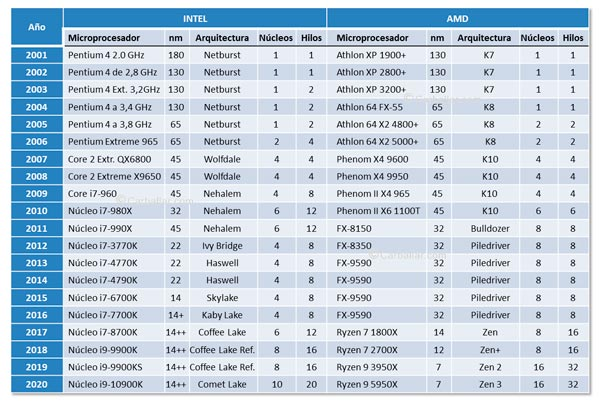
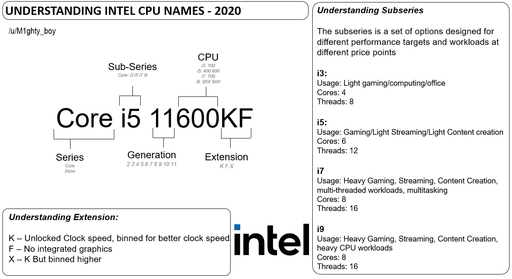
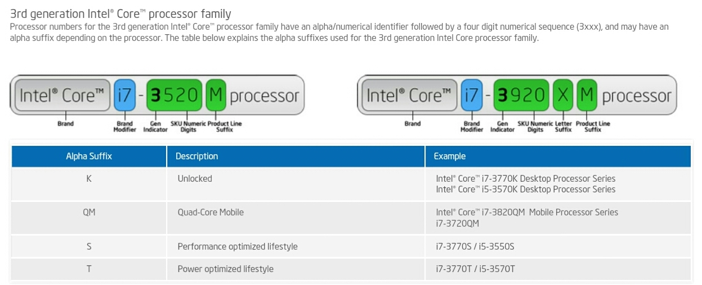
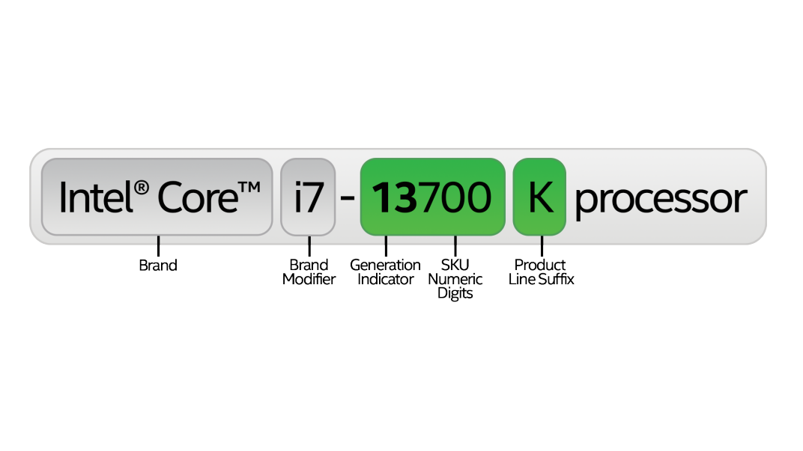
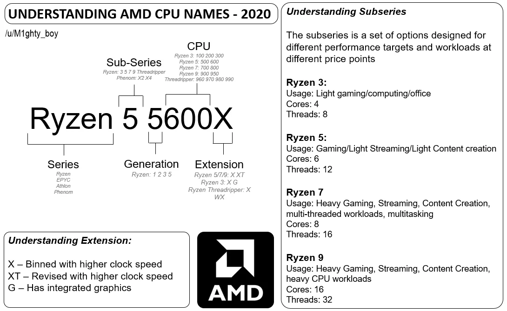
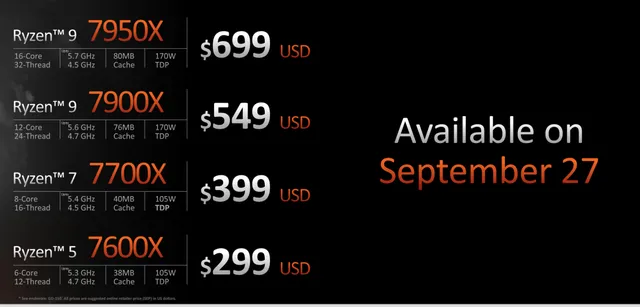
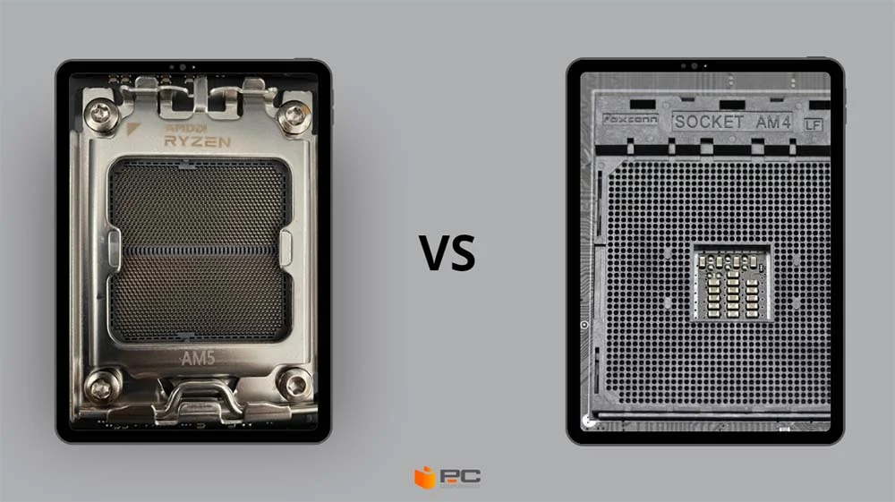
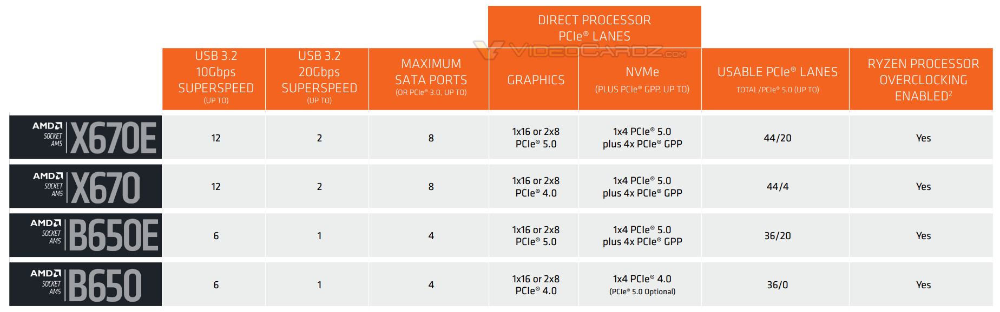

# Componentes que forman la CPU
La CPU se forma por dos componentes principales: la **Unidad de Control (UC)** y la **Unidad aritmético-lógica (ALU)**. Además, cuenta con unos **buses de sistema** que se encargan de transmitir información y unos **registros** que pueden almacenarla.

## Unidad aritmeticológica (ALU)
Realiza operaciones aritméticas (suma, resta, multiplicación...) y lógicas (AND, OR...). Se comunica a través de un bus dedicado con la Unidad de Control.

## Unidad de control (UC)
Se ocupa de coordinar y controlar las funciones de un ordenador. Monitoriza y envía las instrucciones a cada una de las partes del ordenador.

# Juegos de instrucciones
TODO (CISC/RISC)

# Procesadores comerciales
En el ámbito comercial, Intel y AMD se disputan la lucha en la venta de procesadores.

## AMD vs Intel en el tiempo

|  |
|:-:|
| *Tabla de las generaciones de procesadores intel y AMD. Obtenida de: [Carballar.com](https://carballar.com/historia-de-intel-vs-amd)*. |

!!! NOTA

    Para obtener información más detallada sobre las distintas generaciones de procesadores, [consulta este enlace](https://www.itechtics.com/processor-generations/).

## Nomenclatura en procesadores Intel
El usuario de Reddit M1ghty_boy ha creado [imágenes *beginner friendly* sobre procesadores y tarjetas gráficas](https://www.reddit.com/r/pcmasterrace/comments/khmowo/i_made_some_beginnerfriendly_guides_to/). A continuación se muestra la que ha creado de Intel:

### Ejemplos variados
A continuación se muestra un **Intel de 3ª generación para portátiles**, con **dos núcleos** y un precio de lanzamiento en Junio de **2012** de aproximadamente **345€**.

La **última generación de Intel es la número 13**, la cuál ha aparecido por primera vez en este año **2023**.

|  |
|:-:|
| *Nomenclatura de procesadores Intel explicada. Obtenida de: [Intel](https://www.intel.com/content/www/us/en/processors/processor-numbers.html)*. |

## Nomenclatura en procesadores AMD
A continuación se muestra la nomenclatura de AMD. En la imagen se indica que las generaciones de AMD van de la 1 a la 5 (pero ya ha salido la 7 también).

A continuación, mostramos la imagen del anuncio de AMD para sus procesadores de 7ª generación (Ryzen 3/5/7/9 7***) que han salido a finales de 2022:

# Intel vs AMD: Sockets y chipsets

## AMD: sockets AM4 y AM5
En AMD 7000 (séptima generación) el socket usado en la placa base se denomina AM5 (en las anteriores su denominación era AM4). El socket AM5 va a ser reutilizable, como mínimo, por la siguiente generación de procesadores que salga de AMD. Si compramos una placa base con socket AM5 podremos, **como mínimo**, cambiar el procesador hasta 2025 (esto ha indicado la propia empresa).

|  |
|:-:|
| *Imagen de un procesador AM5 (izquierda) y un AM4 (derecha). Obtenida de: [artículo en PCComponentes](https://www.pccomponentes.com/socket-am5-vs-am4)*. |

Intel, por otra parte, va a sacar un nuevo socket el año que viene. El socket actual para la última generación de Intel (la 13ª, **Raptor Lake**) es el LGA1700, pero el año que viene ya han anunciado que [se utilizará un socket diferente](https://www.noticias3d.com/noticia/92666/socket-intel-lga1851-exclusivo-ddr5.html) (el LGA1851) entre 2024 y 2026.

### Chipsets para el socket AM5
En AM5 tenemos 5 gamas de chipsets. A continuación se resumen brevemente:
#### Gama baja
- **A620:** soporta PCIe 4.0 x16, SSD NVMe, DDR5 y AMD Expo (perfiles de overclock para la RAM). No dispondrá de overclock para el procesador. No soporta USB 3.2 gen2.

#### Gama media
- **B650:** soporte para PCIe4.0 x16 o 2 x8. Viene hasta con un USB 3.2 Gen2. Algunas placas serán compatibles con PCIe 5.0.
- **B650E:** similar a la anterior, ahora soportando GPUs de quinta generación (PCIe 5.0) y mejores fases VRM.

#### Gama alta
- **X670:** a diferencia de los chipsets 650, este incorpora una ranura PCIe 5.0 M.2.
- **X670E:** es como el anterior, pero además es compatible con GPUs (tarjetas gráficas) PCIe 5.0.

# Intel: socket LGA1700
La última generación de Intel (13) utiliza un socket LGA1700. Este socket soporta la generación 13 y soportará la 14 (saldrá a finales de este año 2023 con). En la generación se espera una mejora de rendimiento muy pequeña.

### Chipsets para LGA1700
Chipsets presentados en 2021
- H610:
- B660:
- H670:
- Z690:

Nuevos chipsets (finales de 2022):
- B760
- H770
- Z790

Algunas novedades de los nuevos chipsets son:
- PCI-Express 5.0 con 16 raíles, además de PCIe 4.0 y 3.0.
- Soporte para DDR5.
- Wifi 6E integrado.
- USB 3.2 Gen 2 ampliado.
- Menos puertos SATA priorizando PCIe.
- Distinta compatibilidad de procesadores.

!!! Nota

    Estos son los chipsets compatibles mientras se escribe este documento, a fecha del 03/10/2023.

# Referencias:
- Ángel Aller. Socket AM5 vs AM4, la comparativa AMD ideal para comprar CPU. Obtenida de: [artículo en PCComponentes](https://www.pccomponentes.com/socket-am5-vs-am4) el 3 de Octubre de 2023.
- LGA1700, el socket Intel que soporta la 13ª y 14ª generación Core. Obtenida de: [artículo en PCComponentes](https://www.pccomponentes.com/lga1700-intel) el 3 de Octubre de 2023.
- Guía placas y chipsets AMD Ryzen 7000. Obtenido de: [Wikiversus](https://www.wikiversus.com/informatica/placas-base/guia-placas-chipsets-amd-ryzen-7000/)
