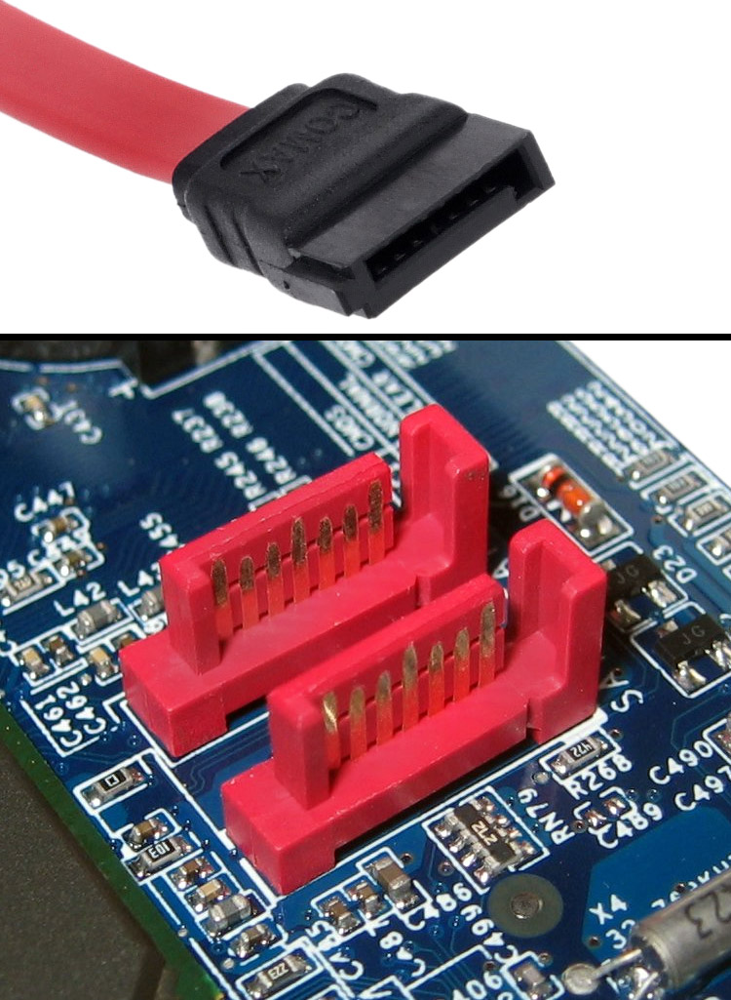

# La placa base
La placa base (*motherboard*) es el componente principal del ordenador. Es una tarjeta de circuito impreso a la que se conectan todos los componentes (de forma lógica, estos componentes envían mensajes que circulan a través de los circuitos de la placa base y así se comunican entre ellos).

|  |
| :-: |
| *Placa base con el chipset antiguo (northbridge y southbridge)* |

|  |
| :-: |
| *Dibujo de una Placa base con chipset actual. Obtenido de: [PowerCert Animated Videos](https://www.youtube.com/watch?v=b2pd3Y6aBag&ab_channel=PowerCertAnimatedVideos)* |

En una placa base existen una serie de ranuras (slots) donde se pueden introducir componentes:
## Zócalo del procesador (socket de la CPU)
Es donde se introduce el procesador. Se corresponde en la placa con el recuadro grande de color negro en la parte superior.

## Slots de expansión
En la **parte inferior izquierda** se disponen una serie de ranuras negras y rojas donde introducir tarjetas de expansión (tarjetas de red, tarjetas gráficas, tarjetas de sonido, etc.).

Actualmente, estas ranuras suelen ser siempre PCI-Express (PCI-E). Las más grandes se utilizan para la tarjeta gráfica, mientras que las pequeñas se usan para cualquier otro tipo (p. ej: una tarjeta de red o una tarjeta de sonido).

!!! Nota

    Las placas base suelen tener ya integrada una tarjeta de red por cable (para poder conectarse a internet) y/o inalámbrica (Wifi). También suelen incluir la tarjeta de sonido sin necesidad de añadirla nosotros a un slot de expansión.

    :question:: *Entonces, ¿por qué hablamos de añadir esas tarjetas ahí?*

    :ok_hand:: *Pues es útil si queremos tener un sonido o conexión "más especializado", mejor que el que nos da la placa base de serie.*

## Slots de memoria RAM
Son las cuatro ranuras que se pueden ver en la parte superior derecha de la placa del ejemplo.

## Conectores SATA
Son los conectores hembra rojos que se ven en la parte inferior derecha de la placa. Sirven para conectar habitualmente discos duros rígidos o SSD y unidades de CD/DVD (estas últimas empiezan ya a estar en desuso).

|  |  |
| :-: | :-: |
| *Imagen obtenida de: [Wikipedia](https://es.wikipedia.org/wiki/Serial_ATA)* | Imagen obtenida de artículo en [Amazon](https://www.amazon.es/QiCheng-LYS-Cable-extensi%C3%B3n-Datos/dp/B075B32D9Z?th=1) |

|  |
| :-: |
| *Imagen obtenida de [un magnífico vídeo de PowerCert en Youtube](https://www.youtube.com/watch?v=b2pd3Y6aBag)* |

## Interfaces de entrada/salida
Algunos de los principales son los siguientes:

- **Puertos USB (tipo A):** es la interfaz de E/S más común (Universal Serial Bus). Se utiliza para gran cantidad de periféricos y además suministra una cierta cantidad de energía eléctrica a los mismos.
- **Puertos USB (tipo C):** es el conector USB más moderno. No tiene posición errónea (no importa si lo inviertes, siempre conecta correctamente) y además es más delgado que el conector USB que conocemos (tipo A). Permite conectar casi cualquier tipo de dispositivo (incluyendo pantallas). En sus estándares 3.2 y 4.0 es posible cargar móviles y portátiles.
- **Adaptador de vídeo:** las placas base que tienen tarjeta gráfica integrada suministran un adaptador para pantalla. Las tarjetas gráficas integradas son buenas para aplicaciones ligeras, en caso de ejecutar aplicaciones que necesitan fuerte procesamiento gráfico (como en el caso de videojuegos) es necesario disponer de una tarjeta gráfica dedicada que conectaríamos en el puerto PCI-Express de la placa base. En la imagen del miniPC podemos ver un puerto de vídeo (que saldría de la tarjeta gráfica o la placa base) de tipo **DisplayPort**.
- **Tarjeta de red:** actualmente suelen venir integradas en la placa (pero se puede comprar una más potente y ponerla en uno de los slots de expansión PCI-E). La interfaz de salida será el conector de red RJ-45 (se puede ver cuál en la imagen).
- **Tarjeta de sonido:** actualmente suelen venir integradas en placa (se pueden también comprar y poner mejores tarjetas de sonido en uno de los slots de expansión). La salida son unos conectores circulares (jack 3.5mm).

<!-- |  |
| :-: |
| *Imagen obtenida de artículo en venta en [PCComponentes](https://www.pccomponentes.com/startech-cable-usb-20-a-usb-c-2m-blanco)* | -->

|  |
| :-: |
| *Imagen de los puertos de un miniPC **Minisforum b550 pro**. Obtenida de: artículo en [liliputing](https://liliputing.com/minisforum-b550-pro-modular-mini-pc-supports-up-to-ryzen-7-5800x-and-discrete-graphics/)* |

# Factores de forma
Existen diferentes tamaños de torres disponibles para ordenadores de sobremesa. El tamaño de la torre tiene mucho que ver con la placa base que se desee instalar en ella. A continuación se muestran los tipos de torres existentes y los factores de forma (form factor) de las placas base compatibles con ella. A continuación se muestran los distintos tipos de torre y placas base compatibles de más pequeña a más grande:

## Factores de forma y placas base más comunes

|  |
| :-: |
| *Imagen obtenida de: [Wikipedia](https://en.wikipedia.org/wiki/Form_factor_(design))*

### Minitorre (placas mini ITX y micro ATX)
Las torres en formato “minitorre” tienen el espacio adaptado para placas base desarrolladas para el estándar como micro ATX (244x244 mm) y mini ITX (170x170 mm).

Las placas micro ATX son compatibles con casi todas las cajas del mercado de tipo semitorre (es decir, ATX). Si se dispone de una semitorre habrá espacio de sobra para todos los componentes.

En el caso de las mini ITX (o simplemente ITX) son las más pequeñas para PCs de escritorio y suelen también ser compatibles con otras cajas más grandes.
Hoy en día se puede montar un ordenador con placas ITX o micro ATX que sea tope de gama.

### Semitorre (placas ATX)
Son de tamaño estándar y la placa base que más se adapta a ellas es la de tipo ATX (305x244mm). Son las más habituales (prácticamente el 90% de las cajas son compatibles con ellas). Estas placas base suelen tener 4 ranuras DIMM y espacio para dos tarjetas gráficas.

En una semitorre también puede ser habitual incluir placas micro ATX.

### Supertorre o torre (placas E-ATX)
Estas torres tienen más espacio que las anteriores y están pensadas para las placas base de tipo E-ATX. Estas placas son bastante grandes (sin llegar al nivel de las placas base de servidores). Las medidas son de 300x330mm. Se suelen utilizar para los chipsets x299 y x399 y disponen de espacio para 8 ranuras DIMM y muchas tarjetas de expansión.

|  |
|-:-|
| *Imagen obtenida de: [artículo en Hardzone](https://hardzone.es/tutoriales/componentes/tipos-cajas-pc/)*

## Otros factores de forma

### Desktop y Small Form Factor (SFF)
Diseñados para encajar en un monitor. Se usan con placas micro ATX e ITX (igual que las minitorres) pero no dejan espacio para gráfica dedicada. Se colocan debajo del monitor.

### Ultra Small Form Factor (USFF)
Suelen usar discos duros y memorias de portátiles (más pequeños). Solo tienen dos slots PCI, dejan poco flujo de aire (hay poco espacio) y por tanto suelen calentarse más y es más difícil cambiar componentes.

## Micro/Mini PCs
Son ordenadores que usan alguno de los factores de forma anteriores y se integran en pantallas o televisores.

|  |  |
| :-: | :-: |
|  |  |
*Imágenes obtenidas de: [Stonerefurb](https://www.stonerefurb.co.uk/form-factors-explained)*.

## Tipos de placa base antiguos
Aunque en este punto se están relacionando los tipos de torre con formatos actuales de placas base (según el tamaño de la placa), en este punto se podrían nombrar tipos de placa base que se han ido quedando obsoletos:

- **Tecnología extendida (Extended Technology) o TX**: creado por IBM en 1983 para el primer ordenador personal. Las dimensiones eran de 216x279 mm.
- **Tecnología avanzada (Advanced Technology) o AT**: formato introducido en IBM en 1984 de 350x305 mm.
- **Baby-AT**: ha sido estándar durante muchos años, el tamaño es de 216x330mm y fueron habituales desde los ordenadores 286 hasta los primeros pentium.

| Factor de forma TX | Factor de forma Baby AT |
| :-: | :-: |
|  |  |

# Elección de torre y placa base
Para elegir uno u otro tamaño de torre y placa base debemos considerar diversos aspectos, entre los que se encuentran, de forma básica, el espacio disponible que tenemos para poner el ordenador (o si necesitamos transportarlo habitualmente, con lo que quizás nos interesaría un factor de forma más pequeño) donde queramos ponerlo así como la refrigeración que se necesita (cuánto más pequeños y potentes más difíciles son de refrigerar).

Además de esto debemos considerar lo siguiente:

## Procesador que queremos comprar
Las placas base tiene un "socket" o ranura donde colocar el procesador. Este socket solo es compatible con algunas series de procesadores. Debemos consultar si el socket de la placa base es compatible con el procesador.

|  |
|-:-|
| *Imagen obtenida de: [artículo en Makeuseof](https://www.makeuseof.com/tag/cpu-socket-types-explained-from-socket-5-to-bga-makeuseof-explains/)*

Incluso aunque los sockets sean compatibles, hay casos en que el procesador y el chipset de la placa base no lo son.

## El soporte para memoria RAM
- **Tipo de RAM:** las últimas versiones de las memorias van desde DDR (1) hasta DDR5. Si decides comprar una RAM de tipo DDR5 (sería lo óptimo si estás comprando nuevo todo el ordenador) tendrás que asegurarte de que la placa base la soporta.
- **Número de slots:** las placas mini-ITX van a tener siempre solamente dos ranuras, mientras que las ATX tienen 4 y las E-ATX suelen tener 8.
- **Máxima capacidad de RAM soportada**: especialmente si se desea ampliar la RAM en un futuro.
- **Máxima velocidad (en MHz) soportada**: las RAMs tienen distintas velocidades de reloj y capacidades. Si compras una RAM con 3200 Mhz de velocidad de reloj, pero las especificaciones de la placa base indican que soporta solo 2666 Mhz, estarás comprando una RAM más cara de lo que necesitas para ese equipo.

Hay más cosas a considerar de la RAM que veremos en el apartado de memorias. Respecto a la compatibilidad de la RAM con la placa base, estas serían las más importantes.

## Ranuras PCI-Express, SATA y otras
- Comprobar que la placa dispone de las ranuras PCI-Express necesarias y qué versión de PCI-Express (4.0 o 5.0).
- Comprobar si dispone de ranura M.2 y, en caso de existir, si se conecta por SATA o por PCI-Express (NVMe). Esto último sería lo más rápido.
- En una placa ITX no hay espacio para más de una tarjeta gráfica, pero a partir de micro-ATX ya es posible hacer SLI y Crossfire con dos tarjetas gráficas (si se desea mucha potencia, no es habitual).

## Chipset
Existen chipsets específicos de Intel y AMD para gamas baja, media y alta en distintas generaciones de procesadores. Si quieres un ordenador *gaming* de última generación, quizá te compense una placa base con un chipset de gama alta. Si solo quieres el ordenador, en cambio, para tareas de ofimática y ver el correo, es suficiente con una placa base con un chipset de gama baja.

!!! Nota

    Puedes identificar (a grandes rasgos) si un chipset es de gama baja, media o alta según su número y letra (cuánto más altos sean ambos más alta es la gama del chipset).

    Por ejemplo, en AM4 de 3ª, 4ª y 5ª generación:

    - Chipset A520 -> gama baja.
    - Chipset B550 -> gama media.
    - Chipset X570 -> gama alta.

    En séptima generación AM5:

    - B650 -> gama media.
    - X670 -> gama alta.

    Etc.

# Referencias
- Placa base. Wikipedia. Obtenido de: [Wikipedia](https://es.wikipedia.org/wiki/Placa_base) . Última visita: el 3 de octubre de 2020.
- PowerCert Animated Videos. Vídeo “Motherboard”. Visualizado en [Youtube](https://www.youtube.com/watch?v=b2pd3Y6aBag)
- Castillo, José Antonio. Placas base ITX y ATX. Obtenido de: [Profesional Review](https://www.profesionalreview.com/2019/05/14/placa-base-micro-atx/#Tamanos_de_placa_base_disponibles)
- Miguel Ángel Navas. Componentes de una placa base. Obtenido de: [Profesional Review](https://www.profesionalreview.com/2018/11/04/componentes-de-una-placa-base)
- Computer Cases and The Different Types of Form Factors. stonerrefurb. Obtenido de: [Stonerrefurb](https://www.stonerefurb.co.uk/form-factors-explained)
