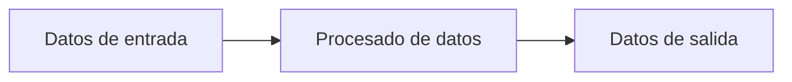
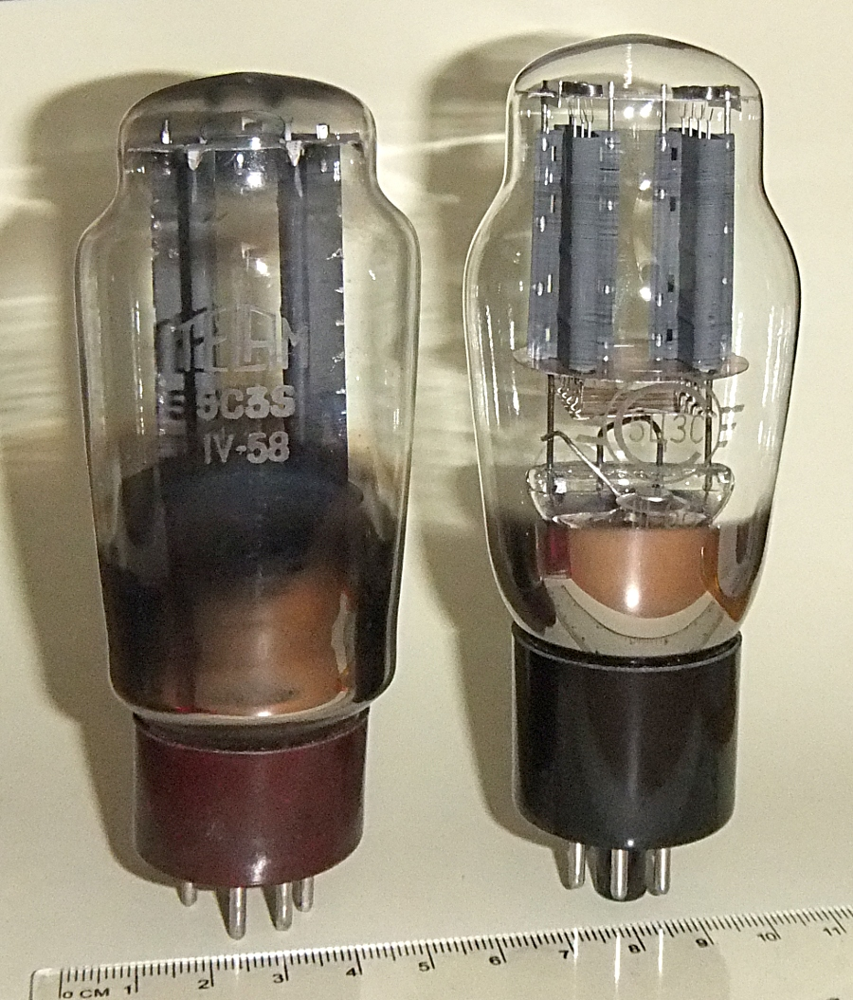
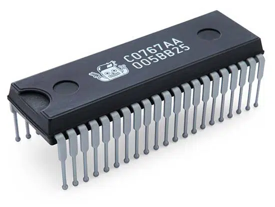
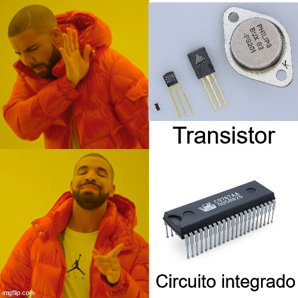

# Introducción e historia de la informática
La historia de la informática es reciente, pero sin duda es una de las ciencias que más ha evolucionado y más desarrollo sufrirá en el futuro. A continuación se definirán algunos de los conceptos históricos más importantes relacionados con la misma.

## Definiciones
### Informática
El término informática se creó en Francia en el año 1962, y procede de la contracción de las palabras información y automática. Según la RAE, se define informática como **el conjunto de conocimientos científicos y técnicas que permiten el tratamiento de información de forma automática**.

### Ordenador humano
Ordenador (en inglés: computer y en español latino computadora) es una palabra que se refiere a contar o calcular. Esta palabra se usaba como referencia a las acciones que realizaban los ordenadores mecánicos y, antes de eso, los ordenadores humanos (1613).

La palabra **ordenador (humano)** nació en el siglo XVII y fue definida por Alan Turing tres siglos más tarde como **alguien que debía seguir unas reglas fijas sin ninguna autoridad que los desvíe ni en el más mínimo detalle**. Esto es, era una persona capaz de realizar operaciones matemáticas antes de que los ordenadores electrónicos estuviesen disponibles.
Más adelante han surgido los ordenadores como máquinas.

### Ordenador
Actualmente, un ordenador se puede definir como una máquina electrónica capaz de realizar las siguientes tareas:

- Aceptar información
- Almacenarla.
- Procesarla según un conjunto de instrucciones
- Producir y proporcionar unos resultados.

En otras palabras, el ordenador puede aceptar unos datos de entrada, realizar con ellos operaciones lógicas y aritméticas y, finalmente, proporcionar la información resultante a través de un medio de salida.

### Datos e información
Los datos son hechos y cifras sin procesar, sin ningún análisis ni interpretación añadida. La información es un conjunto de datos que, procesados y analizados, aportan conocimiento sobre las cosas.

### Movimiento de información: bits y señales
En informática, el movimiento de información se realiza de forma digital por lo general. El término **dígito** nos da una idea de que la representación no va a tomar cualquier valor del mundo real (señales analógicas) sino un número discreto de estos y, al igual que los dedos de nuestras manos son limitados, también lo es el sistema decimal (base 10).

El **concepto de bit** (binary digit o dígito binario) está ligado a esta representación digital de información. Los ordenadores solo van a almacenar internamente dos estados (voltaje o ausencia de este, magnetizado o no, refleja un láser o no, etc.). Estos estados se van a representar como dígitos binarios con un uno o un cero. **El bit es la unidad más pequeña de información.**

### Sistema informático
Un sistema informático se forma no solo por componentes físicos (hardware), sino también lógicos (software). Además de esto se dispone del firmware (software integrado directamente en el hardware, como la BIOS/UEFI). La combinación de estos es lo que forma el sistema informático.

## Historia del ordenador digital
### Antecedentes al ordenador digital (aún imposible de crear)
- En 1642 Blaise Pascal crea la primera calculadora (con ruedas y engranajes) denominada **Pascalina**.
- En 1833 **Charles Babbage y Ada Byron** establecen los principios del ordenador digital, pero que no se podían poner en práctica porque la tecnología de la época se lo impedía. **Ada Byron es considerada como la creadora del primer algoritmo de la historia**, creado para la **máquina Babbage** que no existía físicamente.
- En 1885 **Herman Hollerith crea las tarjetas perforadas** y el invento se usa para censar a la población. Tuvo tanto éxito que la empresa que crea dedicada al censo será una de las que se fusionará para formar lo que hoy se conoce como IBM.

### División en generaciones
Respecto a la historia de la informática, en la mayor parte de la literatura se definen además varias generaciones (según el momento histórico):

#### Primera generación
- **Situada entre:** 1938 y 1958 (años 40/50).
- Los ordenadores se usaban para fines científicos y/o militares.
- Construidos mediante válvulas de vacío y relés.

|  |
|:-:|
| *Imagen de una **válvula de vacío**. Obtenida de: [Wikipedia](https://es.wikipedia.org/wiki/V%C3%A1lvula_termoi%C3%B3nica)*. |

Entre los ordenadores creados durante esta época se encuentran:

- **1938:** Konrad Zuse crea primer ordenador electromecánico (**Z1**), era una calculadora basada en cinta perforada. Más adelante se crean sus sucesores: **Z2, Z3 y Z4**. La Z1 fue destruida en un bombardeo en Berlín a finales de 1943.
- **1944:** creación del **Harvard MARK I**. Posteriormente las versiones II, III y IV.
- **1944:** Se crea el **Colossus** utilizado durante la 2ª guerra mundial y representado hace unos años en el cine mediante la película "Descifrando Enigma".
- **1946:** Se **finaliza** el **ENIAC** y más adelante sus sucesores: **EDVAC** (1951) y **UNIVAC** I y II.

Inicialmente ENIAC se consideraba el primer ordenador digital de la historia, algo que cambió con la desclasificación de documentos con el paso de los años. A día de hoy, todavía se disputa cierta controversia en la consideración de **cuál fue el primer ordenador digital de la historia**.

#### Segunda generación
- **Situada entre**: 1959 y 1964.
- **Reducción considerable del tamaño** mediante la **sustitución de la válvula de vacío por el transistor**.
- Empiezan a usarse **lenguajes de alto nivel** (se inicia la creación de COBOL en 1959).
- Aparición de os **periféricos**.

|  |
|:-:|
| *Imagen de varios tamaños de transistores. Obtenida de: [Wikipedia](https://es.wikipedia.org/wiki/Transistor)*. |

#### Tercera generación
- Entre 1965 y 1971.
- Aparecen las cintas magnéticas para almacenamiento.
- Uso de sistemas operativos de propósito general y de los circuitos integrados (también llamados chips o microchips). Esto hace los ordenadores más rápidos y completos reduciendo el tamaño y el coste.

|  |
|:-:|
| *Imagen de un **circuito integrado**. Obtenida de: [tecnología-informática](https://www.tecnologia-informatica.com/la-tercera-generacion-de-computadoras/#Qu%C3%A9_a%C3%B1os_abarca_la_tercera_generaci%C3%B3n_de_computadoras?)*. |

<!-- 

 -->

!!! Nota

    Un circuito integrado es un componente que puede contener en un espacio muy pequeño muchos componentes electrónicos interconectados: resistencias, transistores, capacitores, etc.

#### Cuarta generación
- Entre **1972 y 1982**.
- Sigue la reducción de tamaño y coste: las CPUs se establecen en un solo circuito integrado. Esto son los microprocesadores.
- Más lenguajes de alto nivel como Pascal, C o Basic.
- Aparición de UNIX.

#### Quinta generación
- Desde 1982 hasta la actualidad.
- Se caracteriza por la comercialización del ordenador personal.
- Aparición de MSDOS.
- Aparición de C++, Java y muchos otros lenguajes.
- La nube, teléfonos inteligentes...

### División en eras
Diversa literatura realiza una división en eras:

#### Era mecánica
Desde la aparición de la Pascalina (calculadora con ruedas y engranajes) en 1642 hasta 1944 (fecha aproximada de aparición de los primeros circuitos eléctricos).

#### Era electromecánica
Se corresponde con las creaciones de los primeros ordenadores de la historia. Desde el ENIAC (que se mejoraría más adelante dando lugar a la computadora EDVAC) hasta los Z1, Z2, Z3 y Z4 creados por Konrad Zuse. El Z4 se considera el primer ordenador civil de la historia.

En este periodo se crea también la arquitectura Von Neumann y la calculadora MARK I.

#### Era electrónica
Esta época es la más actual, contamos en ella con máquinas compuestas por componentes electrónicos y es un periodo en el que IBM cobra gran importancia. Se han desarrollado los discos duros o la memoria RAM en módulos que aún siguen usándose hoy en día.

## TODOs
- Añadir imágenes para contextualizar las épocas.
- Añadir gráficos en las definiciones de ordenador/sistema informático.
