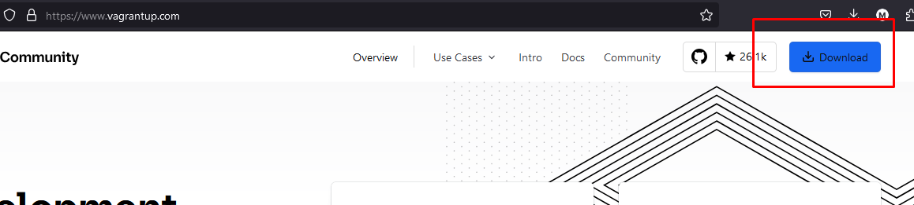
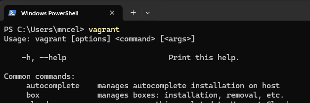
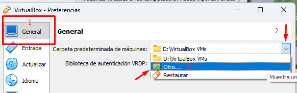
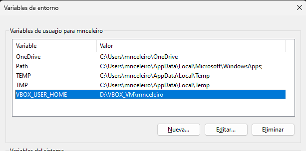
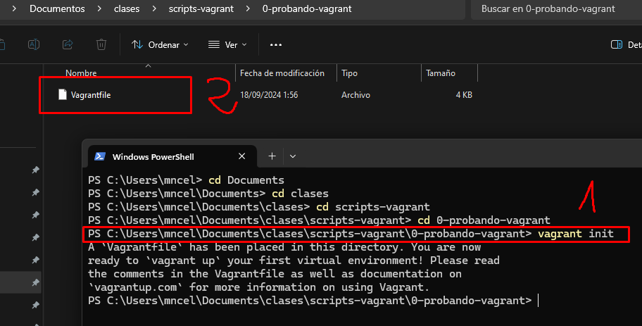
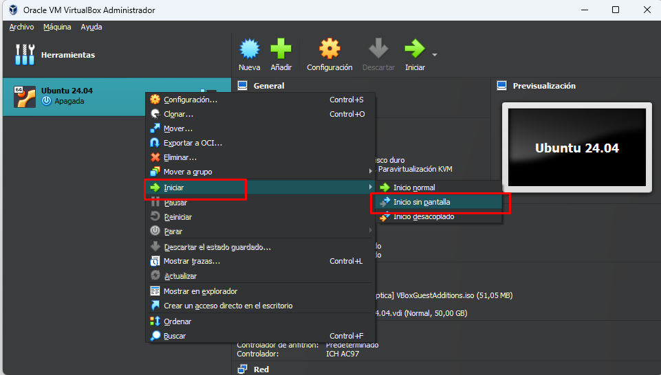

# Gestión de máquinas virtuales con Vagrant
Vagrant es un software que requiere tener detrás otras aplicaciones de virtualización. Algunas compatibles son: VirtualBox, VMWare e HyperV.

## Descarga e instalación
Entra en [www.vagrantup.com](https://www.vagrantup.com){target="_blank"} y descarga e instala Vagrant:


Una vez instalado se te pedirá reiniciar. Para comprobar si Vagrant funciona correctamente abre un CMD o Powershell y ejecuta el comando "vagrant". 

Si funciona saldrá algo como lo de la imagen siguiente:


## Antes de empezar... (opcional, cambio de directorios de las máquinas virtuales de Virtualbox y Vagrant)
Antes de empezar con Vagrant, puede que quieras configurar la carpeta donde se guardan las boxes de Vagrant y las máquinas virtuales de Virtualbox (ya que ambas ocuparán mucho espacio).

Por defecto, Virtualbox almacena las máquinas virtuales que creas en:

- CARPETA_USUARIO/Virtualbox VMs.

Vagrant, por su parte, almacena datos en:

- CARPETA_USUARIO/.vagrant/

Estas rutas se definen en variables de entorno, llamadas: VBOX_USER_HOME (virtualbox) y VAGRANT_HOME (Vagrant). Si se cambian, tus archivos de esas aplicaciones irán a almacenarse en otro sitio. Muchas de las aplicaciones que usas, utilizan **variables de entorno** para indicar donde se almacenan ciertas cosas. En el caso de Virtualbox y Vagrant estas variables son **VBOX_USER_HOME** y **VAGRANT_HOME**.

Si vas a la [sección de Virtualbox de esta misma página](../virtualbox), puedes ver como cambiar graficamente la carpeta donde almacenar las máquinas virtuales:

.

Al hacer este cambio, lo que Virtualbox hace por detrás es crear la variable de entorno VBOX_USER_HOME y asignarle como valor la ruta que hayas indicado. Podemos comprobar esto si vamos a "Inicio" y buscamos "Variables de entorno":



En el caso de crear máquinas virtuales con **Vagrant**, estas, realmente, se almacenarán en Virtualbox. Por otro lado, Vagrant descarga muchos ficheros también de gran tamaño, por lo que puede interesarte modificar la variable de entorno **VAGRANT_HOME** con un disco duro o ruta diferente.

!!! Note "Ejercicio"
    1. Cambia el directorio donde se guardan las máquinas virtuales de Virtualbox. Después, mira las variables de entorno y comprueba que hay una variable con la ruta que hayas indicado. Luego, si quieres, puedes volver a dejar la carpeta por defecto.
    2. Ahora, crea una variable de entorno VAGRANT_HOME donde escribas la ruta para almacenar los datos de Vagrant (ten en cuenta que, de la misma manera que con Virtualbox, estos datos ocuparán mucho espacio en disco).

## Creación de la primera máquina virtual con Vagrant y Virtualbox

### Creando un Vagrantfile con "vagrant init"
Crea una carpeta donde almacenar los scripts de Vagrant. Yo, por ejemplo, los guardaré en:

- *C:/Users/<tu-usuario\>/Documentos/clases/scripts-vagrant/*. 

Ahora, vamos a crear la siguiente carpeta (en la que más tarde crearmos un sript): 

- C:/Users/<tu-usuario\>/Documentos/clases/scripts-vagrant/0-probando-vagrant/.

Sitúate en la carpeta "0-probando-vagrant" desde un terminal. Una vez ahí, ejecuta el siguiente comando:

```
vagrant init
```



Si has hecho todo bien, al abrir el Vagrantfile debería aparecer un fichero de más de 60 líneas (con casi todo comentarios iniciados con el caracter "#"). **Vamos a borrar esos comentarios** y el script debería quedar así:

```rb title="Vagrantfile"
Vagrant.configure("2") do |config|
  config.vm.box = "base"
end
```

!!! Ejercicio
    1. Borra todos los comentarios para dejar el Vagrantfile limpio como el anterior.

La línea importante a fijarnos aquí es: **config.vm.box = "base"**. Una box de Vagrant es basicamente una imagen de una máquina virtual exportada destinada a usarse en Vagrant.

Si consultamos la [el quickstart de la documentación oficial](https://developer.hashicorp.com/vagrant/tutorials/getting-started/getting-started-project-setup), en él utilizan como box "hashicorp/bionic64", vamos a cambiar el script para adaptarlo a la documentación oficial.

!!! Note "Ejercicio"
    Modifica el Vagrantfile para que utilice como imagen de máquina virtual (en vagrant conocida con el nombre de "box") la que sale en la documentación oficial: *hashicorp/bionic64*

```rb title="Solución"
Vagrant.configure("2") do |config|
  config.vm.box = "hashicorp/bionic64"
end
```

### Comprobación de que el Vagrantfile está correctamente
Existe un comando para comprobar que el script está correcto y sin errores, este comando es:

=== "Comando"

    ```
    vagrant validate
    ```
=== "Resultado esperado"

    ```
    Vagrantfile validated successfully.
    ```

!!! Note "Ejercicio"

    Utiliza el comando anterior para comprobar que tu Vagrantfile no tiene errores. Para ello, sitúate en un terminal en la carpeta donde está el Vagrantfile y escribe el comando.

### Descargar y encender la máquina
Si queremos descargar y encender una máquina a través de Vagrant usamos el siguiente comando:
```
vagrant up
```

Este comando lee el Vagrantfile, descarga la box (si no estaba descargada anteriormente), crea la máquina virtual y la enciende. Cuando el comando termine tu máquina estará encendida (aunque no verás la interfaz gráfica).

!!! Info "Más información"
    - :question: Una vez termine la ejecución del "vagrant up", si no ha dado errores, **abre Virtualbox, ¿ves algo nuevo?**

    - :thumbsup: Si el comando tuvo éxito **deberías ver la nueva máquina virtual**. Esto es porque **Vagrant utiliza por detrás Virtualbox como provider** (si alguna vez recibes algún error en Vagrant en que veas la palabra "provider", está relacionado con Virtualbox). 
    
    - :information_source: Existen otros providers (VMWare o HyperV) compatibles con Vagrant.


!!! Note "Ejercicio"
    Ahora prueba tu el comando anterior. Esto descargará la máquina, la configurará con unos parámetros por defecto y la arrancará. No te preocupes por no ver ninguna máquina en la interfaz gráfica, esto es normal.

### Conexión con la máquina virtual
**En vagrant, por defecto, la máquina se inicia sin la interfaz gráfica.** Esto también es posible hacerlo en Virtualbox (recuerda, usamos Virtualbox como provider y estamos, por tanto, limitados a lo que se puede hacer en Virtualbox). 

|  |
| :-: |
| *Captura de ejemplo de como iniciar una máquina sin pantalla en Virtualbox* |

!!! question "Pero, si no tiene pantalla ¡¿cómo demonios la uso?!"

    No problem :ok_hand: :person_gesturing_ok:
    
    Las boxes de Vagrant vienen con conexión remota configurada, por lo que podemos conectarnos a la máquina remotamente de forma transparente con el comando: *vagrant ssh*

En la siguiente captura vemos como nos conectamos desde nuestra máquina Windows a la máquina Linux que hemos encendido previamente:


!!! Note "Ejercicio"
    1. Ejecuta el comando `vagrant ssh` para conectarte a la máquina. **Importante**: ejecuta siempre el comando desde la carpeta donde tienes el Vagrantfile, igual que has hehco con `vagrant validate` y `vagrant up`.
    2. Muestra un mensaje con el comando `echo`.
    3. Crea un fichero con el comando `touch <nombre_fichero>`. Revisa que se ha creado con `ls`.
    4. Sal de la máquina con el comando `exit`. Esto te devolverá a la máquina host (en mi caso una máquina Windows).

### Apagando la máquina virtual
Para apagar la máquina se usa el comando:

```
vagrant halt
```

!!! Note "Ejercicio"

    1. Abre Virtualbox.
    2. Escribe en el terminal el comando "vagrant halt" y fíjate si la máquina se apaga.

También se puede comprobar si la máquina está apagada con comandos de Vagrant. Comprueba que la máquina está apagada usando el comando 

```
vagrant status
```

### Examinando las propiedades de la máquina virtual
Hemos creado la máquina virtual pero solo hemos configurado la imagen (de Ubuntu 18.04) que queríamos. 

!!! Note "Ejercicio"
    Desde Virtualbox, examina las propiedades que tiene por defecto la máquina virtual que has creado e intenta responder a las siguientes preguntas:

     1. Número de procesadores (esto puedes verlo mirando en Virtualbox)
     2. RAM (puedes verlo en Virtualbox)
     3. Capacidad (disco duro, puedes verlo en Virtualbox).
     4. Tipo de adaptador de red (red interna, NAT, puente...)
     5. Nombre de la máquina en Virtualbox
     6. Nombre de la máquina dentro del sistema GNU/Linux (esto es lo único que estoy preguntando que no depende de Virtualbox, tienes que mirarlo accediendo a la máquina virtual).
    
Bien, **todas estas propiedades son configurables** y se configuran desde el Vagrantfile (lo veremos pronto).

### Destrucción de la máquina virtual
Para eliminar la máquina virtual se usa el comando siguiente:

```
vagrant destroy -f
```

La bandera `-f` es para forzar. Además, en el borrado, se recomienda eliminar la carpeta ".vagrant" (esta se crea automáticamente la primera vez que levantas la máquina con `vagrant up`).


!!! Note "Ejercicio"
    Destruye totalmente la máquina virtual creada.

## Vagrant boxes
Antes hemos utilizado como "box" (como imagen de máquina virtual) la que nos viene en la documentación oficial de Vagrant en el [*getting started*](https://developer.hashicorp.com/vagrant/tutorials/getting-started/getting-started-project-setup).

Pero, ¿y si queremos crear máquinas con otras versiones de Ubuntu distintas a la 18.04 o queremos instalar otros sistemas operativos (p. ej: Almalinux, Debian, RHEL, Fedora, OpenSuse...)?

Bien, pues existe una [lista de boxes de Vagrant listas para usarse](https://portal.cloud.hashicorp.com/vagrant/discover) (Vagrant cloud).

Si entras al enlace verás que las boxes están definidas en un formato "usuario/máquina". Es más fiable utilizar máquinas oficiales y, por ello, si queremos una máquina de Ubuntu iremos mejor al usuario "Ubuntu" y la buscaremos.

!!! Ejercicio
    1. Busca una máquina con Ubuntu 22.04 (o superior) del usuario "Ubuntu". Ojo! No te será tan fácil y vas a tener que buscarte la vida para descubrir cuál es la máquina 22.04 ya que no vienen las versiones de la máquina si no "el nombre" que recibe la versión. Utiliza Google para descubrir cuál de las disponibles es la 22.04 (o una superior a esa, pero que sea del usuario Ubuntu). 
    2. Una vez descubras la máquina que quieras, crea una carpeta **"1-ubuntu22"** (al lado de la anterior **"0-probando-vagrant"**) y crea un Vagrantfile como el anterior pero ahora con el box de Ubuntu 22.04. Después:

        - Arranca la máquina.
        - Conéctate a ella con vagrant ssh
        - Desde dentro de la máquina, comprueba que el sistema operativo instalado es Ubuntu 22.04. Esto puedes hacerlo con el comando: "lsb_release -a"
        - Crea una carpeta con tu nombre y apellidos en la máquina.
        - Sal de la máquina.
        - Apaga la máquina
        - Destruye totalmente la máquina (usa el comando y borra la carpeta .vagrant después).

## Configurando la máquina virtual
La configuración de la máquina virtual se hace desde el Vagrantfile (antes se ha puesto en un ejercicio el comprobar cuáles eran las propiedades que tenía por defecto). Vamos a crear una máquina virtual y configurar alguna cosa más.

A continuación se muestra un Vagrantfile algo más completo que los anteriores:
```rb
Vagrant.configure("2") do |config|
  config.vm.box = "ubuntu/jammy64"
  
  config.vm.provider :virtualbox do |vb|
    vb.name = "2-configuracion-basica"
  end
  
  config.vm.boot_timeout = 1000
end
```

En este Vagrantfile se configura lo siguiente:

1. Usar como imagen "ubuntu/jammy64".
2. Se configura que el arranque pueda durar hasta 1000 segundos antes de fallar (por defecto se corta a los 300 segundos -> 5 minutos).
3. Se indican las configuraciones de virtualbox dentro de la parte "config.vm.provider :virtualbox". Dentro solo hemos configurado una cosa, ¿qué crees que es eso de **vb.name**?

!!! Note "Ejercicio"
    1. Crea la carpeta 2-configuracion-basica y copia el anterior Vagrantfile (algo más completo que los primeros que vimos).
    2. Una vez lo tengas asegúrate de que funciona (vagrant validate).
    3. Ahora arranca la máquina y comprueba que no da errores. Mira que ha hecho por ti la línea donde cambias el **vb.name**.
    4. Una vez funcione, **apaga la máquina y modifica el Vagrantfile** para intentar conseguir lo siguiente:
        - **Cambiar el nombre del equipo (puedes buscar en internet el comando para saber cuál es) a rivendel** (no lo confundas con vb.name, eso es el nombre de la máquina en Virtualbox, no el nombre del equipo en Linux). Hay otra línea que puedes escribir que te cambiará por ti el nombre de la máquina Linux dentro.
        - **Conseguir que se te abra la interfaz gráfica de la máquina virtual (GUI) al arrancar la máquina.** Esto se hace dentro de la parte de provider, ya que forma parte de Virtualbox y es también una sola línea.
        - Hacer que la máquina use dos procesadores en lugar de uno (esto es dentro de la parte del provider nuevamente, que es virtualbox). Es solo una línea también.

Recuerda, por lógica, si quieres cambiar número de procesadores, ram u otras cosas que se hacen en Virtualbox, tienes que hacerlo en la parte del Vagrantfile relacionada con Virtualbox (dentro de la parte de provider :virtualbox). Si lo que quieres cambiar es algo relacionado con la configuración de la propia máquina Linux, lo haces fuera.

Intenta realizar el ejercicio anterior y levantar la máquina. Puedes ayudarte de [la documentación oficial](https://developer.hashicorp.com/vagrant/docs/vagrantfile/machine_settings), búsquedas en Google y ChatGPT (no te compliques demasiado, el ejercicio son sentencias de código bastante simples dentro del Vagrantfile, basicamente cada ejercicio es una línea).

## Aprovisionamiento mediante scripts
El aprovisionamiento se trata de darle a la máquina virtual una serie de tareas que se ejecuten automáticamente una vez arrancada. Vamos a empezar con una tarea muy simple: **queremos que al arrancar la máquina por primera vez se cree un fichero con una línea.**

!!! Note "Ejercicio: aprovisionamiento básico usando scripts"
    Destruye la máquina "2-configuracion-basica" (importante que lo hagas). Luego modifica el Vagrantfile de "2-configuracion-basica" para que ejecute la siguiente línea al arrancar la máquina (pon tu nombre y apellidos): 
    
    echo "Hola, me llamo X Y Z." >> /home/vagrant/texto.txt
    
    Una vez hecho esto arranca la máquina y verifica que se ha creado el fichero con una línea con tu nombre y apellidos.

En este caso voy a dejar que os busqueis un poco la vida. Para hacer este ejercicio utiliza la [documentación oficial](https://developer.hashicorp.com/vagrant/docs/provisioning/shell#inline-scripts) en la parte de "inline Scripts". 

??? Tip "Consejo"
    También puedes ayudarte de internet y herramientas de IA sin problema (eso sí, asegúrate de aprender y no solo de hacer lo que la IA te dice, la IA bien usada es genial pero mal usada solo te lastra). 
    
    Interactúa con ChatGPT o cualquier otra IA de manera que, si hay partes que te cuenta que no entiendes, le puedes decir que te especifique más, pregúntale por qué algo es como es, dile que algo te funciona pero no entiendes por qué, etc.

    Si utilizas las IAs para hacer las cosas rápido en lugar de para aprender las estás usando mal.

Ahora, ya has conseguido que al levantar la máquina se ejecute un script de una línea incrustado en el Vagrantfile. Bien, vayamos un paso más allá!

### Ejercicio
Crea una carpeta al lado de las anteriores con el nombre "3-aprovisionamiento". Debe tener 2GB de ram, 2 procesadores y Debian 12 instalado. Además, la máquina en Virtualbox se llamará con tu nombre y dentro del Debian con tu primer apellido.

Arranca la máquina, conéctate a ella y haz lo siguiente:

1. Ejecuta los comandos necesarios para actualizar tu sistema Debian (son 2, tendrás que descubrirlos).
2. Ejecuta un comando que instale el paquete "sl".
3. Ejecuta un comando que instale el paquete "vim".
4. Los comandos te han pedido todos confirmación, utiliza internet y el manual de Linux para **ejecutar esos comandos asegurándote de que NO te pidan confirmación**. Esto es, si tu instalas un paquete que no te pregunte si estás seguro.
5. Cada comando del punto 4 guárdalo en tu ordenador en un fichero de nombre "script-provision.sh".
6. Añade como primera línea en ese fichero de texto "#!/bin/bash".

Si has hecho bien todos los pasos anteriores tendrás un fichero de texto con una serie de comandos. Has creado tu primer script. Guarda ese script en la carpeta "3-aprovisionamiento" (al lado de tu Vagrantfile). Posteriormente, modifica el Vagrantfile para que al ejecutar `vagrant up` se ejecute ese script (puedes forzar el aprovisionamiento con vagrant up --provision).

!!! Note "Nota"
    Este ejercicio se diferencia del anterior realizado en que en el anterior ejecutábamos una única línea de código directamente. En este caso tenemos un fichero con varias líneas y queremos indicar en el Vagrantfile que se ejecute ese fichero. Esta forma es mucho más ordenada.


TODO: Se ampliará este tutorial. A partir de este momento necesitas saber algo de GNU/Linux y tener conceptos de scripting en BASH. Si no sabes usar GNU/Linux con fluidez o no sabes hacer scripts puedes ir al apartado de "GNU/Linux --> scripting" de esta misma página.

## Referencias
- Vagrant quickstart (documentación oficial de Vagrant). Obtenido de: https://developer.hashicorp.com/vagrant/tutorials/getting-started/getting-started-project-setup