## ¿Dónde se almacenan las máquinas? Cambiando la ruta

El primer paso después de instalar Virtualbox es elegir donde quieres que se almacenen las máquinas virtuales.

!!! Note
    La ruta por defecto donde se almacenan las máquinas es en: **CARPETA_USUARIO/Virtualbox VMs**.

    - Windows: C:/Usuarios/mnceleiro/Virtualbox VMs (para mi usuario mnceleiro)
    - GNU/Linux: /home/mnceleiro/Virtualbox VMs (para mi usuario mnceleiro)

En mi caso, tengo un segundo disco duro de 2 TB, por lo que elijo este como sitio para almacenar todas las máquinas.

| 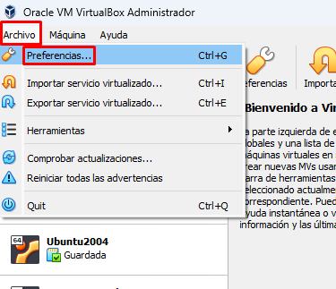 |  |
| :--------------------------------------------------: | :--------------------------------------------------: |
|        *Paso I: archivo &rarr; preferencias*         |   *Paso II: seleccionamos la carpeta que queramos*   |

Si no dispones de un disco principal (C: en Windows) enorme, es mejor que o pongas en un disco o partición secundaria. Eso sí, ten en cuenta que en un SSD las máquinas irán mejor que si están en un HDD. Otra cosa que se puede hacer es poner la ruta de las máquinas en el HDD (más grande) y luego, individualmente al crear las máquinas, poner en el SSD alguna que uses con mucha frecuencia.

## Creando mi primera máquina virtual

### Descarga de ISOs
Puedes descargar la ISO de W11 en [la página oficial de Microsoft](https://www.microsoft.com/es-es/software-download/windows11).
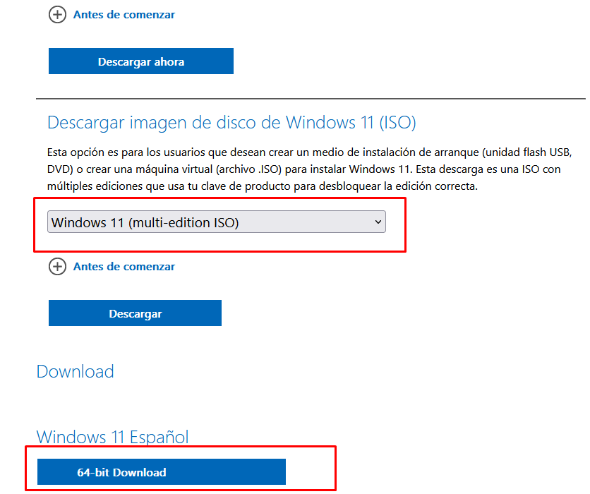

!!! Note

    Recuerda elegir el idioma

### Creación de máquinas

| **1. Pulsamos en el botón "Nueva" (o máquina &rarr; Nueva)** |
| :----------------------------------------------------------: |
|              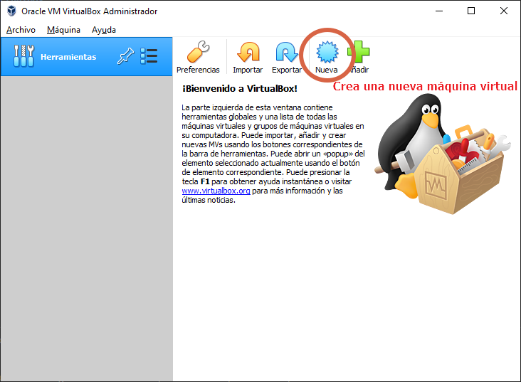              |

| **2. Elegimos sistema operativo y nombre de la máquina** |
| :------------------------------------------------------: |
|            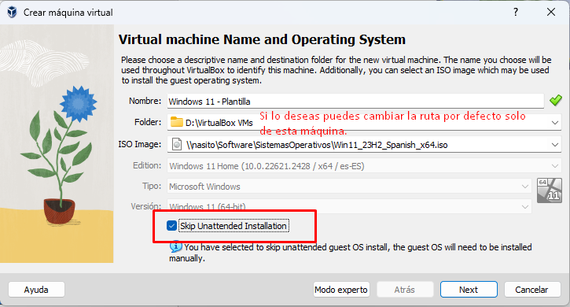            |

En este caso, he elegido en el desplegable **Windows 11** como sistema y en el nombre he puesto **Windows 11 - Plantilla**. Puedes elegir una imagen .ISO de Windows 11 en este mismo paso o hacerlo después manualmente.

!!! Warning "Instalación desatendida (*unattended installation*)"

    Marca la casilla de "saltarse la instalación desatendida". La instalación desatendida de Virtualbox es bastante nueva y en la mayoría de sistemas no funciona aún como debe.

| **3. Asignamos recursos a la máquina (RAM y procesadores)** |
| :---------------------------------------------------------: |
|             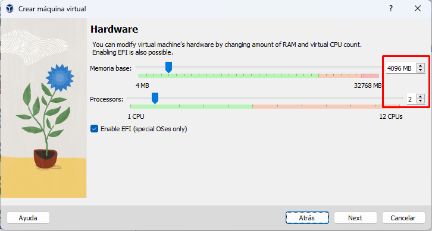              |
|       Asigna según los recursos de los que dispongas        |

Ten en cuenta que Windows 11 tiene como requisitos mínimos 4 GB de RAM.

- Si tienes un ordenador con más de 8 GB de RAM y más de 2 procesadores no tendrás problema.
- En caso de tener un ordenador con solo 2 procesadores (dual-core) asígnale a la máquina solo 1. Si tienes más puedes ponerle 2 (no te preocupes, esto puede cambiarse más adelante sin ningún tipo de problema)
- Mi consejo si dispones de 8GB de RAM o menos es que lo hagas con una ISO de W10 en lugar de Windows 11 y le pongas solo 2 GB.

|                                                **4. Asignamos tamaño del disco duro**                                                |
| :----------------------------------------------------------------------------------------------------------------------------------: |
|                                                  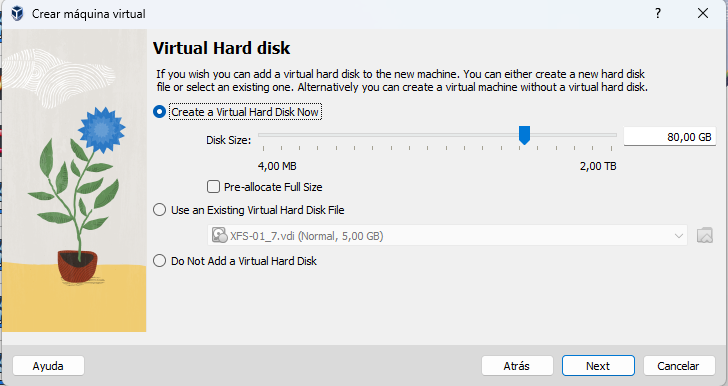                                                  |
| [No asignes menos de 64 GB para Windows 11](https://blogs.oracle.com/virtualization/post/install-microsoft-windows-11-on-virtualbox) |

El disco duro no es más que un archivo normal con extensión .vdi. Cualquier cosa que hagas en Virtualbox solo usará ese archivo. Hagas lo que hagas ahí, tu sistema operativo base no corre peligro!

|   **5. Revisamos y finalizamos**   |
| :--------------------------------: |
| 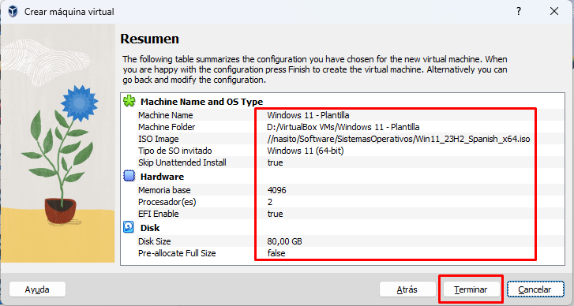 |

Para arrancar la máquina podemos hacerlo pulsando botón derecho en ella, pulsando "iniciar" en el menú superior o simplemente haciendo doble click sobre ella.

|                                                                   **6. Arrancar la máquina**                                                                   |
| :------------------------------------------------------------------------------------------------------------------------------------------------------------: |
|                                                               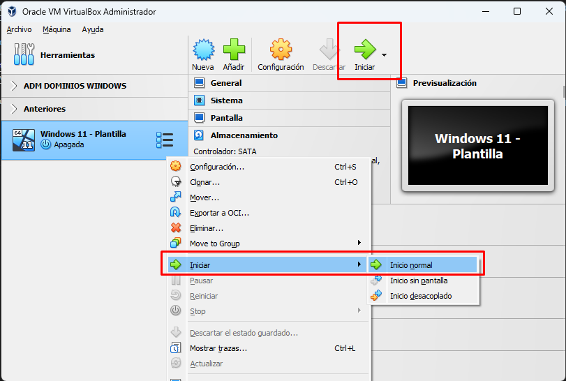                                                               |
| Para arrancar la máquina podemos hacerlo pulsando botón derecho en ella, pulsando "iniciar" en el menú superior o simplemente haciendo doble click sobre ella. |

## Configuración de las máquinas
La mayor parte de las configuraciones de máquinas solo puede cambiarse si estas están apagadas (tenlo en cuenta). Esto es, no puedes ampliarle la RAM a la VM si está encendida.

Para acceder a la configuración:

|                                                                     **Accediendo a la configuración**                                                                      |
| :------------------------------------------------------------------------------------------------------------------------------------------------------------------------: |
|                                                              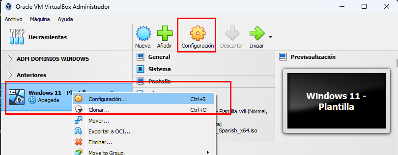                                                              |
| Se puede acceder con **botón derecho sobre la máquina y "configuración"** o bien pulsando sobre la máquina con **click izquierdo y "configuración" en la parte superior**. |

### Modificar la cantidad de procesadores y RAM de la máquina
Accedemos a la configuración &rarr; Sistema. Podemos modificar las cantidades en las pestañas "Placa base" y "Procesador".

| 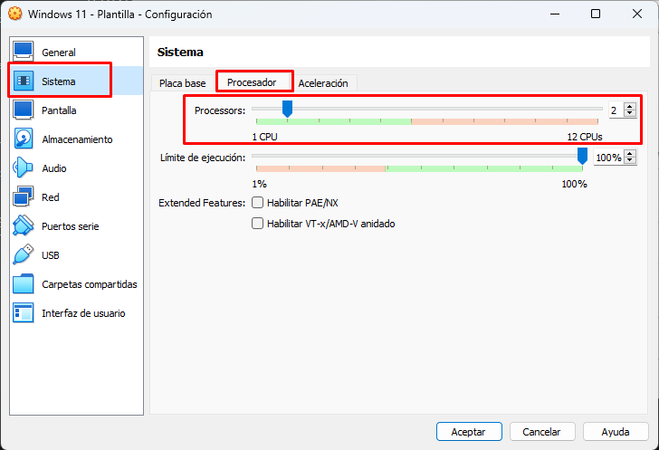 | 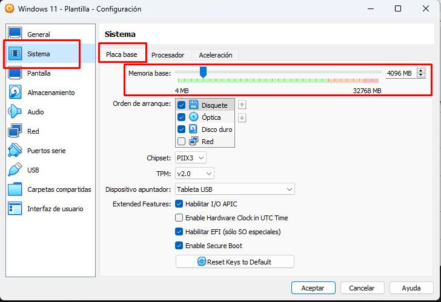 |
| :-----------------------------------------------------------------------------: | :-------------------------------------------------------------------: |
|                        Cambiando número de procesadores                         |                 Cambiando RAM (pestaña *placa base*)                  |

### Copiar y arrastrar archivos entre host y máquina virtual
Puede habilitarse el arrastrar y soltar y el copy/paste entre el host y la VM (si no se hace serían máquinas independientes y no podrías copiar textos entre una y otra).

|              **6. Compartición entre las máquinas de copiar/pegar y arrastrar ficheros**               |
| :----------------------------------------------------------------------------------------------------: |
| 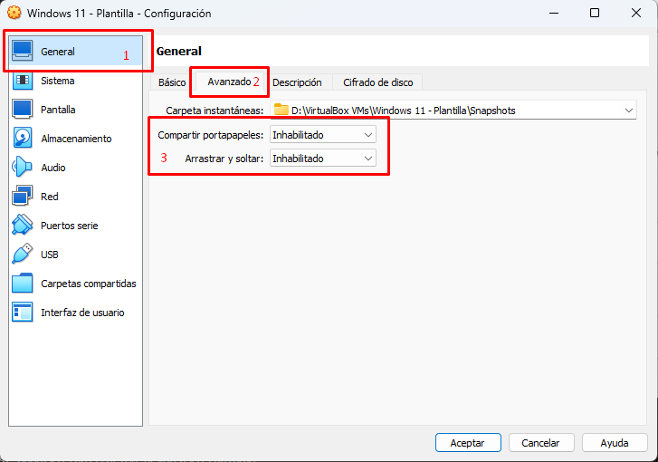 |
|                 **Hay que cambiar ambas opciones de "inhabilitado" a "bidireccional"**                 |

### Configuración de red
Por defecto viene una configuración NAT. Con NAT, la máquina host (nuestro ordenador) no puede hacer ping a la máquina virtual (no hay comunicación entre ellas). A veces nos interesa tener distintas alternativas a esto como, por ejemplo, tener dos máquinas en la misma red (adaptador puente) o poner múltiples máquinas sin acceso a internet en la misma red interna (red interna).

|                                    **6. Configuraciones de RED**                                     |
| :--------------------------------------------------------------------------------------------------: |
| 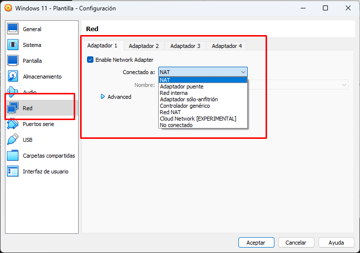 |

Esta parte es importante. [Consulta este enlace para entender bien como funcionan las configuraciones de red en Virtualbox](https://github.com/davidgchaves/apuntamentos-complementarios-som-distancia-ies-san-clemente/tree/main/1-redes-en-virtualbox).
